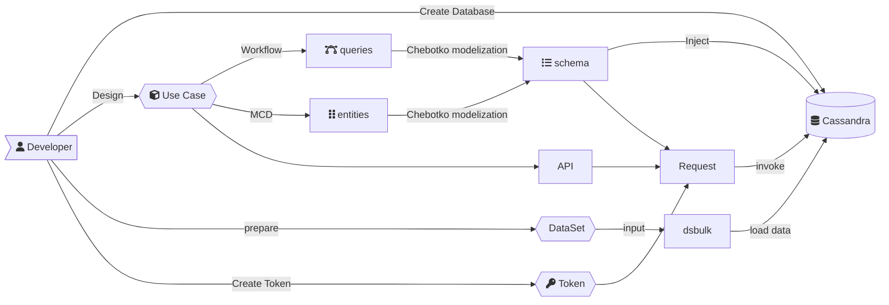

<link rel="stylesheet" href="https://maxcdn.bootstrapcdn.com/font-awesome/4.6.1/css/font-awesome.min.css">

## CheatSheet

### Mermaid

### Font Awesome

<i class="fa fa-camera-retro fa-lg"></i> fa-lg
