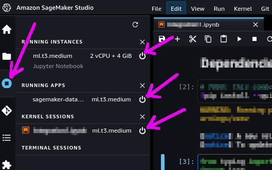

# Amazon Bedrock

## Overview

Amazon Bedrock is a fully managed, fully serverless service offering access to
foundation models from various AI companies in a single API, together with
additional capabilities such as facilities for fine-tuning and agent frameworks.

Amazon Bedrock aims at simplifying development, especially for Generative AI,
while maintaining privacy and security. Experimenting with foundation models
is easy, and models can be further customized in a privacy-aware fashion
within Bedrock.

Foundation models from Amazon Bedrock can be easily **integrated with Astra DB**,
most notably with its Vector capabilities, thereby providing a solid framework for
developing Generative AI and other ML-centered applications.

In the following example, you will be able to run a standard RAG
(retrieval-augmented generation) application
that makes use of AI models from Amazon Bedrock and uses Astra DB as a Vector Store.

The integration is built with the LangChain framework, which conveniently offers
native support for Amazon Bedrock as well as Astra DB. Using LangChain is a popular
and well-established choice -- but certainly not the only one. See the references at
the end of the page for further options.

## Prerequisites

To run the integration demo notebook, you need:

- An **Amazon account** with access to Amazon Bedrock and Amazon SageMaker Studio. In particular, you will be asked to provide a set of credentials for programmatic access (i.e. `AWS_ACCESS_KEY_ID`, `AWS_SECRET_ACCESS_KEY` and `AWS_SESSION_TOKEN`);
- Alternatively, if you run the notebook from within SageMaker Studio, it is sufficient to add the Bedrock policy to your SageMaker role instead of explicitly providing the above secrets. Please refer to [this link](https://github.com/aws-samples/amazon-bedrock-workshop#enable-aws-iam-permissions-for-bedrock) for details.
- An **Astra account** with a **Serverless Cassandra with Vector Search** database. You will need the [Database ID](https://awesome-astra.github.io/docs/pages/astra/faq/#where-should-i-find-a-database-identifier) and an [Access Token](https://awesome-astra.github.io/docs/pages/astra/create-token/) with role "Database Administrator".

## Run the example

The integration example is a Python 3.8+ runnable notebook. The suggested method is to import
the notebook in your Amazon SageMaker Studio environment and run it from there.

<admonition markdown="1">
!!! note "Other options to run the example"
    The notebook runs in a local Jupyter environment and on Google Colab as well.
</admonition>

    

**Step 1.** Download the notebook from this repository at [this link](https://raw.githubusercontent.com/awesome-astra/docs/main/docs/pages/aiml/aws/notebooks/bedrock.ipynb) and save it to your local computer.
(You can also view it [on your browser](https://github.com/awesome-astra/docs/blob/main/docs/pages/aiml/aws/notebooks/bedrock.ipynb).)

**Step 2.** Open your Amazon SageMaker console and click the "Studio" item in the left navbar. _Do not choose "Studio Lab", which is a different thing._

**Step 3.** Click the "Open Studio" button after choosing a user profile: this will bring you to the Studio interface. _You may need to create a Studio instance ("SageMaker domain") if you don't have one already._

**Step 4.** In the left toolbox of Sagemaker Studio, make sure you select the "File Browser" view and locate the "Upload" button: use it to upload the notebook file you previously saved. The notebook will be shown in the file browser.

**Step 5.** If you double-click on it, the notebook will be opened in Studio. In order to run it, you will be asked to start a "notebook environment" (essentially, a Python runtime). Choose the "Data Science 3.0" image and a "Python 3" kernel and hit "Select".

**Step 6.** Once the kernel has fully started, you can run each cell in sequence by clicking on them and pressing Shift+Enter. You will be asked for the secrets during execution.

#### Cleanup

During the above steps, some resources are created, which you may want to
cleanly dispose of after you are done.

These have been started to run the notebook itself. You can shut them down from within SageMaker Studio:
select the "Running Terminals and Kernels" view on the left toolbar (see picture below) and click the "shut down" icon next to all instances, apps and sessions associated to the notebook you just ran.

## Additional information

[More info on Amazon Bedrock](https://docs.aws.amazon.com/bedrock/latest/userguide/what-is-bedrock.html)

[Accessing Amazon Bedrock from Python](https://github.com/aws-samples/amazon-bedrock-samples/tree/main/introduction-to-bedrock)

[Using Astra DB for your Generative AI applications](https://awesome-astra.github.io/docs/pages/aiml/)
