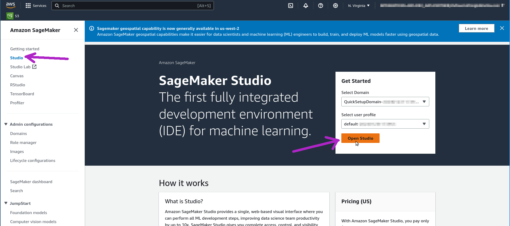
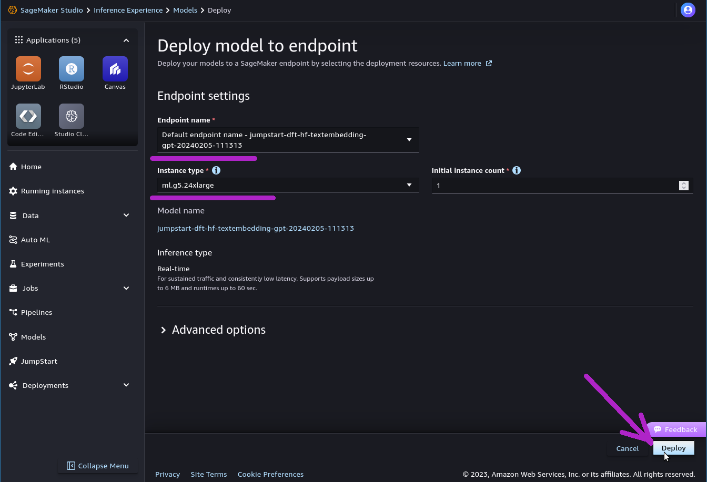
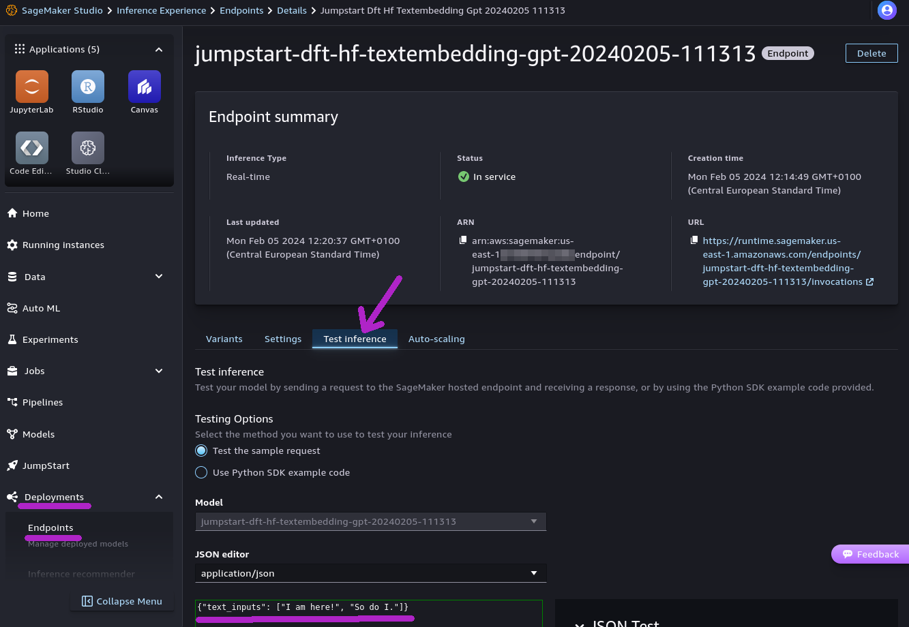
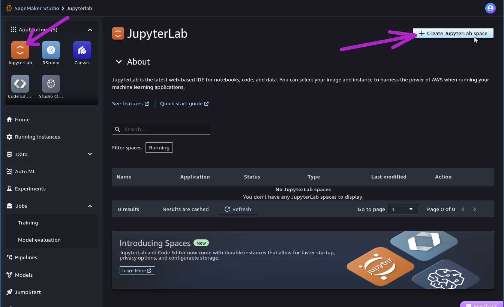

# Amazon SageMaker

<div class="nosurface" markdown="1">

</div>

## Overview

Amazon SageMaker is a managed service to deploy and use Machine Learning models
for a variety of purposes. Its offering includes infrastructure provisioning,
tooling and end-to-end workflow setup.

With Amazon SageMaker it is possible not only to deploy ready-made models, but
also to manage training data and perform custom training or fine-tuning steps.
The easiest way to begin using SageMaker is to deploy and use many well-established
foundation models that are made available through "SageMaker JumpStart".

Models deployed within Amazon SageMaker can be **integrated with Astra DB**,
making it possible to build enterprise-grade Generative AI applications with
minimal infrastructural effort, while retaining desirable features such
as the usage of secure, dedicated instances.

In the following example, you will provision and execute a simple end-to-end
application implementing the RAG (retrieval-augmented generation) flow,
with AI models from Amazon SageMaker JumpStart
and Astra DB as the backend for the Vector Store.

The example makes use of the LangChain framework (which has great support
for both SageMaker and Astra DB); however, other, lower-level ways to interact
programmatically with SageMaker are available -- as a matter of fact you will
get a chance to experiment with them in an Appendix at the end of the integration
example.

For more information and other options to interface with SageMaker, please
consult the suggested readings at the end of this page.


## Prerequisites

To run the integration demo notebook, you need:

- An **Amazon account** with access to Amazon SageMaker. In particular, you will need to acces SageMaker Studio and run the example in there: besides ensuring a standardized runtime and environment, SageMaker Studio provides automated access to a ready-made set of Amazon IAM roles that grant your account all necessary permissions to deploy the "JumpStart" models in SageMaker (see below for details);
- An **Astra account** and a **Vector database** created in it. To connect to it, you need the _API Endpoint_ and an _Application Token_, which you can obtain from the database main dashboard on Astra. You may optionally need to specify a _Namespace_ for the connection if you are not targeting the default one.


## Setup

The sample application needs an embedding model and a large language model
(LLM), both in SageMaker.

The models can be deployed either through the SageMaker UI or programmatically
with the Python SageMaker SDK. You can choose your preferred method: the integration
example will adapt to your choice.

### Deploy models programmatically

The code for automated deployment of the models is included in the example:
you can skip to ["Run the example"](#run-the-example) below and start with the code.

### Deploy models from SageMaker UI

If you prefer to use the SageMaker UI to deploy the models, here are all steps.

<admonition markdown="1">
!!! note "Choice of the models"

    This example is tailored to run using exactly the models we suggest in the following.

    Please _pay attention to deploying the right models_ for a smooth
    quickstart experience. Changes could
    impact the performance or the results or even not work altogether,
    since the signature of the inputs and outputs varies between models.

    On the other hand, the reason why this method is described in some details
    is precisely because it is what you may need when using your own models -- possibly
    created, trained or fine-tuned outside of the JumpStart experience.

    If you plan on using other models, remember that you will have to adapt
    parts of the code (such as the signature of the input parameters,
    the serializers/deserializers and the "context handlers" passed to the
    LangChain SageMaker objects) your model's specific needs.

</admonition>


**Step 1.** Open your Amazon SageMaker console and click the "Studio" item in the left navbar. _Do not choose "Studio Lab", which is a different thing._



**Step 2.** Click the "Open Studio" button after choosing a user profile: this will bring you to the Studio interface. _You may need to create a Studio instance ("SageMaker domain") if you don't have one already. Creation of a new domain may take about five minutes._


**Step 3.** Make sure you are on the "Home" view (click on the home icon in the left navbar) and pick the "JumpStart" button under _Prebuilt and automated solutions_. Clicking on it will bring the "SageMaker JumpStart" listing in the main view, with the entries grouped by "Hub". Notice the search box at the top of the listing.


**Step 4.** Search for the embedding model `GPT-J 6B Embedding` with the search box of JumpStart. Click on it in the search results: you will be brought to the model's details. Click the "Deploy" button on the top right to configure and start the model deployment.



**Step 5.** Check the endpoint name (you can keep the default suggested one) and select `ml.g5.24xlarge` for the instance type that will host the model. _(Note: you might need
to check with your [Service Quotas](https://docs.aws.amazon.com/servicequotas/latest/userguide/intro.html) to make sure you have capacity to deploy this instance.)_

**Step 6.** Click "Deploy" (bottom right) to start the process. This might take between _five and ten minutes_. The endpoint you are going to use has been given a final name (visible also as the title of this page) obtained by prepending `"jumpstart-dft-"` to the name chosen earlier. **Keep this endpoint name handy: you will be asked to provide it later when running the example code.**


**Step 7.** While you wait, you can check the status of the deploy in two ways: (a) from the Amazon SageMaker UI, choosing the "Inference / Endpoints" entry in the left navbar, and then refreshing periodically;
or (b) from within SageMaker Studio, by selecting the "Deployment/Endpoints" entry in the left navbar. You have to periodically click the "Refresh" button until you see the status of your model changing from "Creating" to "In service".

<admonition markdown="1">
??? note "Checking deploy status, screenshots"
    From the SageMaker UI:
    
    From within SageMaker Studio:
    
</admonition>




**Step 8.** When the deploy has finished, you will see its status being reported as "In Service". You can run a quick test with a handy Playground-like interface available in SageMaker Studio: click on the endpoint name in the list (reachable through "Deployments/Endpoints" on the left navbar), then select the "Test inference" tab to open it. Try with a JSON payload such as `{"text_inputs": ["I am here!", "So do I."]}`: paste this text in the "JSON Payload" text field, then hit "Send Request" (bottom right): the endpoint response should resemble the one shown in the screenshot, with the two embedding vectors under the `body => embedding` list-of-lists entry.

> Now the embedding model is deployed and ready to be used in the example code.

**Step 9.** Repeat steps 4 through 7, this time _to deploy the LLM_: search in JumpStart for the model named "Llama 2 70B Chat" and choose `ml.g5.48xlarge` as instance type. _(Note: this model, made available by Meta, requires acceptance of its "End User License Agreement" and "Acceptable Use Policy" prior to use: you will be presented with a dialog to do so at deploy time. Also, keep in mind that the deploy time for this model can well exceed twenty minutes in some cases.)_

**Step 10.** Similarly as for the embedding model, you can test the LLM in the UI through the model's "Test inference" tab. Try with a payload like the following: `{"inputs": "Write a short poem about the late Paleocene.", "parameters": {"max_new_tokens": 256, "temperature": 0.6, "top_p": 0.9}}`. Hit the "Send Request" button (bottom right), then check the results in the right-hand panel. _(Note: the "Test inference" tab can also show Python code to use that particular endpoint through `boto3` invocations. This may come handy, as in most cases exemplifies more advanced usages such as how to encode a past exchange between system/assistant/user roles in the text generation request.)_

> **Deploys are now complete.** You can now start the example notebook as outlined in the next section.


## Run the example

The integration example is a Python 3.8+ runnable notebook. The notebook is designed to run
within Amazon SageMaker Studio, so as to receive, through its usage of
the AWS `boto3` library, an AWS identity equipped with the special permissions required
to programmatically deploy the SageMaker JumpStart models.

<!-- <admonition markdown="1">
??? note "Running the app from other environments"

    Strictly speaking, the permission limitations only apply to the
    task of _deploying the JumpStart models_.

    That means, if the models are deployed already (e.g. through the UI),
    the rest of the notebook will still work on other environments
    such as your local Jupyter, or Google Colab, provided you slightly
    change the cell that deals with authentication of your AWS client.

    Please refer to the notes at the end of this page for more details.

</admonition> -->

As mentioned earlier, you will be able to either supply the endpoint names for the AI models
(in case you went for UI-based deploys as outlined earlier), or have the SageMaker SDK
take care of them programmatically.

The main flow of the notebook features usage of the models through the corresponding
SageMaker-specific LangChain plugins: however, the model endpoints can be accessed
in other ways - something that is demonstrated in an Appendix at the end of the notebook.

<p align="center">
    <a href="https://raw.githubusercontent.com/awesome-astra/docs/main/docs/pages/aiml/aws/notebooks/sagemaker.ipynb" target="blank;">
        
    </a>
</p>

**Step 1.** Download the notebook from this repository at [this link](https://raw.githubusercontent.com/awesome-astra/docs/main/docs/pages/aiml/aws/notebooks/sagemaker.ipynb) and save it to your local computer.
(You can also view it [on your browser](https://github.com/awesome-astra/docs/blob/main/docs/pages/aiml/aws/notebooks/sagemaker.ipynb).)




**Step 2.** You need a "JupyterLab space", i.e. an Amazon-provided filesystem with compute resources on top of it, ready to run Jupyter kernels and effectively execute your notebooks. You find JupyterLab in the "Applications" icon group at the top of the left-hand sidebar; then, if you don't have one yet, click the "Create JupyterLab space" button, give it a name and hit "Create space". You should now see the space's dashboard -- and notice that it has been _created_, but it is not running yet.


**Step 3.** Check the compute instance type that will support the execution of your code (you can stick with a `ml.t3.medium` instance for this example) and click "Run space" to actually get your space running. Wait a minute or so until you see the space's status change from "Starting" to "Running".

**Step 4.** Once the JupyterLab space is _Running_, you can click "Open JupyterLab": a new browser tab will be brought up. There is a toolbox on the left, which you will momentarily use to upload the notebook file. _(Note: you can stop and re-start the space whenever you want, in order to optimize your resource usage. The notebooks stored in the space's file system will be persisted.)_


**Step 5.** In the left toolbox of your JupyterLab space, make sure you select the "File Browser" view and locate the "Upload" button: click on it and pick the notebook file from your computer. The notebook will be shown in the file browser.


**Step 6.** If you double-click on it, the notebook will be opened in Studio, with a Jupyter kernel behind id, ready to execute its code.


**Step 7.** You can now run each cell in sequence by clicking on them and pressing Shift+Enter. You will be asked for the secrets and the connection details during execution.

#### Cleanup

During the above steps, some resources are created, which you may want to
cleanly dispose of after you are done:

- endpoints deployed in SageMaker (i.e. the Embedding and the LLM models). You can delete them from the "Endpoints" view, reachable through the "Deployments/Endpoints" entry in SageMaker's left-hand navbar (once deleted, you can click the Refresh button in the listing, to make sure they are not displayed anymore); _(Please note some endpoints can be deleted only after having manually deleted the Models that are part of the endpoint. The SageMaker UI would guide you through the process.)_
- to delete the JupyterLab you created earlier, navigate to "Applications/JupyterLab" and select the JupyterLab space. First you need to hit "Stop space" and acknowledge the warning about additional resources (endpoints, buckets); wait until the space is "Stopped" (about 10 seconds), then you can open the "..." menu on the upper right and pick the "Delete space" menu entry.
- Deletion of a JupyterLab space will not delete the associated S3 bucket created with it (called something like `sagemaker-studio-01234567890-9abc8defg7h`) automatically: you need to navigate to S3, identify the bucket and delete it separately;
- you may want to even delete entirely the "SageMaker domain" you created. This requires several steps, outlined [here](https://docs.aws.amazon.com/sagemaker/latest/dg/gs-studio-delete-domain.html). Do not forget you will have to manually destroy an associated S3 bucket as well;
- a Collection in your Astra DB instance. The notebook provides a way to delete it programmatically; alternatively, you can do so through the "Data Explorer" tab in the Astra DB dashboard for the database.


## Additional information

[What is Amazon SageMaker?](https://docs.aws.amazon.com/sagemaker/latest/dg/whatis.html)

[Documentation for the Python SageMaker SDK](https://sagemaker.readthedocs.io/en/stable/index.html)

[Using Astra DB for your Generative AI applications](https://awesome-astra.github.io/docs/pages/aiml/)

[Getting Started with SageMaker JumpStart](https://aws.amazon.com/sagemaker/jumpstart/getting-started)

[Llama 2 foundation models from Meta available in SageMaker JumpStart](https://aws.amazon.com/blogs/machine-learning/llama-2-foundation-models-from-meta-are-now-available-in-amazon-sagemaker-jumpstart/)

[Accessing SageMaker from boto3 with Python](https://boto3.amazonaws.com/v1/documentation/api/latest/reference/services/sagemaker.html)

<!-- ### Running the app from outside of SageMaker Studio

As mentioned earlier, you can still run this app from other environments than SageMaker Studio,
provided the models are already deployed, i.e. if you do not need to execute the deployment
itself in the code.

To do so, you will have to slightly adjust the cell that handles authentication of your AWS identity
(besides of course providing ready-made endpoint names for both embedding and LLM when prompted).

Replace the cell in the notebook that defines variables `boto3_sm_client`, `region_name`, `sagemaker_session` and `aws_role` with the following, where
the first three lines are needed to enter your AWS access credentials:

```
import getpass

# Input your AWS secrets:
AWS_ACCESS_KEY_ID = getpass.getpass("Please enter secret 'AWS_ACCESS_KEY_ID':")
AWS_SECRET_ACCESS_KEY = getpass.getpass("Please enter secret 'AWS_SECRET_ACCESS_KEY':")
AWS_SESSION_TOKEN = getpass.getpass("Please enter secret 'AWS_SESSION_TOKEN':")


# Create the AWS clients with these credentials:
boto_session = boto3.Session(
    aws_access_key_id=AWS_ACCESS_KEY_ID,
    aws_secret_access_key=AWS_SECRET_ACCESS_KEY,
    aws_session_token=AWS_SESSION_TOKEN
)

boto3_sm_client = boto3.client(
    'runtime.sagemaker',
    aws_access_key_id=AWS_ACCESS_KEY_ID,
    aws_secret_access_key=AWS_SECRET_ACCESS_KEY,
    aws_session_token=AWS_SESSION_TOKEN
)
region_name = boto3.Session().region_name

sagemaker_session = Session(boto_session=boto_session)
aws_role = sagemaker_session.get_caller_identity_arn()
```

Now, the rest of the notebook should run just like in SageMaker Studio.
 -->