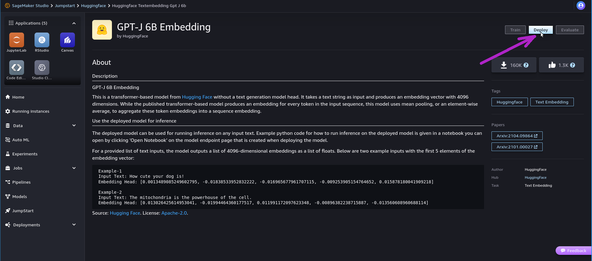

# Amazon SageMaker

<div class="nosurface" markdown="1">

</div>

## Overview

Amazon SageMaker is a managed service to deploy and use Machine Learning models
for a variety of purposes. Its offering includes infrastructure provisioning,
tooling and end-to-end workflow setup.

With Amazon SageMaker it is possible not only to deploy ready-made models, but
also to manage training data and perform custom training or fine-tuning steps.
The easiest way to begin using SageMaker is to deploy and use many well-established
foundation models that are made available through "SageMaker JumpStart".

Models deployed within Amazon SageMaker can be **integrated with Astra DB**,
making it possible to build enterprise-grade Generative AI applications with
minimal infrastructural effort, while retaining desirable features such
as the usage of secure, dedicated instances.

In the following example, you will provision and execute a simple end-to-end
application implementing the RAG (retrieval-augmented generation) flow,
with AI models from Amazon SageMaker JumpStart
and Astra DB as the backend for the Vector Store.

The example makes use of the LangChain framework (which has great support
for both SageMaker and Astra DB); however, other, lower-level ways to interact
programmatically with SageMaker are available -- as a matter of fact you will
get a chance to experiment with them in an Appendix at the end of the integration
example.

For more information and other options to interface with SageMaker, please
consult the suggested readings at the end of this page.


## Prerequisites

To run the integration demo notebook, you need:

- An **Amazon account** with access to Amazon SageMaker. In particular, you will need to acces SageMaker Studio and run the example in there: besides ensuring a standardized runtime and environment, SageMaker Studio provides automated access to a ready-made set of Amazon IAM roles that grant your account all necessary permissions to deploy the "JumpStart" models in SageMaker (see below for details);
- An **Astra account** with a **Serverless Cassandra with Vector Search** database. You will need the [Database ID](https://awesome-astra.github.io/docs/pages/astra/faq/#where-should-i-find-a-database-identifier) and an [Access Token](https://awesome-astra.github.io/docs/pages/astra/create-token/) with role "Database Administrator".


## Setup

The sample application needs an embedding model and a large language model
(LLM), both in SageMaker.

The models can be deployed either through the SageMaker UI or programmatically
with the Python SageMaker SDK. You can choose your preferred method: the integration
example will adapt to your choice.

### Deploy models programmatically

The code for automated deployment of the models is included in the example:
you can skip to ["Run the example"](#run-the-example) below and start with the code.

### Deploy models from SageMaker UI

If you prefer to use the SageMaker UI to deploy the models, here are all steps.

<admonition markdown="1">
!!! note "Choice of the models"

    This example is tailored to run using exactly the models we suggest in the following.

    Please _pay attention to deploying the right models_ for a smooth
    quickstart experience. Changes could
    impact the performance or the results or even not work altogether,
    since the signature of the inputs and outputs varies between models.

    On the other hand, the reason why this method is described in some details
    is precisely because it is what you may need when using your own models -- possibly
    created, trained or fine-tuned outside of the JumpStart experience.

    If you plan on using other models, remember that you will have to adapt
    parts of the code (such as the signature of the input parameters,
    the serializers/deserializers and the "context handlers" passed to the
    LangChain SageMaker objects) your model's specific needs.

</admonition>


**Step 1.** Open your Amazon SageMaker console and click the "Studio" item in the left navbar. _Do not choose "Studio Lab", which is a different thing._


**Step 2.** Click the "Open Studio" button after choosing a user profile: this will bring you to the Studio interface. _You may need to create a Studio instance ("SageMaker domain") if you don't have one already._


**Step 3.** Click the "Home" icon on the left toolbox of Studio and scroll to the "JumpStart / Models, notebooks, solution" entry. Clicking on it will open the "SageMaker JumpStart" tab in the main view. _(Note: we will mostly refer to "tabs within the Studio UI" simply as "tabs" in the following. These, however, are not meant to be separate tabs in your browser.)_



**Step 4.** Search for the embedding model `GPT-J 6B Embedding` with the search box of the JumpStart tab. Click on it in the search results: a tab will open with this model's details. Make sure you are on the "Deploy" tab and expand the "Deployment Configuration" section.

**Step 5.** Give the endpoint a specific name (it must be unique) and select `ml.g5.24xlarge` as the instance type that will host the model. _(Note: you might need
to check with your [Service Quotas](https://docs.aws.amazon.com/servicequotas/latest/userguide/intro.html) to make sure you have capacity to deploy this instance.)_

**Step 6.** Click "Deploy" to start the process. This might take between _five and ten minutes_, during which a newly-opened tab will report progress. As you can see on this tab, the final endpoint you are going to use has been given a final name made by prepending `"jumpstart-dft-"` to the endpoint name you chose earlier. **Keep this endpoint name handy: you will be asked to provide it later when running the example code.**


**Step 7.** While you wait, you can check the status of the deploy in two ways: (a) from the Amazon SageMaker UI, choosing the "Inference / Endpoints" entry in the left navbar, and then refreshing periodically;
or (b) from within SageMaker Studio, by selecting the "Home" icon and then choosing "Deployments / Endpoints" in the left-hand toolbox.

<admonition markdown="1">
??? note "Checking deploy status, screenshots"
    From the SageMaker UI:
    
    From within SageMaker Studio:
    
</admonition>


**Step 8.** When the deploy has finished, you will see its status being reported as "In Service". You can run a quick test with a handy Playground-like interface available in SageMaker Studio: click on the endpoint name in the "Endpoints" tab to open it. Try with a JSON payload such as `{"text_inputs": ["I am here!", "So do I."]}` and hit "Send Request": the endpoint response should resemble the one shown in the screenshot, with the two embedding vectors under the `body => embedding` list-of-lists entry. _The embedding model is deployed and ready to be used in the example code.

**Step 9.** Repeat steps 4 through 7, this time _to deploy the LLM_: search in JumpStart for the model named "Llama-2-70b-chat" and choose `ml.g5.48xlarge` as instance type. _(Note: this model, made available by Meta, requires acceptance of its "End User License Agreement" and "Acceptable Use Policy" prior to use: you will be presented with a dialog to do so at deploy time, and for each model invocation as well. Also, keep in mind that the deploy time for this model can well exceed twenty minutes in some cases.)_

<admonition markdown="1">
!!! failure "This LLM cannot be currently tested in the playground"

    The custom header required to properly pass the EULA acceptance when issuing
    invocations from the playground in SageMaker Studio is not working in the playground.
    Without this header, invocations would return with this error:
    `Need to pass custom_attributes='accept_eula=true' as part of header. This means ...`.
    Unfortunately, for the time being, this model can be tested only through the code,
    in the ways that will be demonstrated in the example.

</admonition>

**Deploys are now complete.** You can now start the example notebook
as outlined in the next section.


## Run the example

The integration example is a Python 3.8+ runnable notebook. The notebook is designed to run
within Amazon SageMaker Studio, so as to receive, through its usage of
the AWS `boto3` library, an AWS identity equipped with the special permissions required
to programmatically deploy the SageMaker JumpStart models.

<admonition markdown="1">
??? note "Running the app from other environments"

    Strictly speaking, the permission limitation only apply to the
    task of _deploying the JumpStart models_.

    That means, if the models are deployed already (e.g. through the UI),
    the rest of the notebook will still work on other environments
    such as your local Jupyter, or Google Colab, provided you slightly
    change the cell that deals with authentication of your AWS client.

    Please refer to the notes at the end of this page for more details.

</admonition>

As mentioned earlier, you will be able to either supply the endpoint names for the AI models
(in case you went for UI-based deploys as outlined earlier), or have the SageMaker SDK
take care of them programmatically.

The main flow of the notebook features usage of the models through the corresponding
SageMaker-specific LangChain plugins: however, the model endpoints can be accessed
in other ways - something that is demonstrated in an Appendix at the end of the notebook.

<p align="center">
    <a href="https://raw.githubusercontent.com/awesome-astra/docs/main/docs/pages/aiml/aws/notebooks/sagemaker.ipynb" target="blank;">
        
    </a>
</p>

**Step 1.** Download the notebook from this repository at [this link](https://raw.githubusercontent.com/awesome-astra/docs/main/docs/pages/aiml/aws/notebooks/sagemaker.ipynb) and save it to your local computer.
(You can also view it [on your browser](https://github.com/awesome-astra/docs/blob/main/docs/pages/aiml/aws/notebooks/sagemaker.ipynb).)


**Step 2.** In the left toolbox of SageMaker Studio, make sure you select the "File Browser" view and locate the "Upload" button: use it to upload the notebook file you previously saved. The notebook will be shown in the file browser.


**Step 3.** If you double-click on it, the notebook will be opened in Studio. In order to run it, you will be asked to start a "notebook environment" (essentially, a Python runtime). Choose the "Data Science 3.0" image and a "Python 3" kernel and hit "Select".


**Step 4.** Once the kernel has fully started, you can run each cell in sequence by clicking on them and pressing Shift+Enter. You will be asked for the secrets during execution.


#### Cleanup

During the above steps, some resources are created, which you may want to
cleanly dispose of after you are done:

- endpoints deployed in SageMaker (i.e. the Embedding and the LLM models). You can delete them from the "Endpoints" view, reachable through the "Inference / Endpoints" entry in SageMaker's left-hand navbar (once deleted, you can click the Refresh icon in SageMaker Studio's "Endpoints" tab to make sure they are not listed anymore);
- resources started to run the notebook itself. These can be shut down from within SageMaker Studio: select the "Running Terminals and Kernels" view on the left toolbar (see picture below) and click the "shut down" icon next to all instances, apps and sessions associated to the notebook you just ran.


## Additional information

[What is Amazon SageMaker?](https://docs.aws.amazon.com/sagemaker/latest/dg/whatis.html)

[Documentation for the Python SageMaker SDK](https://sagemaker.readthedocs.io/en/stable/index.html)

[Using Astra DB for your Generative AI applications](https://awesome-astra.github.io/docs/pages/aiml/)

[Getting Started with SageMaker JumpStart](https://aws.amazon.com/sagemaker/jumpstart/getting-started)

[Llama 2 foundation models from Meta available in SageMaker JumpStart](https://aws.amazon.com/blogs/machine-learning/llama-2-foundation-models-from-meta-are-now-available-in-amazon-sagemaker-jumpstart/)

[Accessing SageMaker from boto3 with Python](https://boto3.amazonaws.com/v1/documentation/api/latest/reference/services/sagemaker.html)

### Running the app from outside of SageMaker Studio

As mentioned earlier, you can still run this app from other environments than SageMaker Studio,
provided the models are already deployed, i.e. if you do not need to execute the deployment
itself in the code.

To do so, you will have to slightly adjust the cell that handles authentication of your AWS identity
(besides of course providing ready-made endpoint names for both embedding and LLM when prompted).

Replace the cell in the notebook that defines variables `boto3_sm_client`, `region_name`, `sagemaker_session` and `aws_role` with the following, where
the first three lines are needed to enter your AWS access credentials:

```
from getpass import getpass

# Input your AWS secrets:
AWS_ACCESS_KEY_ID = getpass("Please enter secret 'AWS_ACCESS_KEY_ID':")
AWS_SECRET_ACCESS_KEY = getpass("Please enter secret 'AWS_SECRET_ACCESS_KEY':")
AWS_SESSION_TOKEN = getpass("Please enter secret 'AWS_SESSION_TOKEN':")


# Create the AWS clients with these credentials:
boto_session = boto3.Session(
    aws_access_key_id=AWS_ACCESS_KEY_ID,
    aws_secret_access_key=AWS_SECRET_ACCESS_KEY,
    aws_session_token=AWS_SESSION_TOKEN
)

boto3_sm_client = boto3.client(
    'runtime.sagemaker',
    aws_access_key_id=AWS_ACCESS_KEY_ID,
    aws_secret_access_key=AWS_SECRET_ACCESS_KEY,
    aws_session_token=AWS_SESSION_TOKEN
)
region_name = boto3.Session().region_name

sagemaker_session = Session(boto_session=boto_session)
aws_role = sagemaker_session.get_caller_identity_arn()
```

Now, the rest of the notebook should run just like in SageMaker Studio.
