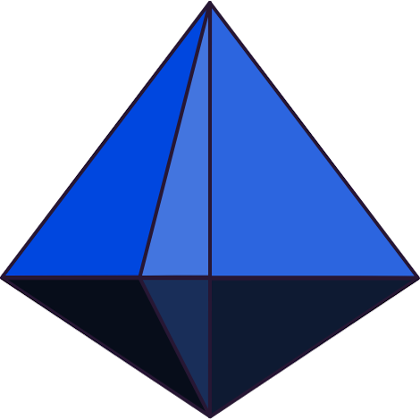
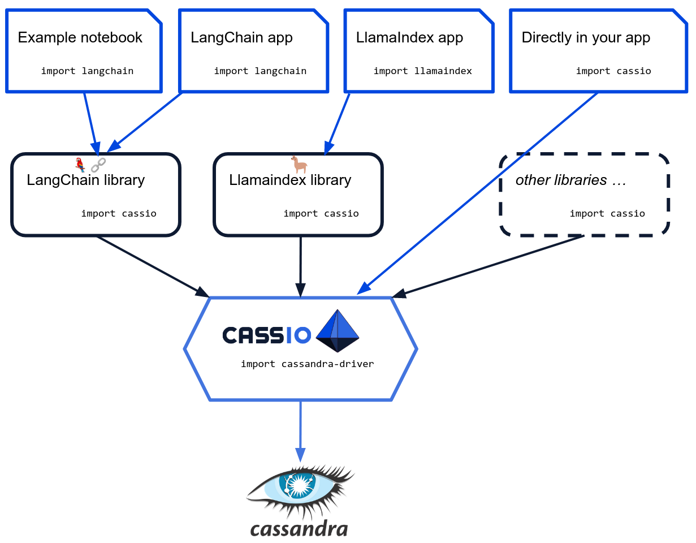

## Overview

[CassIO](https://cassio.org/) is the ultimate solution for seamlessly integrating Astra DB and Apache Cassandra® with generative artificial intelligence and other machine learning workloads. This powerful Python library simplifies the complicated process of accessing the advanced features of the Cassandra database, including vector search capabilities. With CassIO, developers can fully concentrate on designing and perfecting their AI systems without any concerns regarding the complexities of integration with Cassandra.

While CassIO can be used directly in your application, most often the library is used as the core engine
powering integration with third-party LLM-oriented frameworks, such as LangChain or LlamaIndex.

To find out more, stay up to date, and get plenty of code examples and demos, please
head over to [cassio.org](httos://cassio.org).

