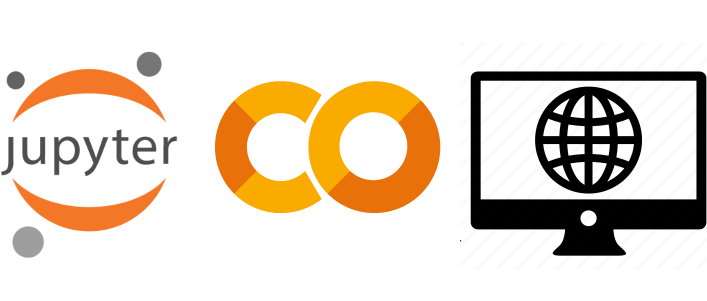

**Vector Search and GenAI, a curated collection of demo notebooks and apps.**

## Notebooks

This is a collection of quickstarts and tutorials, available either
as stand-alone [Jupyter](/docs/pages/tools/notebooks/jupyter/)
or Google Colab notebooks (usually both),
and involving Astra DB and generative AI --
specifically, vector-search-powered use cases.

| Overview | Prerequisites | Links |
|---|---|---|
| Learn about using Vector Search to find content related to a query, and then pass that to an LLM to understand how the RAG pattern works for AI powered chatbots.   | You will need an **Astra account** with a **Serverless Cassandra with Vector Search** database. Moreover, an **OpenAI API Key** is required. |    Or, <a href="https://github.com/awesome-astra/docs/blob/main/docs/pages/tools/notebooks/Retrieval_Augmented_Generation_(for_AI_Chatbots).ipynb">download the notebook</a>.|
| Learn how to use Vector Similarity Search to find images based on natural language descriptions using CLIP. | You will need an **Astra account** with a **Serverless Cassandra with Vector Search** database. |    Or, <a href="https://github.com/awesome-astra/docs/blob/main/docs/pages/tools/notebooks/astra_vsearch_image.ipynb">download the notebook</a>.|
| Try a simple Question-Answering demo powered by a vector-capable database instance. You will use the Astra integration for LangChain and OpenAI for the embeddings and the LLM (Large-Language-Model). | You will need an **Astra account** with a **Serverless Cassandra with Vector Search** database. Moreover, an **OpenAI API Key** is required. |    Or, <a href="https://github.com/awesome-astra/docs/blob/main/docs/pages/tools/notebooks/Quickstart_QA_Search_with_LangChain.ipynb">download the notebook</a>.|
| Understand Vector Search and the RAG pattern by building a simple generator of "philosophical quotes" which uses Astra for storage and OpenAI for retrieval+generation. | You will need an **Astra account** with a **Serverless Cassandra with Vector Search** database. Moreover, an **OpenAI API Key** is required. | Notebooks (including Colab links) hosted by [openai-cookbook](https://github.com/openai/openai-cookbook/tree/main/examples/vector_databases/cassandra_astradb). |

If you open the notebooks in Colab, and would like to make changes to them, choose "Save a copy in Drive" from the File menu in Colab.

## Sample applications

Check this section for full applications making use of Vector Search,
Astra DB and other GenAI technologies.

- AI-powered ["Hotel search demo"](https://github.com/CassioML/langchain-hotels-app#readme) (uses Vector Search and GenAI personalization; has a one-click "open in Gitpod" button)
- AI-powered ["FLARE QA on PDF files"](https://github.com/CassioML/langchain-flare-pdf-qa-demo#readme) application (vector-search-based question-answering client+API setup; has a one-click "open in Gitpod" button)

