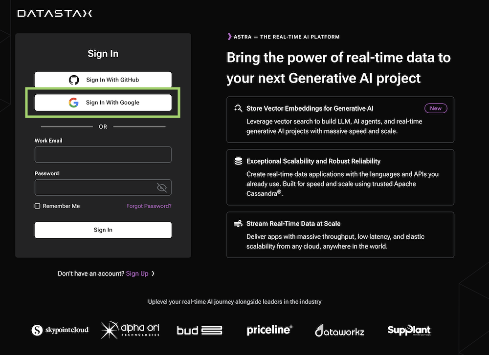

<link rel="stylesheet" href="https://maxcdn.bootstrapcdn.com/font-awesome/4.6.1/css/font-awesome.min.css">

## A - Overview

ASTRA DB is the simplest way to run Cassandra with zero operations. **No credit card required** and $25.00 USD credit every month (_roughly 20M reads/writes, 80GB storage monthly_) which is sufficient to run small production workloads.

[https://astra.datastax.com](https://astra.dev/3B7HcYo) is the URL create an account and get started with the solution.

<a href="https://astra.datastax.com" class="md-button">
  <i class="fa fa-sign-in" ></i>&nbsp;Sign Up to Astra
</a>

## B - Sign Up

You can use your `Github`, `Google` accounts or register with an `email`.

### 1. Sign In with Github

???+ note "Click the `[Sign In with Github]` button"

    

??? note "1️⃣ Click `Continue` on the OAuth claims delegation"

    The OAuth2 delegation screen from github is asking for permissions.

    

??? success "2️⃣ You are redirected to the homepage"

    

### 2. Sign In with Google

??? note "1️⃣ Click the `[Sign In with Google]` button"

    

??? success "2️⃣ You are redirected to the homepage"

    

### 3. Sign Up

??? note "1️⃣ Click the `Sign up` on the bottom of the page"

    

??? note "2️⃣ Provide your information and validate the captcha"

    

??? note "3️⃣ Accept terms and policies"

    

    Astra is now looking for you to validate your email adress

    

??? note "4️⃣ Open the mail in your inbox and validate with the `Verify my email` link"

    

    - Astra will show a validation message, select **Click Here to proceed**.

    

    - Select **back to application**
    

??? success "5️⃣ You are redirected to the homepage"

    

## C - Account and Organization

### 1. Overview

When you create an account your personal **Organization** is created, **this is your tenant**:

- The name of the organization is your email address, _(1) in the picture below_
- The unique identifier (GUID) is present in the URL on the dashboard. _(2) in the picture below_

### 2. Organization Objects

`Databases`, `Tenants` and `Security Tokens` objects are created within the organization, as shown on the Organization Dashboard.

### 3. Multiple Organizations

You can create multiple organizations through the **`Manage Organizations`** menu option and invite other users to join as well. It is useful when the same database could be accessed by multiple users with different emails.

As a consequence a user can be part of multiple organizations; the personal organization created during registration, new user-defined organizations, and shared organizations.

