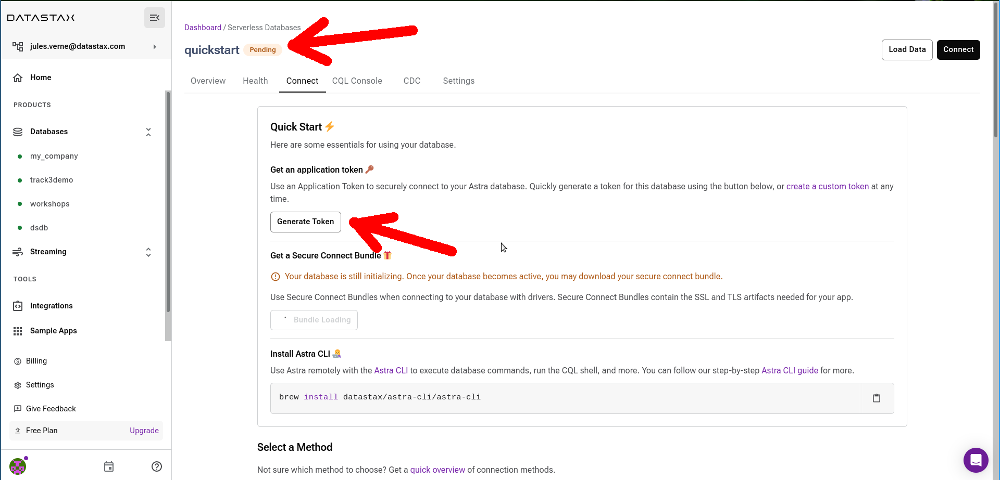

<b> 📖 Reference Documentation and resources</b>

<ol>
<li><a href="https://docs.datastax.com/en/astra/docs/creating-your-astra-database.html"><b>📖  Astra Docs</b> - The Astra database creation procedure</a>
<li><a href="https://www.youtube.com/watch?v=hzZ3nVrsEpM&list=PL2g2h-wyI4SpWK1G3UaxXhzZc6aUFXbvL&index=2"><b>🎥 Youtube Video</b> - Walk through instance creation</a>
</ol>

## A - Overview

**`ASTRA DB`** is the simplest way to run Cassandra with zero operations - just push the button and get your cluster. No credit card required and $25.00 USD credit every month (_roughly 20M reads/writes, 80GB storage monthly_) which is sufficient to run small production workloads.

## B - Prerequisites

- You should have an [Astra account](https://astra.dev/3B7HcYo). If you don't have one yet, keep reading and we'll show you how to create it.

## C - Procedure

**✅ Step 1: Click the `Create Account` button to login or register.**

You can use your `Github`, `Google` accounts or register with an `email`. Make sure to chose a password with a minimum of 8 characters, containing upper and lowercase letters, and at least one number and special character.

> If you already have an Astra account, you can skip this step. Locate the "Create Database" button, as shown in the next step, and read on.

**✅ Step 2: Complete the creation form**

_If you are creating a new account, you will be brought to the DB-creation form directly._

Otherwise, get to the databases dashboard (by clicking on "Databases" in the left-hand navigation bar,
expanding it if necessary), and click the "Create Database" button on the right.

Take a moment to fill the form:

- **ℹ️ Fields Description**

| Field              | Description                                                                                                                                                                                                                       |
| ------------------ | --------------------------------------------------------------------------------------------------------------------------------------------------------------------------------------------------------------------------------- |
| **database name**  | It does not need to be unique, is not used to initialize a connection, and is only a label (keep it between 2 and 50 characters). It is recommended to have a database for each of your applications. The free tier is limited to 5 databases. |
| **keyspace**       | It is a logical grouping of your tables (keep it between 2 and 48 characters). Prefer lower case or `snake_case`, and avoid spaces.                                                                                                                  |
| **Cloud Provider** | Choose whatever you like. Click a cloud provider logo, pick an Area in the list and finally pick a region. We recommend choosing a region that is closest to you to reduce latency. In free tier, there is very little difference.                      |

You will be brought to the "Connect" page of the database, that is being provisioned in the meantime. You can track the progression by looking at the status label at the top, next to the database's name. _It should take a couple of minutes for your database to become `Active`._

**✅ Step 3: Obtain a Database Token**

While the database is created, you can generate and download a [Token](/docs/pages/astra/create-token/) to later access it from your applications.
The automatically-generated token has a "reasonable" set of permissions (limited to this database), but you can also generate a custom token to better suit your needs.

To generate the token click on the "Generate Token" button. The new token can (and should!) be copied elsewhere with the clipboard-icon button and/or downloaded in JSON format for safe storage - it will not be shown anymore once you leave the dialog.

**✅ Step 4: Ready**

In a couple of minutes, the database will switch to `Active`. You can now interact with it,
for example by [downloading a Secure Connect Bundle](/docs/pages/astra/download-scb/)) and start running applications that access it.
