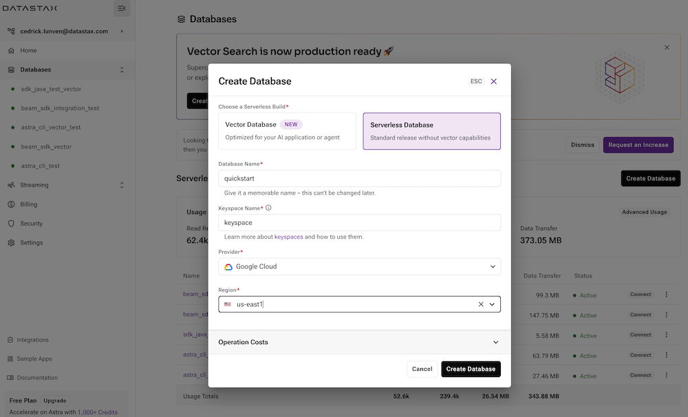

<b> 📖 Reference Documentations and resources</b>

<ol>
<li><a href="https://docs.datastax.com/en/astra/docs/creating-your-astra-database.html"><b>📖  Astra Docs</b> - The Astra database creation procedure</a>
<li><a href="https://www.youtube.com/watch?v=hzZ3nVrsEpM&list=PL2g2h-wyI4SpWK1G3UaxXhzZc6aUFXbvL&index=2"><b>🎥 Youtube Video</b> - Walk through instance creation</a>
</ol>

## A - Overview

**`ASTRA DB`** is the simplest way to run Cassandra with zero operations at all - just push the button and get your cluster. No credit card required, $25.00 USD credit every month, roughly 5M writes, 30M reads, 40GB storage monthly - sufficient to run small production workloads.

## B - Prerequisites

- You should have an [Astra account](http://astra.datastax.com/). If you don't have one yet, keep reading and we'll show you how to create it.

## C - Procedure

**✅ Step 1:Click the `sign-in` button to login or register.**

You can use your `Github`, `Google` accounts or register with an `email`. With the latest make sure to chose a password with minimum 8 characters, containing upper and lowercase letters, at least one number and special character.

> If you already have an Astra account, skip this step, locate and click the "Create Database" button on the left-side navigation bar
> of your Astra UI, and read next step.

**✅ Step 2: Complete the creation form**

_As you create a new account, you will be prompted to create a database; you will see the same form if you simply
hit the "Create database" button in your existing Astra account._

- **ℹ️ Fields Description**

| Field              | Description                                                                                                                                                                                                                       |
| ------------------ | --------------------------------------------------------------------------------------------------------------------------------------------------------------------------------------------------------------------------------- |
| **database name**  | It does not need to be unique and not used to initialize a connection but only a label (Between 2 and 50 characters). It is recommended to have a database for each of your application. The free tier is limited to 5 databases. |
| **keyspace**       | It is a logical grouping of your tables. (Between 2 and 48 characters), Please use lower cases and `snake_case`.                                                                                                                  |
| **Cloud Provider** | Use the one you like, click a cloud provider logo, pick an Area in the list and finally pick a region. We recommend to pick one the closes to you to readuce latencies but in free tier very few difference.                      |

- ℹ️ `Create Database` button becomes enabled only when all fields are filled properly. Please use only lower cases and no space for a keyspace name.

- ℹ️ You will see your new database `pending` in the Dashboard.The status will change to `Active` when the database is ready, this will only take 2-3 minutes. You will also receive an email when it is ready.

**👁️ Walkthrough**

