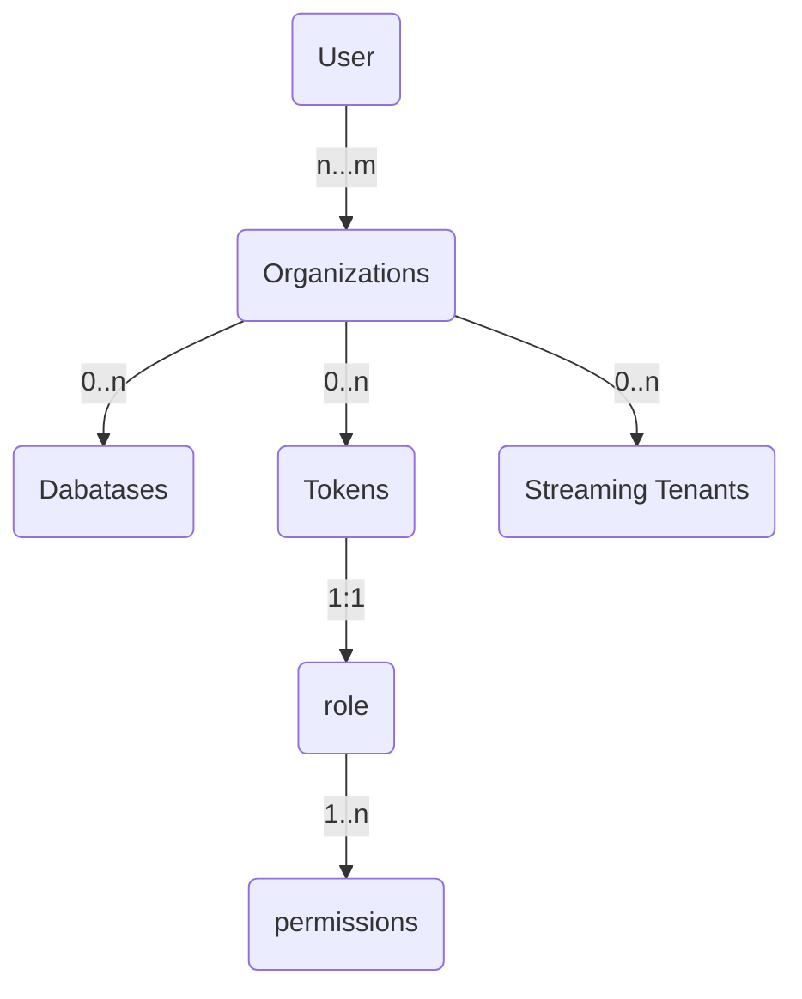
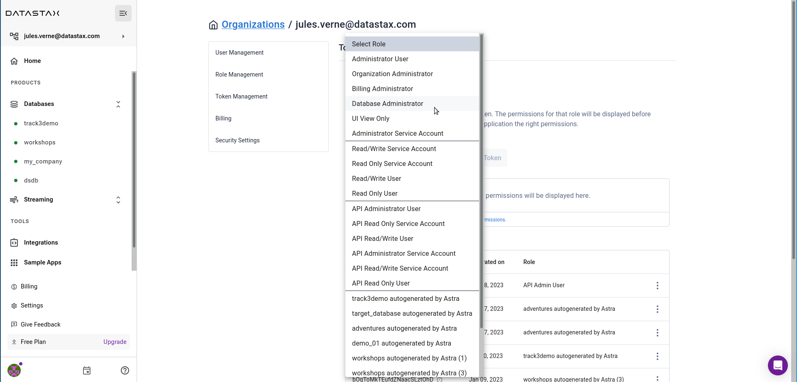
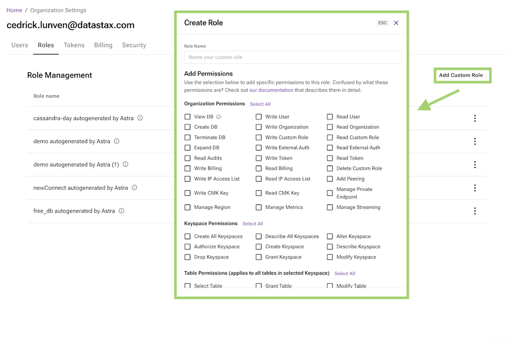
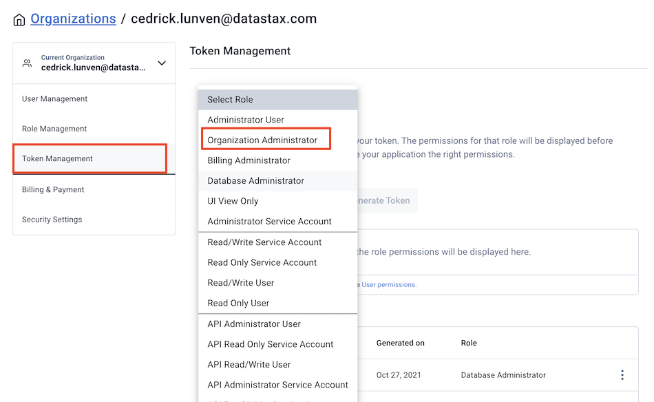
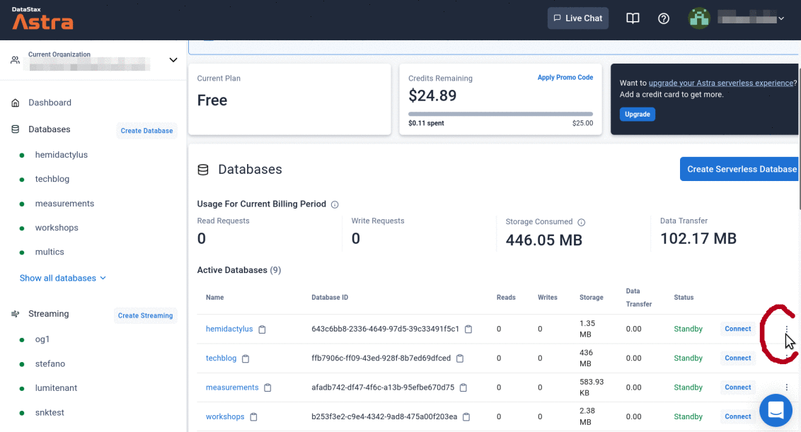

<link rel="stylesheet" href="https://maxcdn.bootstrapcdn.com/font-awesome/4.6.1/css/font-awesome.min.css">

!!! abstract "Reference Documentations and resources"

    <ol>
        <li><i class="fa fa-book" ></i>&nbsp;<a href="https://docs.datastax.com/en/astra/docs/manage-application-tokens.html"><b>Astra Docs</b> - The Astra token creation procedure</a>
        <li><i class="fa fa-youtube-play" ></i>&nbsp;<a href="https://www.youtube.com/watch?v=TUTCLsBuUd4"><b>Youtube Video</b> - Walk through token creation</a>
        <li><i class="fa fa-youtube-play" ></i>&nbsp;<a href="https://youtu.be/k5b5TiafAAM?list=PL2g2h-wyI4SpWK1G3UaxXhzZc6aUFXbvL&t=81"><b>Youtube Video</b> - More about token and roles in Astra</a>
    </ol>

## A - Overview

As stated in the [Create Account](create-account) page the security token are associated to one and only one organization and only one role.

There are some predefined roles within an organizations associated with some default permissions. The full list of permissions per roles is available in [Astra Documentation](https://docs.datastax.com/en/astra/docs/user-permissions.html)

 <i>Figure 1: Default Roles</i>

 <i>Figure 2: Permissions for a role here `Database Administrator`</i>

it is also possible to create a custom roles and associate fined grained permissions. (`Organizations Settings / Role Managennt`)

 <i>Figure 3: Custom Roles screen</i>

## B - Prerequisites

**To create a new token:**

- You should have an [Astra account](http://astra.datastax.com/)

## C - Procedure

??? note "1️⃣ Open the Organization settings panel"

    On the top left hand corner locate the panel `Current Organization` with your email address. Use the chevron down **&#8964;** to open the menu and pick `Organizations Settings`

    

??? note "2️⃣ Open the token management page"

    On the new page, select `Token Management` in the menu. Then use the `Select Roles` combo to select `Organization Administrator` role. This is the administrator of your tenant with all permissions.

    

    ??? tip "The same page can be accessed from the dashboard"

        You can reach the Token Management page directly from the ellipsis menu next to your database in the main Astra dashboard. Expand to see how

        

??? note "3️⃣ Save the token as a CSV."

    The values of `clientSecret` and `token` will not be shown to you later for security reasons. Do not share those values and never commit them on github.

    

???+ note "4️⃣ Walkthough."

    

??? tip "Copy values in the clipboard"

    You can use the clipboard icons close to each parameter to clip them and copy them elsewhere.

    
