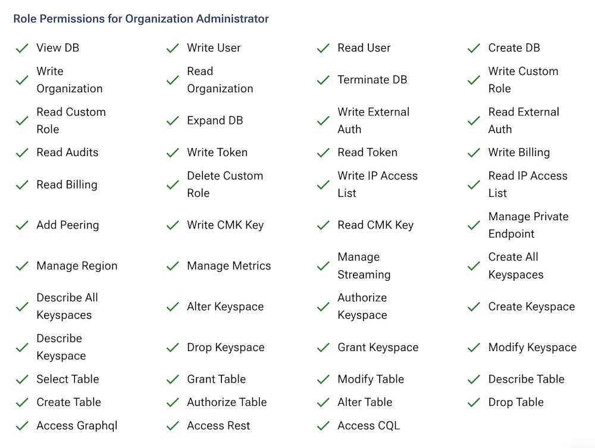
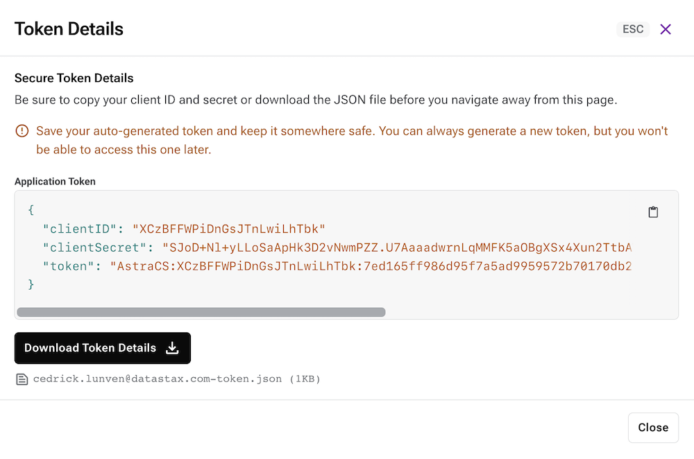

<link rel="stylesheet" href="https://maxcdn.bootstrapcdn.com/font-awesome/4.6.1/css/font-awesome.min.css">

## A - Overview

> <i class="fa fa-book"></i> A page also exists in the <a href="https://docs.datastax.com/en/astra/docs/manage-application-tokens.html">Astra Reference Documentation</a>

As stated in the [Create Account](/docs/pages/astra/create-account/) page, the security token is associated to one and 
only one organization and only one role. There are a set of predefined roles within an organization which are associated 
with some default permissions. The full list of permissions and roles is available in the 
[Astra Documentation](https://docs.datastax.com/en/astra/docs/user-permissions.html).

**Default roles available for a token:**

> ```
> Administrator User
> Organization Administrator
> Billing Administrator
> Database Administrator
> UI View Only
> Administrator Service Account
> Read/Write Service Account
> Read Only Service Account
> Read/Write User
> Read Only User
> API Administrator User
> API Read Only Service Account
> API Read/Write User
> API Administrator Service Account
> API Read/Write Service Account
> API Read Only User
> ```

**Permissions for a role** _(here Organization Administrator got access to everything)_

> <p/>
> 

**Custom Roles**

It is possible to manually create custom roles and tune the corresponding permissions in a fine-grained fashion (`Settings / Role Management`), to later create tokens based on them.
For example, each time [a database is created](/docs/pages/astra/create-instance/), it comes with an autogenerated brand-new token, backed by an ad-hoc custom role essentially scoped to that database only.

> <p/>
> 


## B - Prerequisites

**To create a new token:**

- You should have an [Astra account](https://astra.dev/3B7HcYo)

## C - Procedure

_Note that a token, albeit with a fixed set of permissions, is generated_
_automatically for you as [a database is created](/docs/pages/astra/create-instance/). In many cases, however, you need_
_to manually issue tokens, and here is explained how to do that._

1️⃣ First go to the Organization settings panel in one of the following ways:

???+ note "Settings page"

    On the bottom-right corner of the Astra UI, in the navigation bar, click on "Settings" next to the cog icon. (The navigation bar might be collapsed to the left). Then, select the "Token management" entry in the Settings menu.

    

??? note "From a database"

    Click on the "..." next to a database in the main DB dashboard, then select "Generate a Token".

    

??? note "From the Connect tab"

    On the Connect tab of your database, click on the "create a custom token" link in the Quickstart section.

    

2️⃣ Pick the desired role for the token in the drop-down list and click "Generate".

> <p/>
> 

3️⃣ A new token is generated for you. Make sure to copy/download the values before leaving the page, since the secrets will not be shown anymore. You can copy the individual secrets with the button next to the text fields, or directly download the whole token as a file and store it safely.

> <p/>
> 

??? tip "Anatomy of a Token"

    The Token is in fact three separate strings: a _Client ID_, a _Client Secret_ and
    the _token proper_.
    You will need some of these strings to access the database, depending on the type of access you plan.
    Although the Client ID, strictly speaking, is not a secret, you should
    regard this whole object as a secret and make sure not to share it inadvertently (e.g. committing
    it to a Git repository) as it grants access to your databases.

    

4️⃣ The token will not expire, unless you decide to revoke (i.e. delete) it, for example in case it is compromised. To do so, in the "Token Management" page, click on the "..." menu next to the token you want to delete.

> <p/>
> 

!!! abstract "Reference Documentation and resources"

    <ol>
        <li><i class="fa fa-book" ></i>&nbsp;<a href="https://docs.datastax.com/en/astra/docs/manage-application-tokens.html"><b>Astra Docs</b> - The Astra token creation procedure</a>
        <li><i class="fa fa-youtube-play" ></i>&nbsp;<a href="https://www.youtube.com/watch?v=TUTCLsBuUd4"><b>Youtube Video</b> - Walk through token creation</a>
        <li><i class="fa fa-youtube-play" ></i>&nbsp;<a href="https://youtu.be/k5b5TiafAAM?list=PL2g2h-wyI4SpWK1G3UaxXhzZc6aUFXbvL&t=81"><b>Youtube Video</b> - More about token and roles in Astra</a>
    </ol>