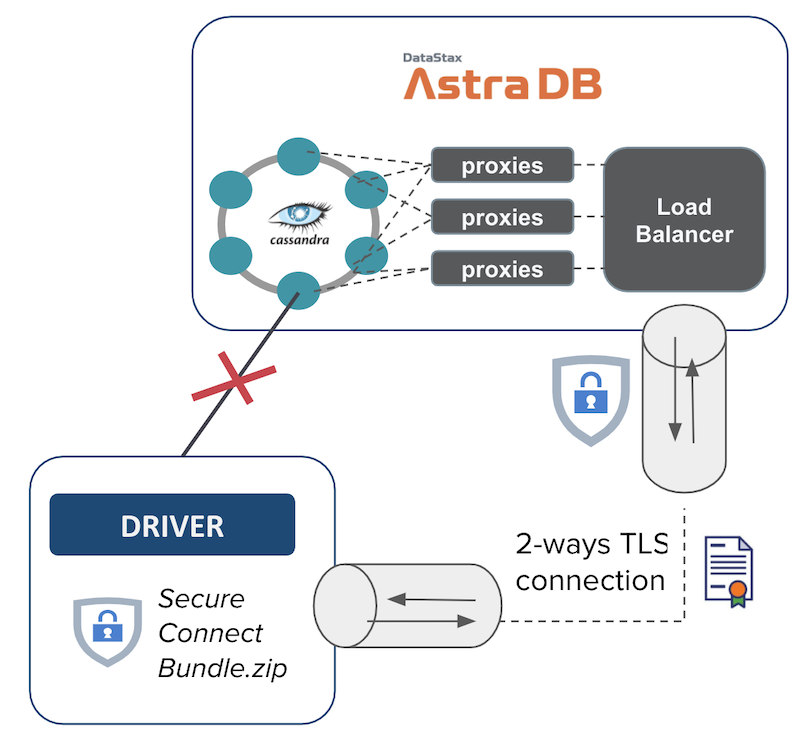
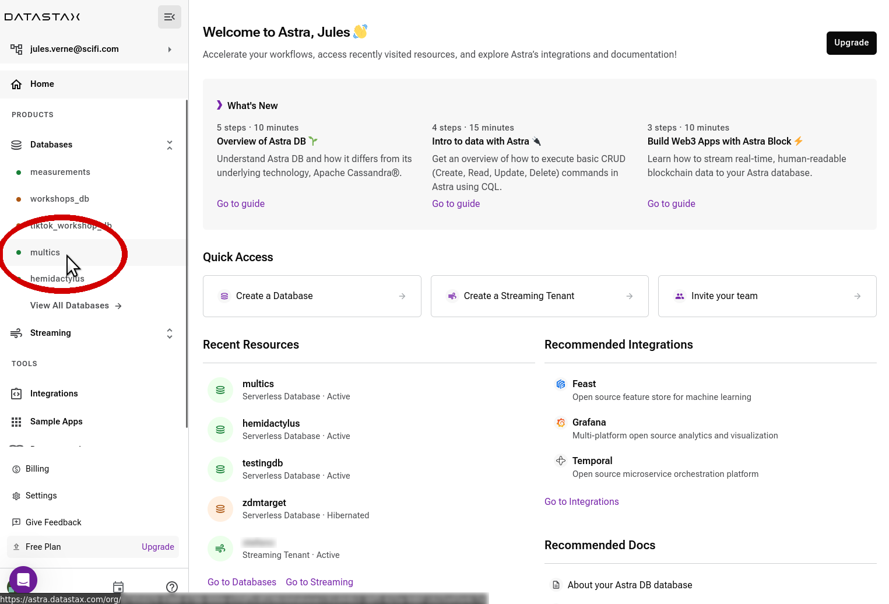
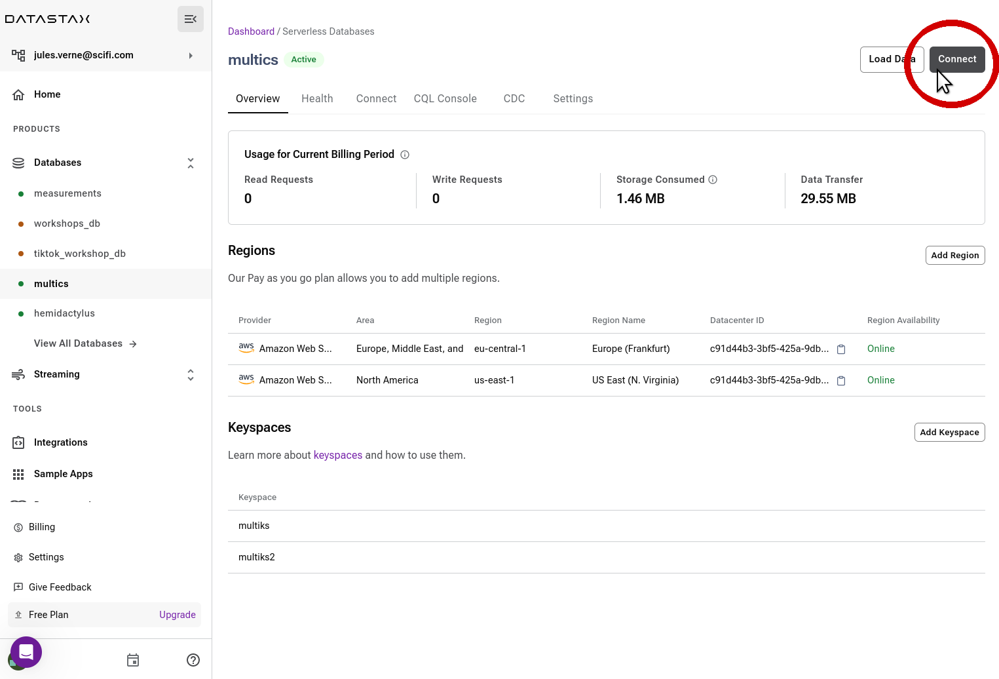
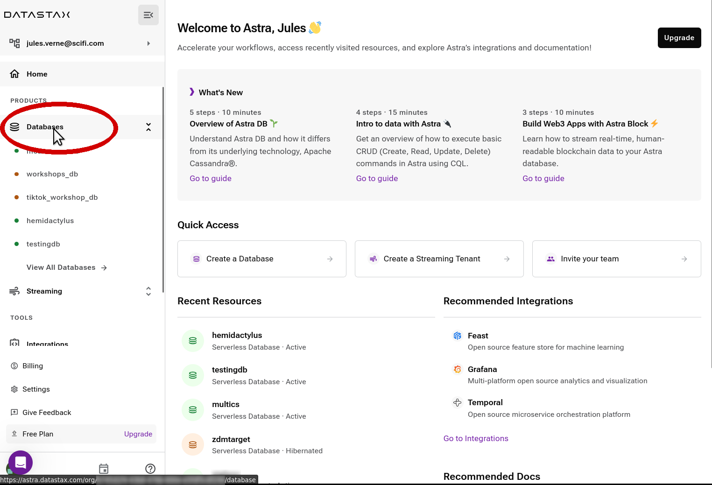
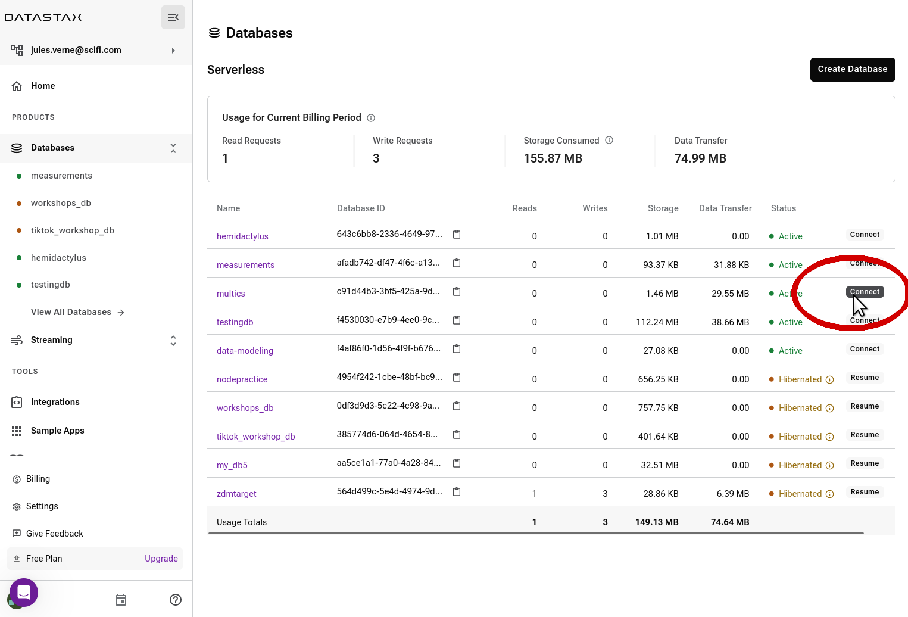
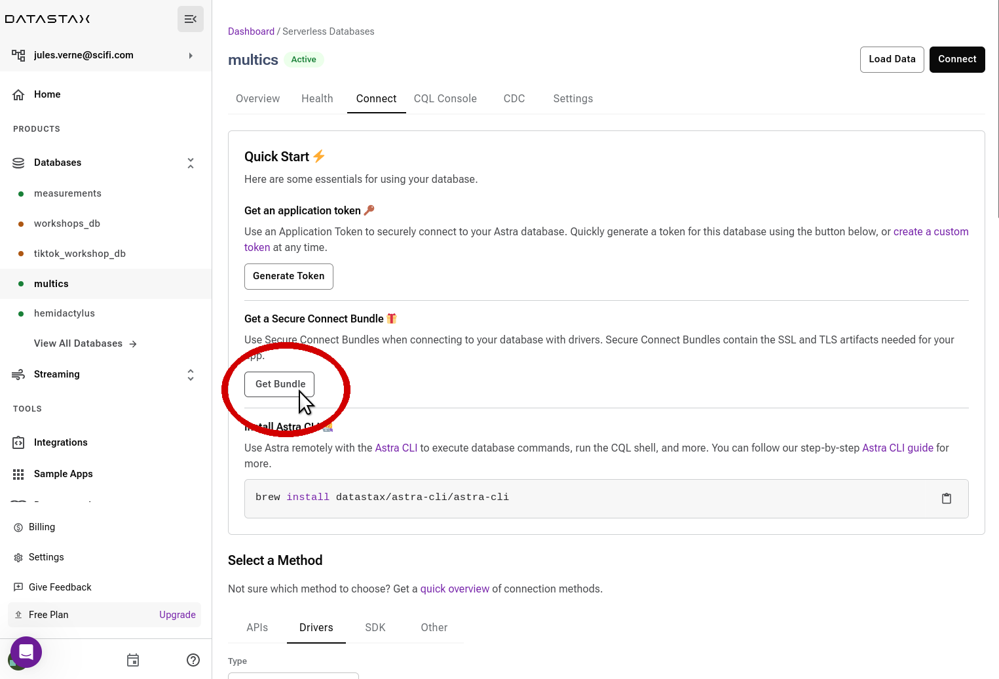
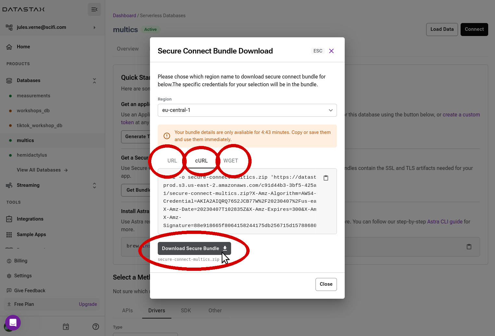

<b> 📖 Reference Documentation and resources</b>

<ol>
<li><a href="https://docs.datastax.com/en/astra-serverless/docs/connect/secure-connect-bundle.html"><b>📖  Astra Docs</b> - Download Cloud Secure Bundle</a>
<li><a href="https://www.youtube.com/watch?v=PNQM-Bsyibg&list=PL2g2h-wyI4SpWK1G3UaxXhzZc6aUFXbvL&index=7"><b>🎥 Youtube Video</b> - Walk through secure </a>
</ol>

## A - Overview

To initialize a **secured** 2-way TLS connection between clients and Astra x509 certificates are needed. The strong authentication is key for maximum security and still benefits from robust driver features (health-check, load-balancing, fail-over). Under the hood the protocol SNI over TCP is used to contact each node independently.

The configuration and required certificates are provided to the user through a zip file called the **secure connect bundle** which can be downloaded for each **DATABASE REGION**. This means that a database deployed across multiple regions will have one secure connect bundle per region. _(1 region = 1 underlying Apache Cassandra™ datacenter)_

## B - Prerequisites

- You should have an [Astra account](https://astra.dev/3B7HcYo)
- You should [Create an Astra Database](/docs/pages/astra/create-instance/)

## C - Procedure

**✅ Step 1 : Go to your database's Connect Quick Start**

Once you sign in and land on your Astra Home, reach the Quick Start page for
the database whose Secure Connect Bundle you want to obtain.
You can do so either through the database list in the left-panel navigation bar,
or from the Databases overview in the main panel:

??? note "From the navigation bar"

    The right-hand navigation bar lists your most commonly-used databases under the "Databases"
    heading. Click on the desired database.

    

    _(Note: the side navigation bar might be collapsed. Click on the "DS" logo at the top to expand it.)_

    The main panel will show the database-specific dashboard. Locate the "Connect"
    button on the top right and click on it.

    

??? note "From the overall database dashboard"

    Alternatively, click on the "Databases" entry in the left-hand
    navigation bar to get to the main databases dashboard.

    

    _(Note: the side navigation bar might be collapsed. Click on the "DS" logo at the top to expand it.)_

    Locate the desired database in the list in the main panel and click on the corresponding
    "Connect" button in the table.

    

**✅ Step 2 : Download the bundle ZIP**

The "Quick Start" section features a "Get Bundle" button. Click on it to bring up
the download-bundle dialog.

Your database might be multi-region (remember there is a separate bundle for each DB region).
In the dialog, choose the desired region for which you need the bundle:
**a download URL is now generated for you**. You now have several options
to download the file:

1. get the file directly with the "Download Secure Bundle" button;
2. copy the generated URL to the bundle, by clicking on the "clipboard" icon, and use it wherever you want (within a few minutes, before the link expires);
3. directly copy a ready-made `cURL` command to paste in a console and have the downloaded bundle zipfile there;
4. similar to the previous case, but using the `wget` console utility.

#### Remarks

- If you download the file directly, be aware that most browsers will give you the option to open the zip file directly. _Do not do that, save it locally instead_: the bundle zipfile has to be passed
  to the drivers as is!

- The link to the bundle zipfile will expire a few minutes after it is generated. If you wait too long,
  you might end up with a faulty bundle. As a check, make sure the zipfile you downloaded is around 12-13 KB in size.
