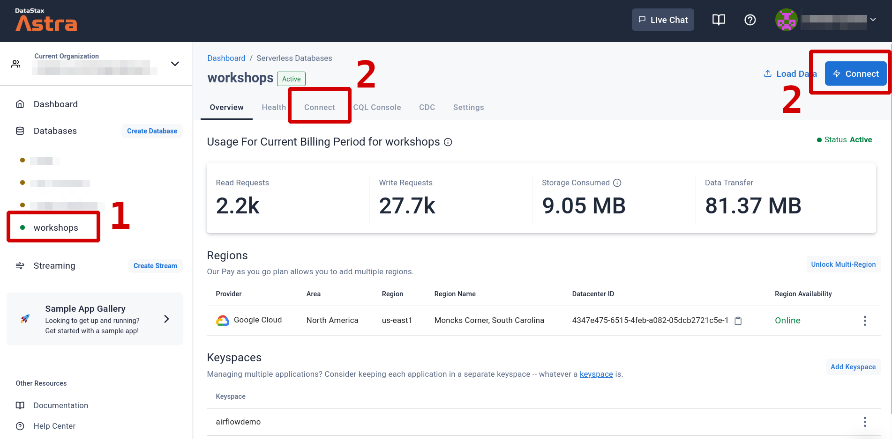
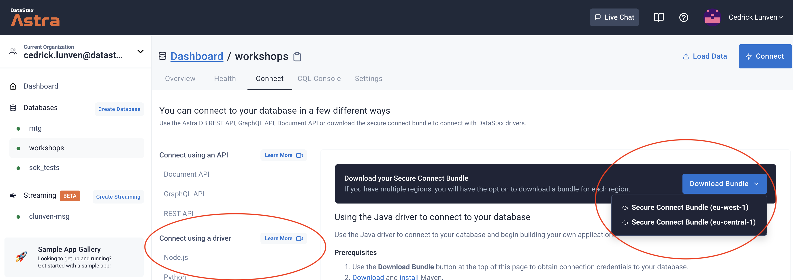

<b> 📖 Reference Documentations and resources</b>

<ol>
<li><a href="https://docs.datastax.com/en/astra/docs/obtaining-database-credentials.html"><b>📖  Astra Docs</b> - Download Cloud Secure Bundle</a>
<li><a href="https://www.youtube.com/watch?v=PNQM-Bsyibg&list=PL2g2h-wyI4SpWK1G3UaxXhzZc6aUFXbvL&index=7"><b>🎥 Youtube Video</b> - Walk through secure </a>
</ol>

## A - Overview

To initialize a **secured** 2-way TLS connection between clients and Astra x509 certificates are needed. The strong authentication is key for maximum security and still benefit from greatest drivers features(health-check, load-balancing, fail-over). Under the hood the protocol SNI over TCP is used to contact each node independently.

The configuration and required certificates are provided to user through a zip file called the **secure connect bundle** that can be downloaded for each **DATABASE REGION**. Meaning a database deployed across multiple regions will have one secure connect bundle per region. _(1 region = 1 underlying Apache Cassandra™ datacenter)_

## B - Prerequisites

- You should have an [Astra account](http://astra.datastax.com/)
- You should [Create and Astra Database](/astra-create-instance)

## C - Procedure

**✅ Step 1 : Select your database**

Once signed in Astra the list of available databases is located in the menu on the left.

- Select the database you want to work with by clicking on it.

- Click on the TAB `CONNECT` or the big blue button `[CONNECT]` on the top right hand corner.

**✅ Step 2 : Download the ZIP**

- On this screen look for **`Connect using a driver`**. You can pick any of the options `Node.js` (`javascript`), `Python` or `Java`. **It will be the same file downloaded.**

- Click on `Download Bundle` and eventually select the region you want to use

- Click on target region to be able to copy the link locally.

#### Remarks

- Most browsers will give you the option to open the zip file directly. _Do not do that, save it whole instead_: the bundle zipfile will be passed
  to the drivers as it is!

- The generated link to the bundle zipfile will expire a few minutes after it is generated. If you download the bundle **much later** after you have reached the "Connect" page,
  you might end up with a faulty bundle. As a check, make sure the zipfile you downloaded is around 12-13 KiB in size.
