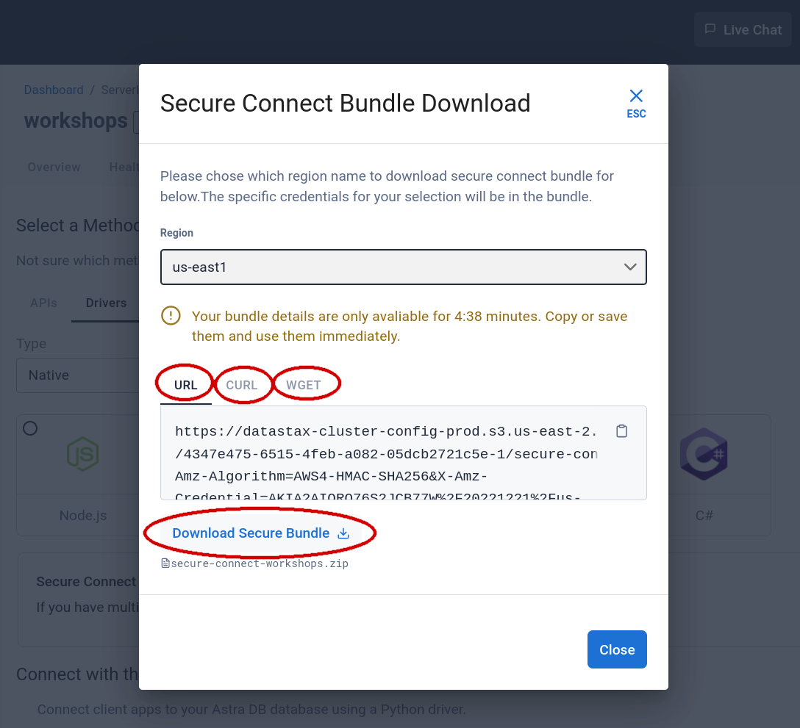

<b> 📖 Reference Documentation and resources</b>

<ol>
<li><a href="https://docs.datastax.com/en/astra-serverless/docs/connect/secure-connect-bundle.html"><b>📖  Astra Docs</b> - Download Cloud Secure Bundle</a>
<li><a href="https://www.youtube.com/watch?v=PNQM-Bsyibg&list=PL2g2h-wyI4SpWK1G3UaxXhzZc6aUFXbvL&index=7"><b>🎥 Youtube Video</b> - Walk through secure </a>
</ol>

## A - Overview

To initialize a **secured** 2-way TLS connection between clients and Astra x509 certificates are needed. The strong authentication is key for maximum security and still benefits from robust driver features (health-check, load-balancing, fail-over). Under the hood the protocol SNI over TCP is used to contact each node independently.

The configuration and required certificates are provided to the user through a zip file called the **secure connect bundle** which can be downloaded for each **DATABASE REGION**. This means that a database deployed across multiple regions will have one secure connect bundle per region. _(1 region = 1 underlying Apache Cassandra™ datacenter)_

## B - Prerequisites

- You should have an [Astra account](https://astra.dev/3B7HcYo)
- You should [Create an Astra Database](/docs/pages/astra/create-instance/)

## C - Procedure

**✅ Step 1 : Select your database**

Once you sign in, locate the list of available databases on the left navigation bar.

- Select the database that you want to work with.

- Click on the `Connect` tab or the `"Connect"` blue button in the upper right hand corner.

**✅ Step 2 : Download the ZIP**

- On this screen, make sure you pick the **"Drivers"** connection method, and then the **"Native"** type in the drop-down (as opposed to the "Cloud" type).

- Pick any of the available languages, it does not matter: the bundle zipfile _is one and the same_.

- Click on `Download Bundle` and select the region that you want to use.

You now have several options:

1. get the file directly with the "Download Secure Bundle" button;
2. copy the generated URL to the bundle and use it wherever you want (within a few minutes before the link expires);
3. directly copy a ready-made `cURL` command to paste in a console and have the downloaded bundle zipfile there;
4. same as before but using the `wget` console utility.

#### Remarks

- If you download the file directly, be aware that most browsers will give you the option to open the zip file directly. _Do not do that, save it locally instead_: the bundle zipfile has to be passed
  to the drivers as is!

- The link to the bundle zipfile will expire a few minutes after it is generated. If you wait too long,
  you might end up with a faulty bundle. As a check, make sure the zipfile you downloaded is around 12-13 KB in size.
