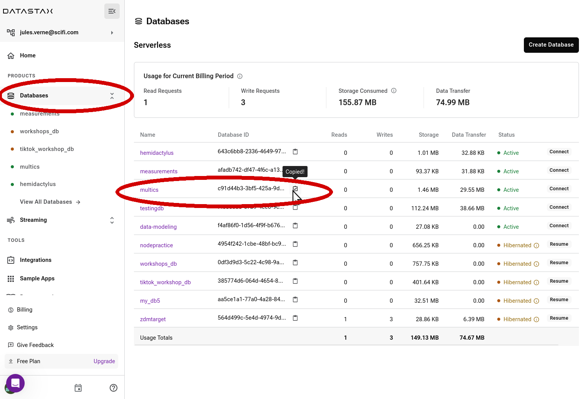
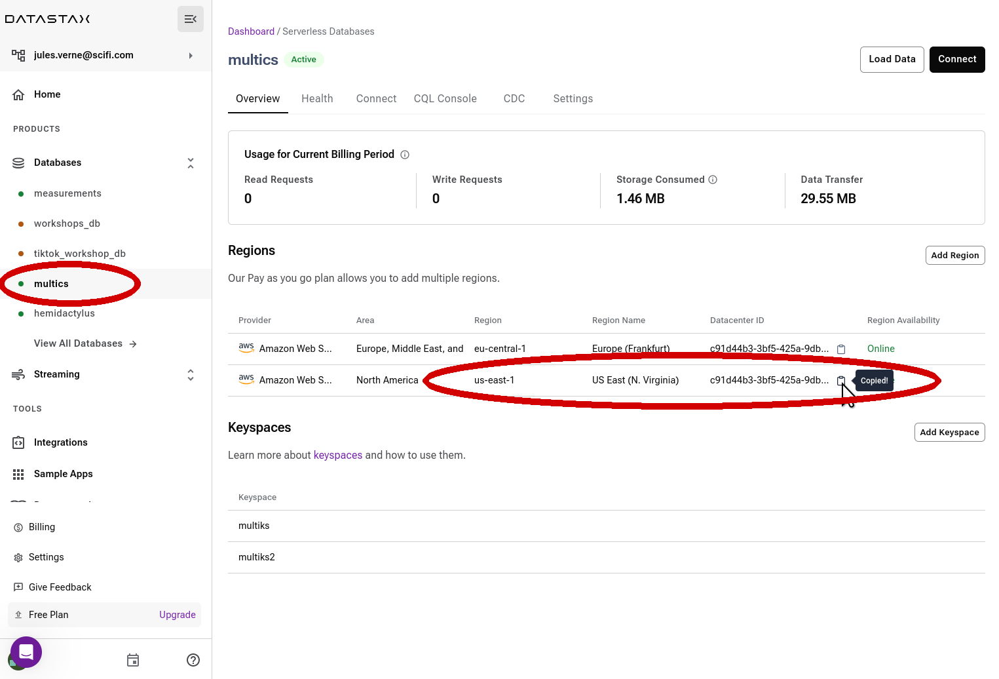
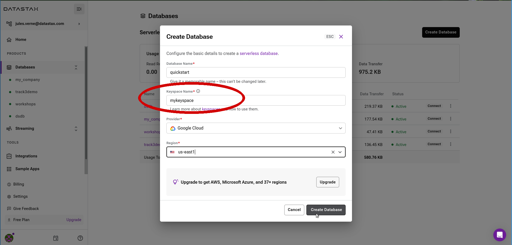
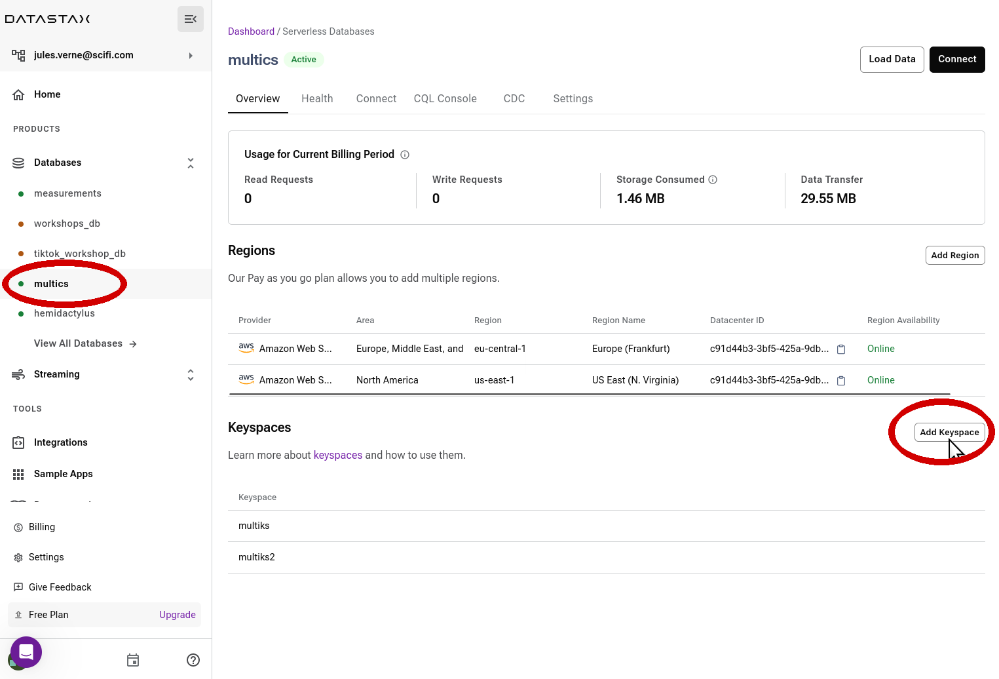
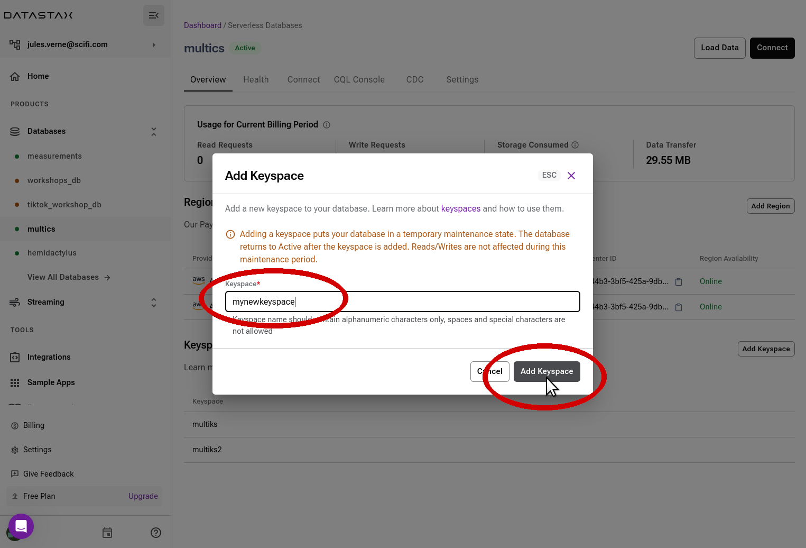
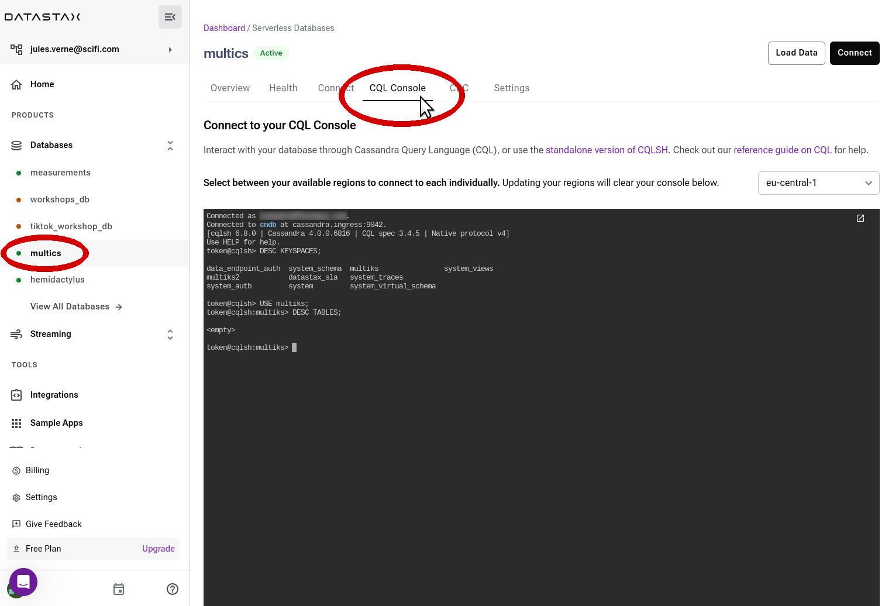

## Questions List

- [Where should I find a **database identifier** ?](#where-should-i-find-a-database-identifier)
- [Where should I find a **database region** name ?](#where-should-i-find-a-database-region-name)
- [How do I **create a keyspace or a namespace** ?](how-do-i-create-a-namespace-or-a-keyspace)
- [How to open the **Web CQL Console?**](#how-to-open-the-web-cql-console)

## Where should I find a database identifier ?

The database `id` is a unique identifier (`GUID`) for your database.
You can find it on the main dashboard of Astra DB,
reachable by clicking "Databases" on the left-side navigation bar.
Copy it to your clipboard by clicking on the small 📋 icon.

_(Note: the side navigation bar might be collapsed. Click on the "DS" logo at the top to expand it.)_

Remember that, unlike the database `id`, the database **name** is not necessarily unique in an organization.
That is, with reference to the above image, one could have more than one `multics` databases, each with a different `id`.

## Where should I find a database region name ?

A database can span one or more regions.
Each region will have a "Datacenter ID" and a "Region".
The "Region" is the one used in the API endpoints.

Reach the dashboard specific to the database by either:

- clicking on the DB name in the left navigation bar,
- clicking on the DB name in the overall "Databases" list (reachable by clicking "Databases" in the navigation bar).

The "Overview" page for the database lists all regions in a table.
In the example below, you see two regions, identified by `eu-central-1` and `us-east-1`.

Should you need the ID of a certain Datacenter, simply click on the clipboard icon
next to the ID to copy it.

## How do I create a namespace or a keyspace ?

In Astra DB, "namespace" and "keyspace" mean exactly the same thing, i.e. mainly a logical grouping of tables.
There are two ways to create them.

#### At DB-creation time

When creating a [new database](/docs/pages/astra/create-instance/), you automatically create a keyspace in it:

#### Add a keyspace to an existing database

From the database's dashboard, find the "Add Keyspace" button in the "Keyspaces" section of the dashboard and click on it.

_You can access your database dashboard by clicking its name either in the navigation bar on the left or on the overall "Databases" main panel._

Keep in mind that in order to add a keyspace, the database must be in "Active" state - [resume it](/docs/pages/astra/resume-db/) first if necessary.

The database will switch to `Maintenance` mode for a few seconds, but no fear: all running applications are still able to access other keyspaces in the database.

## How to open the Web CQL Console?

To access the CQL Console for a certain database, go to the
dashboard for the database (clicking on the DB name on the left-hand navigation bar)
and simply select the "CQL Console" tab in the main panel.

An in-browser Web-based console to exchange CQL commands with the database will be
available in few seconds, already connected to your database.

_Note: if your database spans multiple regions, your will have the possibility to choose a region for the connection. Each choice of a region will completely reset the console._
