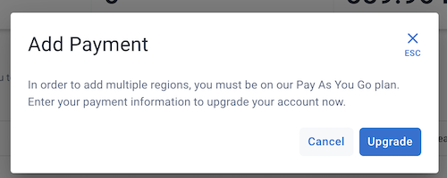
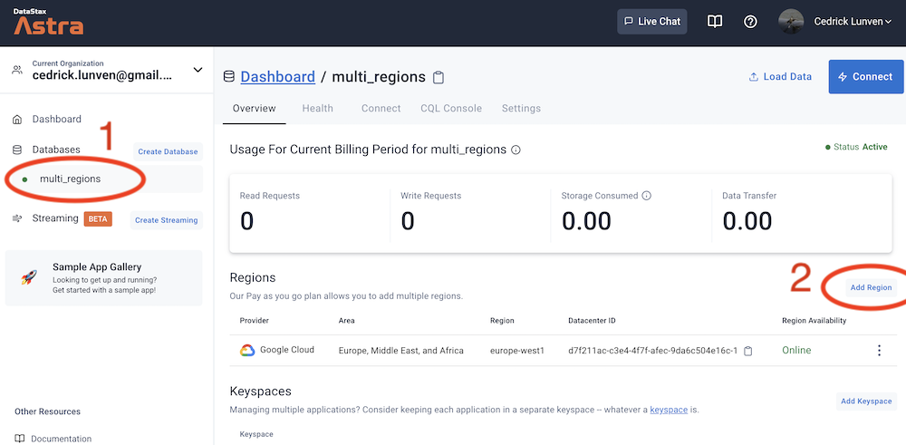
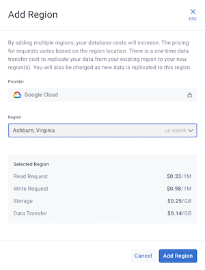
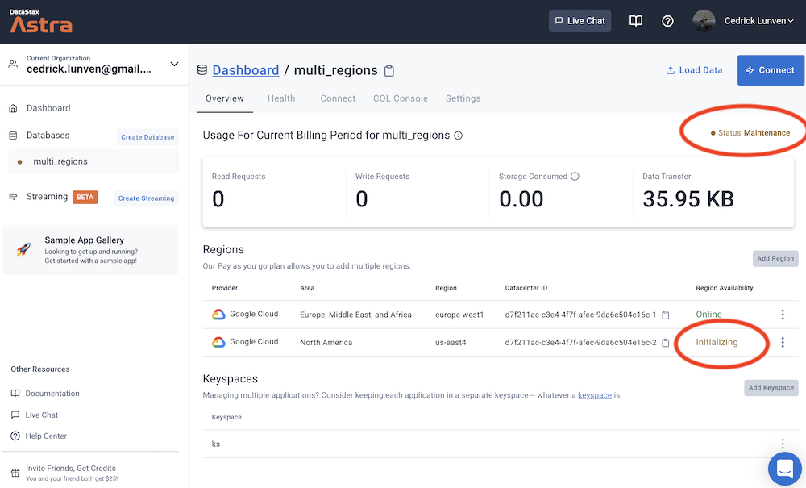
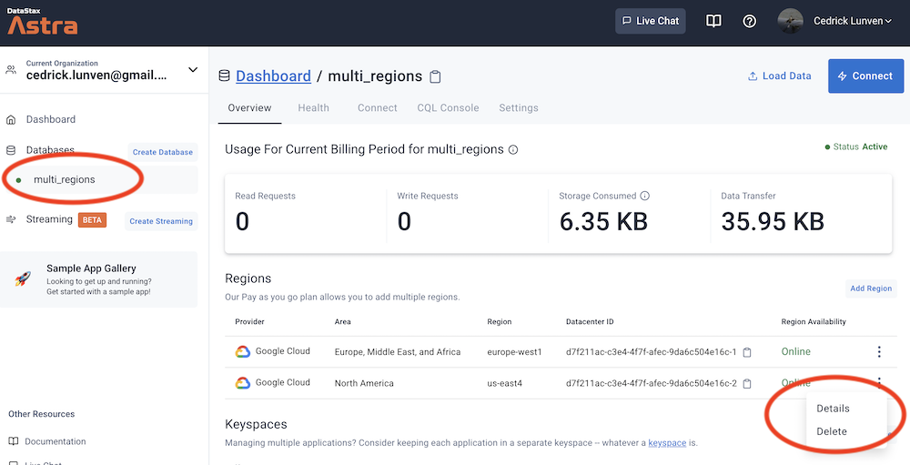
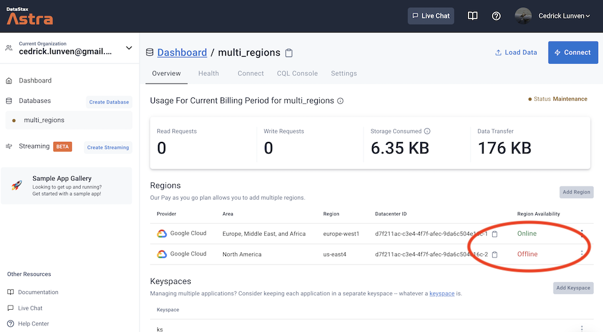

<b> 📖 Reference Documentation and resources</b>

<ol>
<li><a href="https://docs.datastax.com/en/astra/docs/db-multi-region.html"><b>📖  Astra Docs</b> - Reference documentation</a>
<li><a href="https://www.youtube.com/watch?v=UMkX41Y0yZE"><b>🎥 Youtube Video</b> - Walk through instance creation</a>
</ol>

## A - Overview

`AstraDB` allows you to replicate data across multiple regions to maintain data availability for multi-region application architectures. Configuring multiple regions can also satisfy data locality requirements and save money.

### 🔄 Eventual Consistency

Apache Cassandra® and DataStax Astra DB follow the eventual consistency model. As a result, data written to one datacenter/region may not be immediately accessible in other datacenters/regions in the same database cluster. It normally only takes a few minutes to fully replicate the data. However, it could take longer, and possibly span one or more days. There are several contributing factors to the latter scenario; such as the workload volume, the number of regions, the process that runs data repair operations, and network resources.

### ⚖️ Data sovereignty

Astra DB serverless replicates all data in the database to all of a database’s regions. By contrast, multiple keyspaces in Apache Cassandra® and DataStax Enterprise (DSE) allow a database to replicate some tables to a subset of regions. To achieve the same behavior as Cassandra or DSE, create a separate Astra DB instance that adheres to the necessary region restrictions. The database client will need to add a separate connection for the additional database and send queries to the appropriate connection depending on the table being queried.

### ⚠️ Limitations

- Lightweight transactions only work for a single-region datacenter.
- If your original region is disconnected, schema changes are suspended and repairs do not run. If any regions are disconnected, the writes to those regions will not be forwarded.
- While adding a new region, you cannot drop a table or keyspace and you cannot truncate a table.
- If any region is not online, you cannot truncate a table.

## B - Prerequisites

- You should have an [Astra account](http://astra.datastax.com/)

- You should have a **CREDIT CARD** in the system **AND/OR** have **MORE THAN 25$** in Astra Credits.

## C - Create a new Region

**✅ Step 1: Click the `Add Region` Button**

- Select the database to show the Dashboard and select `Add Region.`

**✅ Step 2: Select your region**

- Select your desired region from the dropdown menu.

- Your selected region and the costs appear below the dropdown menu. You can add only a single region at a time.

**✅ Step 3: Validate your region**

- Select Add Region to add the region to your database.

- The database with switch to Maintenance status. Do not worry, the existing regions will remain active and available for operations. There is no downtime.

After you add the new region, your new region will show up in the list of regions on your database Dashboard.

After the initialization, you will get:

## D - Delete a new Region

**✅ Step 1: Select Region to delete**

- From your database Dashboard, select the overflow menu for the database that you want to delete and select Delete. You will notice that you CANNOT delete the original main region.

**✅ Step 2: Validate your action**

- Removing a region is not reversible so proceed with caution. A pop-up will ask you to validate this operation by entering the `delete` word.

- The database will switch to Maintenance mode. After a few seconds, you will see the status of the deleted regions change from `Active` to `Offline`.

- Finally the region will not be visible in the Regions list.

