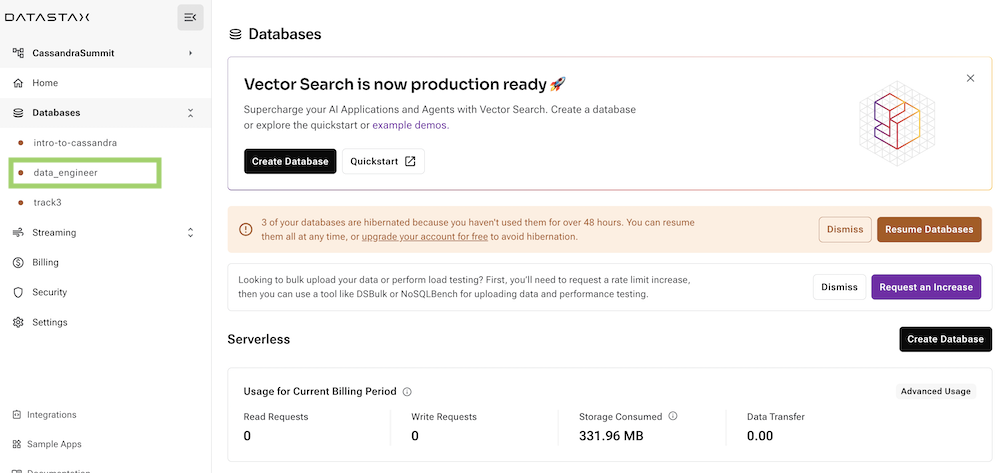
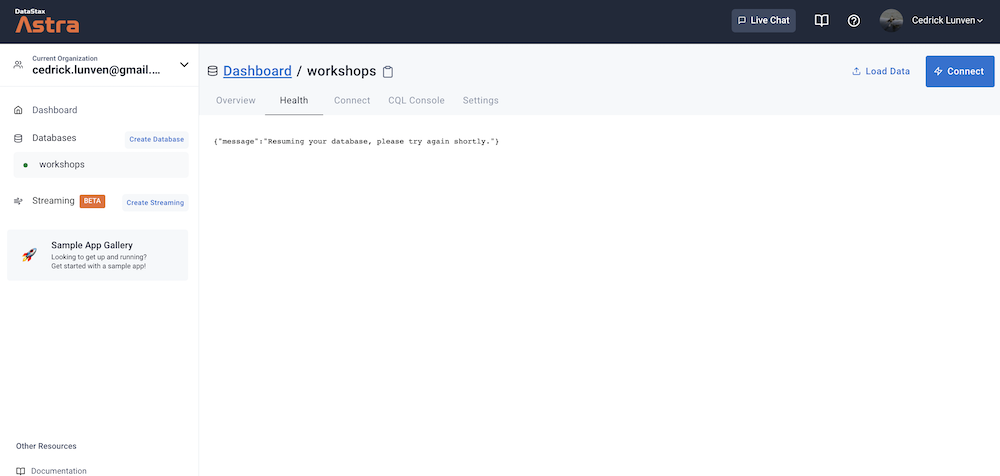

## A - Overview

In the free tier _(serverless)_, after `23 hours`, your database will be **hibernated** and the status will change to **StandBy**.

From there it needs to be resumed or **the first request will fail**. This first request will also change the database to `Active` mode after a few seconds.

## B - Prerequisites

- You should have an [Astra account](http://astra.datastax.com/)

## C - Procedure

The idea here is to trigger a harmless request by accessing the Health tab. This action will cause the Database to resume.

**✅ Step 1: Trigger a request**

- Access the database by clicking its name in the menu on the left.

- Select the Health check tab.

- Wait for a minute for the database to exit hibernation.

