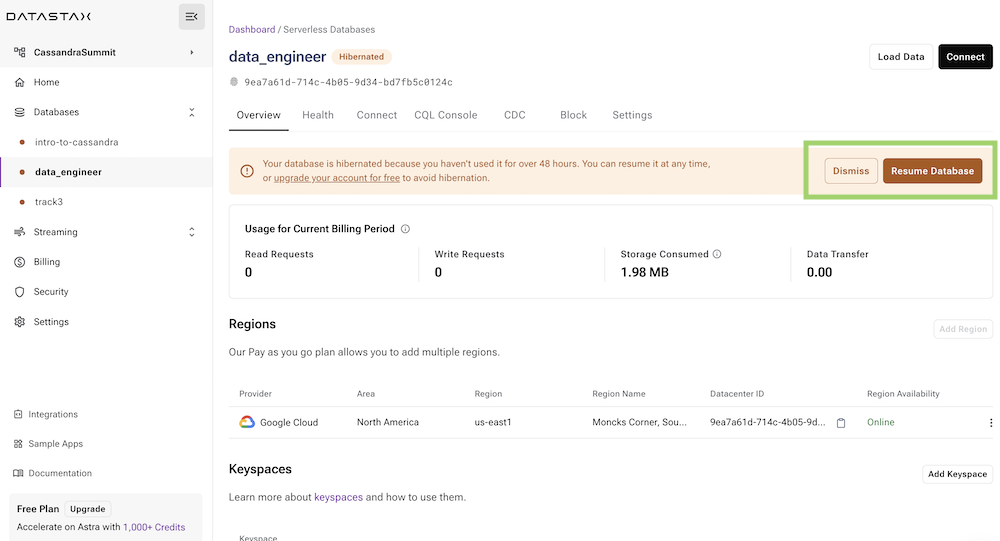
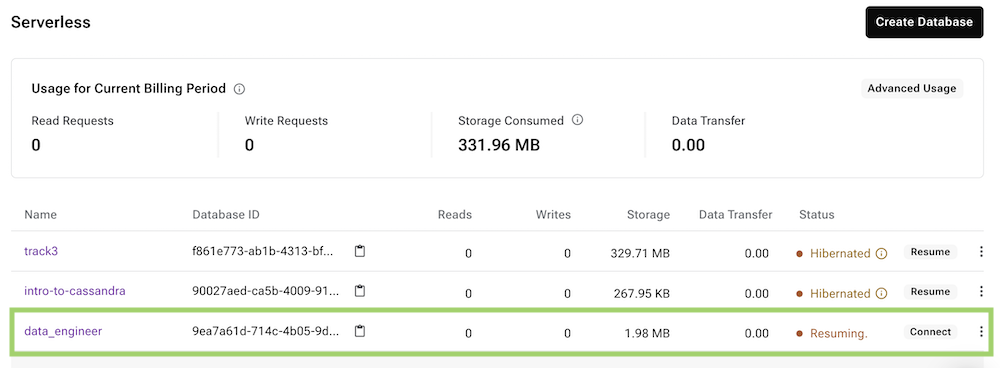
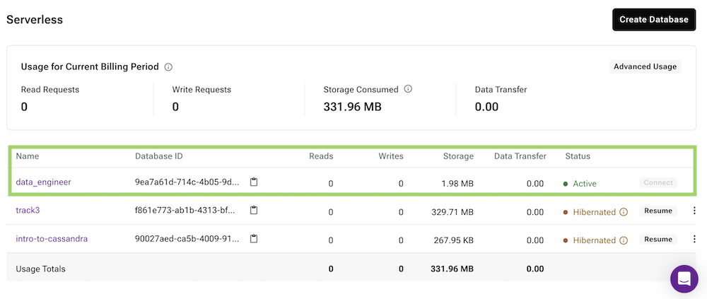

## A - Overview

In the free tier _(serverless)_, after `48 hours` of inactivity, your database will be **hibernated** and the status will change to **Hibernated**. From there it needs to be resumed, there are multiple ways to do it.

## B - Prerequisites

- You should have an [Astra account](https://astra.dev/3B7HcYo)

## C - Procedure

**✅ Option 1: Resume with button in the User interface**

- Access the database by clicking its name in the menu on the left.



- Once the database is selected, on any tab you will get the `Resume Database` button available at top.


**✅ Option 2: Resume with the CLI**

Assuming you have the [Astra CLi](astra-cli.md) installed and setup.

```
astra db resume <my_db>
```

**✅ Option 3: Resume with a first request to the database**

Invoking and Stargate endpoints associated with your database will also trigger resuming. You would have to replace the `dbId`, `dbRegion` and `token` below with values for your environment.

```bash
curl --location \
     --request GET 'https://{dbId}-{dbRegion}.apps.astra.datastax.com/api/rest/v2/schemas/keyspaces/' \
     --header 'X-Cassandra-Token: {token}'
```

You will get a `503` error with the following payload.

```json
{
  "message": "Resuming your database, please try again shortly."
}
```

- In the user interface the status changes to `resuming...`



- After a few seconds the database will be active.


