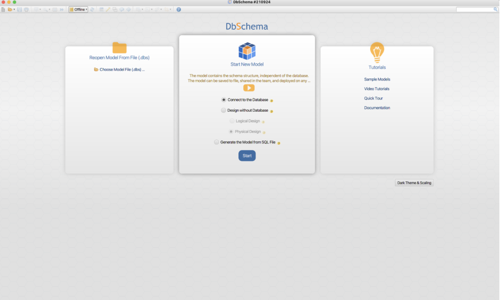
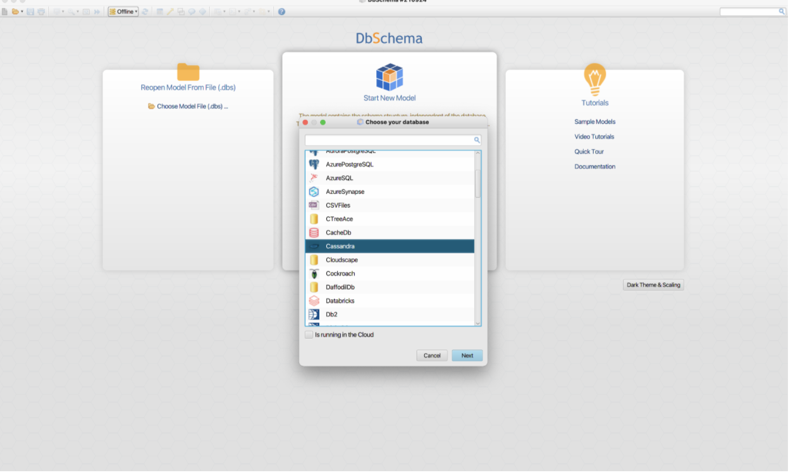
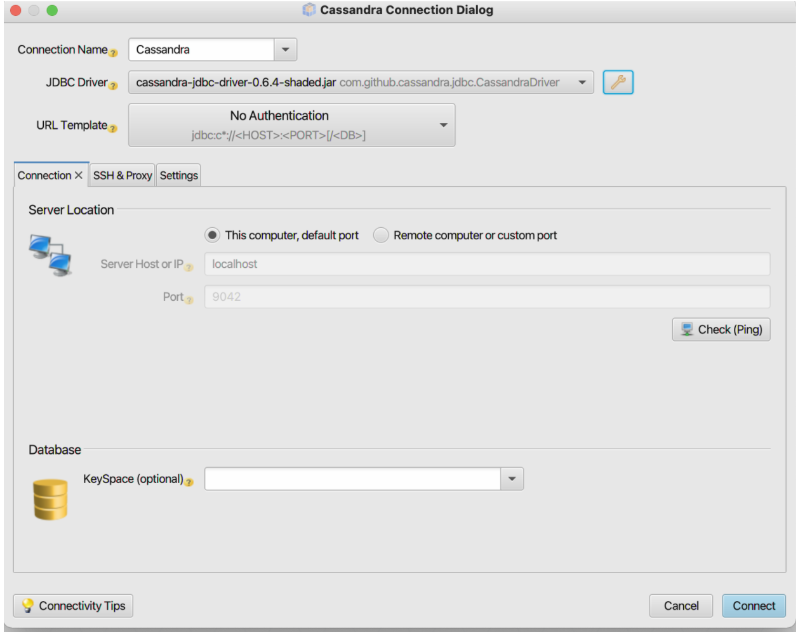
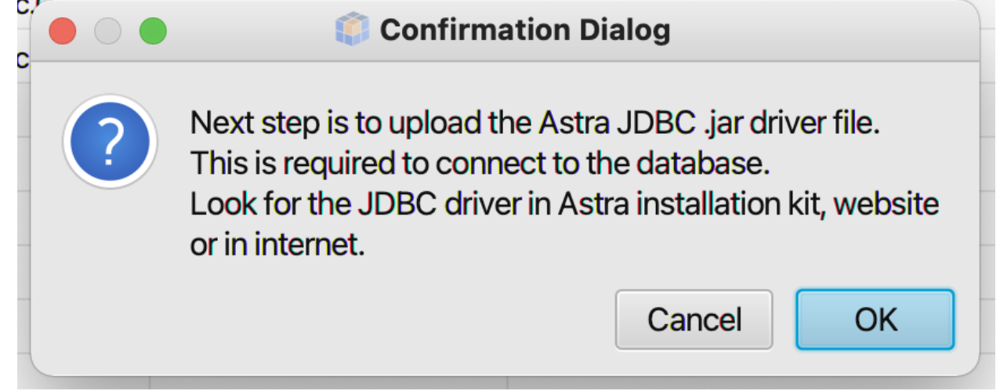
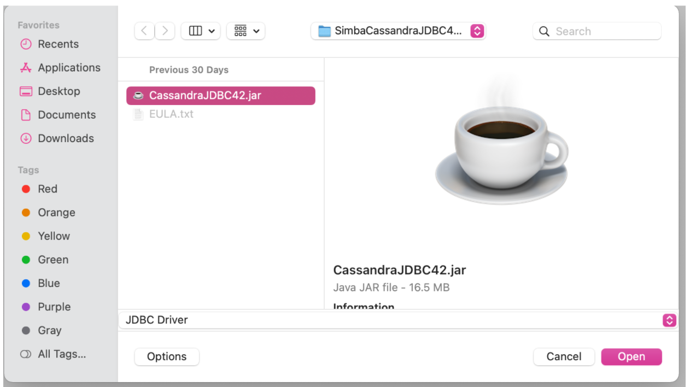
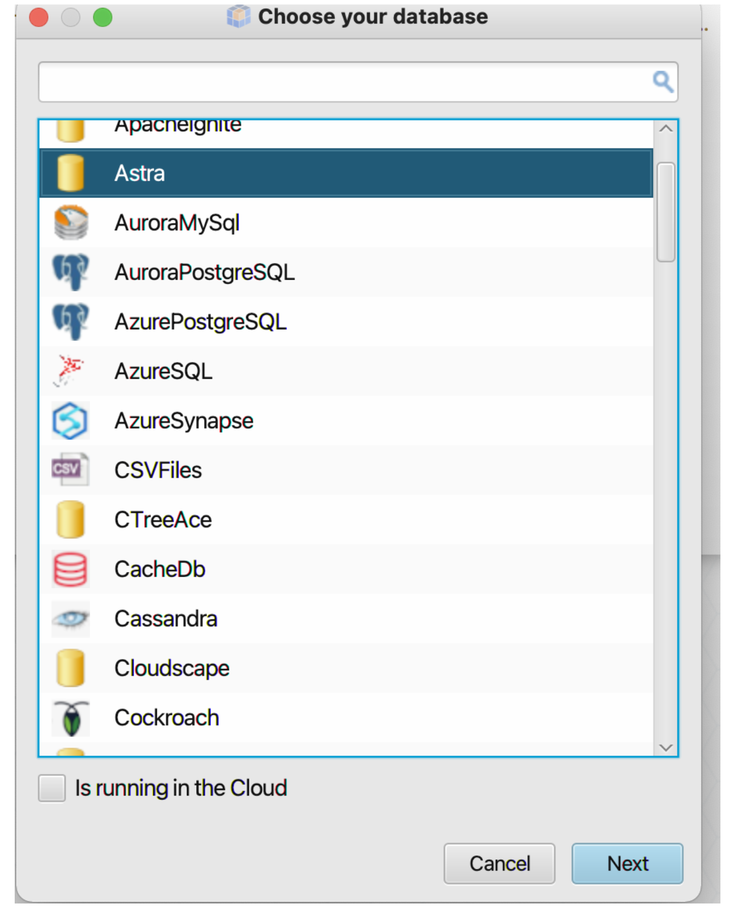
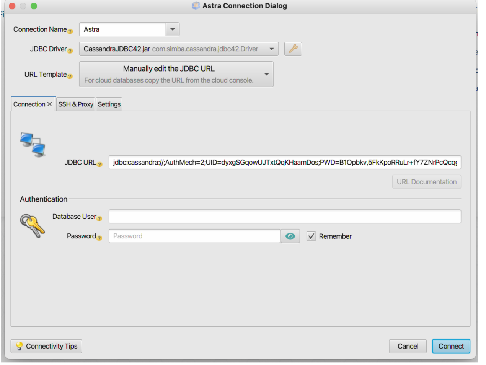

*Last Update {{ git_revision_date }}* 

<b> 📖 Reference Documentations and resources</b>

<ol>
<li><a href="https://docs.datastax.com/en/astra/docs/db-integration-dbschema.html"><b>📖 Astra Docs</b> - Reference documentation</a>
<li><a href="https://www.sestevez.com/astra-datagrip/">Instructions described in **Sebastian Estevez Blog post**</a>
</ol>

## A - Overview

DbSchema is a universal database designer for out-of-the-box schema management and documentation, sharing the schema in the team, and deploying on different databases. Visual tools can help developers, database administrators, and decision-makers to query, explore and manage the data.

- ℹ️ [Introduction to DBSchema](https://dbschema.com/features.html)
- 📥 [DBSchema Installation](https://dbschema.com/download.html)

DBSchema uses the [Simba JDBC driver](https://downloads.datastax.com/#odbc-jdbc-drivers) to connect to Cassandra as the storage backend. The Java driver itself supports connections to Astra DB natively.

## B - Prerequisites

- [Create an Astra Database](/pages/astra/create-instance/)
- [Create an Astra Token](/pages/astra/create-token/)
- [Download your secure connect bundle ZIP](/pages/astra/download-scb/)

This article assumes you have installed the latest version of DBSchema on your laptop or PC.

## C - Installation and Setup

**✅ Step 1: JDBC Driver**

Download the JDBC driver from the DataStax website:

1. Go to https://downloads.datastax.com/#odbc-jdbc-drivers.
2. Select **Simba JDBC Driver for Apache Cassandra.**
3. Select **JDBC 4.2.**
4. Read the license terms and accept it (click the checkbox).
5. Hit the blue **Download** button.
6. Once the download completes, unzip the downloaded file.

**✅ Step 2: Establish the Connection**

1. Open [DB Schema](https://dbschema.com/)
2. Select **Connect to the Database**
3. Select **Start**

4. In the **Choose your database** menu, select Cassandra.

5. Select **Next.**

6. Select **JDBC Driver** edit option.

7. In the JDBC Driver Manager, select **New**.
8. In the Add RDBMS window, enter **Astra** and select **OK**

9. Select **OK** in the confirmation message.

10. Upload the Simba JDBC Driver.
11. Select **Open**

12. Once you upload the Simba JDBC Driver, you will see **Astra** in the **Choose your Database **window. Select **Next**.

13. In the Astra Connection Dialog, add JDBC URL as
    `jdbc:cassandra://;AuthMech=<2>;UID=token;PWD=<ApplicationToken>;SecureConnectionBundlePath=<PATH TO YOUR SECURE CONNECT BUNDLE>;TunableConsistency=<6>` with the following variables:

    - **AuthMech:** Specifies whether the driver connects to a Cassandra or Astra DB database and whether the driver authenticates the connection.
    - **ApplicationToken:** Generated from Astra DB console. See [Manage application tokens.](https://docs.datastax.com/en/astra/docs/manage-application-tokens.html)
    - **SecureConnectionBundlePath:** Path to where your downloaded Secure Connect Bundle is located. See [Get secure connect bundle.](https://docs.datastax.com/en/astra/docs/obtaining-database-credentials.html)
    - **TunableConsistency:** Specifies Cassandra replica or the number of Cassandra replicas that must process a query for the query to be considered successful.

14. Select **Connect**

15. In the **Select Schemas/Catalogs**, select the keyspace to which you want to connect.
16. Select **OK.**

**✅ Step 4: Final Test**

Now that your connection is working, you can create tables, introspect your keyspaces, view your data in the DBSchema GUI, and more.

To learn more about DBSchema, see [Quick start with DBSchema](https://dbschema.com/tutorials.html)

[🏠 Back to HOME](https://awesome-astra.github.io/docs/) 