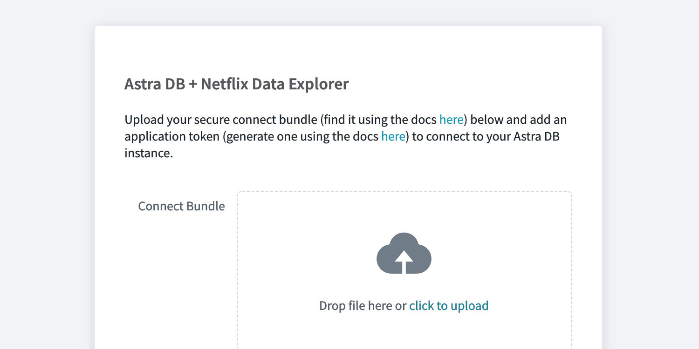

<details>
<summary><b> 📖 Reference Documentations and resources</b></summary>
<ol>
<li><a href="https://netflixtechblog.com/exploring-data-netflix-9d87e20072e3"><b>📖 Netlix Blog</b> - Introduction of the tool by Netflix</a>
<li><a href="https://github.com/Netflix/nf-data-explorer"><i class="fa fa-github"></i><b>Github Repository</b> - Core project </a>
<li><a href="https://github.com/DataStax-Examples/nf-data-explorer"><b>Github Repository</b> - Fork for Astra </a>
</ol>
</details>

## A - Overview

The Data Explorer by netflix is a web-based tools that will help you navigating and editing your data. It supports both **Cassandra** and **Dynomite** but here we will focus on **Astra**. There a few killer features

- **Multi Cluster Access**

Multi-cluster access provides easy access to all of the clusters in your environment. The cluster selector in the top nav allows you to switch to any of your discovered clusters quickly.


- **Explore your data**

The Explore view provides a simple way to explore your data quickly. You can query by partition and clustering keys, insert and edit records, and easily export the results or download them as CQL statements.


- **Schema Designer**

Creating a new Keyspace and Table by hand can be error-prone

Our schema designer UI streamlines creating a new Table with improved validation and enforcement of best practices.


- **Query IDE**

The Query Mode provides a powerful IDE-like experience for writing free-form CQL queries.


## B - Prerequisites

- You should have an [Astra account](https://astra.dev/3B7HcYo)
- You should [Create an Astra Database](/docs/pages/astra/create-instance/)
- You should [Have an Astra Token](/docs/pages/astra/create-token/)
- You should [Download your Secure bundle](/docs/pages/astra/download-scb/)

## C - Procedure

### C.1 Run Locally

> **Prerequisites:** You need `node`, `npm` and `yarn`

- Install Yarn on MAC

```bash
brew install yarn
```

- Clone the repository

```bash
git clone https://github.com/DataStax-Examples/nf-data-explorer.git
cd nf-data-explorer
```

- Install the dependencies (_expect a 2min build it will download quite some packages_)

```
yarn && yarn build
```

- Start the applications

```
yarn start
```

- Import your bundle

> Here are the instructions to get your [cloud secure bundle](/docs/pages/astra/download-scb/)

[](https://gitpod.io/#https://github.com/DataStax-Examples/nf-data-explorer)

### C.2 Execute with Gitpod

- Click the button

[](https://gitpod.io/#https://github.com/DataStax-Examples/nf-data-explorer)

- Open the application



- Import your bundle
