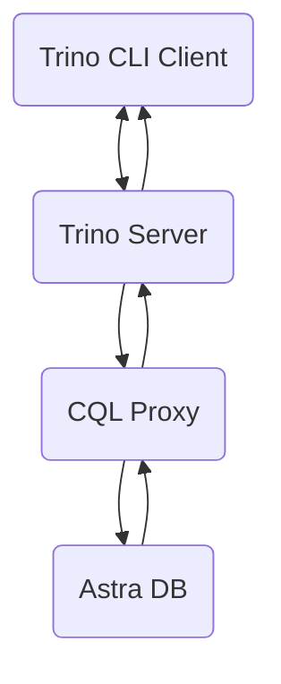

## A - Overview

[Trino](https://trino.io) is a distributed SQL query engine for big data analytics. Trino can query data from over 30 different data sources, including Cassandra, MongoDB, MySQL, PostgresSQL, and Redis. Common Trino use cases include:

* interactive data analytics, 
* SQL-based analytics over object storage systems, 
* data access and analytics across multiple data sources with query federation,
* Batch ETL processing across disparate systems.

In this tutorial, we show **how to use Trino to explore and query data in [Astra DB](http://astra.datastax.com) with SQL**.
The overall architecture of this solution is depicted below. *Trino CLI Client* sends SQL queries to *Trino Server*, *Trino Server* retrieves data from *Astra DB* via *CQL Proxy*, process it and returns the results back to the client.

<center>

</center>

## B - Prerequisites

- [Create an Astra Database](https://awesome-astra.github.io/docs/pages/astra/create-instance/)
- [Create an Astra Token](https://github.com/datastaxdevs/awesome-astra/wiki/Create-an-Astra-Token)

## C - Populate an Astra DB Database

### 1. [Sign in](https://astra.datastax.com/) to your Astra account and [create a new Astra database](https://awesome-astra.github.io/docs/pages/astra/create-instance/) or select an existing one. Add a new keyspace with name `banking_app` or reuse an existing one. 

### 2. Create the following tables using the CQL Console:

```sql
USE banking_app;
```

```sql
CREATE TABLE customer (
    id UUID,
    name TEXT,
    email TEXT, 
    PRIMARY KEY (id)
);

CREATE TABLE accounts_by_customer (
  customer_id UUID,
  account_number TEXT,
  account_type TEXT,
  account_balance DECIMAL,
  name TEXT STATIC,
  PRIMARY KEY ((customer_id), account_number)
);
```


### 3. Insert rows

```sql
INSERT INTO customer (id,name,email) VALUES (8d6c1271-16b6-479d-8ea9-546c37381ab3,'Alice','alice@example.org');
INSERT INTO customer (id,name,email) VALUES (0e5d9e8c-2e3b-4576-8515-58b491cb859e,'Bob','bob@example.org');


INSERT INTO accounts_by_customer (customer_id,account_number,account_type,account_balance,name) 
VALUES (8d6c1271-16b6-479d-8ea9-546c37381ab3,'A-101','Checking',100.01,'Alice');
INSERT INTO accounts_by_customer (customer_id,account_number,account_type,account_balance,name) 
VALUES (8d6c1271-16b6-479d-8ea9-546c37381ab3,'A-102','Savings',200.02,'Alice');
INSERT INTO accounts_by_customer (customer_id,account_number,account_type,account_balance,name) 
VALUES (0e5d9e8c-2e3b-4576-8515-58b491cb859e,'B-101','Checking',300.03,'Bob');
INSERT INTO accounts_by_customer (customer_id,account_number,account_type,account_balance,name) 
VALUES (0e5d9e8c-2e3b-4576-8515-58b491cb859e,'B-102','Savings',400.04,'Bob');
```

## D - Deploy a CQL Proxy

### 4. Follow [these instructions](https://github.com/datastax/cql-proxy) to deploy a *CQL Proxy* as close to a *Trino Server* as possible. The simplest way to start `cql-proxy` is to use an `<astra-token>` and `<astra-database-id>`:

```bash
./cql-proxy \
--astra-token <astra-token> \
--astra-database-id <astra-database-id>
```

An example command with no-longer-valid token and databse id may look like the following:

```bash
./cql-proxy \
--astra-token AstraCS:NoBhcuwCrIhZxqzjEMCSuGos:8a85142b47a588472a1f3b1314e2141f098785895411dee9db11f2a7ade457ce \
--astra-database-id e5e4e925-289a-8231-83fd-25918093257b
```

## E - Configure and Start a Trino Server


## F - Run SQL Queries against Astra DB using a Trino CLI Client