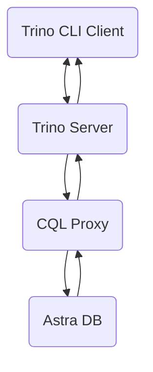

## A - Overview

[Trino](https://trino.io) is a distributed SQL query engine for big data analytics. Trino can query data from over 30 different data sources, including Cassandra, MongoDB, MySQL, PostgresSQL, and Redis. Common Trino use cases include:

- interactive data analytics,
- SQL-based analytics over object storage systems,
- data access and analytics across multiple data sources with query federation,
- batch ETL processing across disparate systems.

In this tutorial, we show **how to use Trino to explore and query data in [Astra DB](http://astra.datastax.com) with SQL**.
The overall architecture of this solution is depicted below. _Trino CLI Client_ sends SQL queries to _Trino Server_. _Trino Server_ retrieves data from _Astra DB_ via _CQL Proxy_, computes the query results and returns them to the client.

<center>

</center>

## B - Prerequisites

- [Create an Astra Database](/docs/pages/astra/create-instance/)
- [Create an Astra Token](/docs/pages/astra/create-token/)

## C - Setup Astra DB

**✅ 1. [Sign in](https://astra.datastax.com/)**

Connect to your Astra account and [create a new Astra database](/docs/pages/astra/create-instance/) or select an existing one. Add a new keyspace with name `banking_db` or use an existing one.

**✅ 2. Create the following tables using the CQL Console**

```sql
USE banking_db;
```

```sql
CREATE TABLE customer (
    id UUID,
    name TEXT,
    email TEXT,
    PRIMARY KEY (id)
);

CREATE TABLE accounts_by_customer (
  customer_id UUID,
  account_number TEXT,
  account_type TEXT,
  account_balance DECIMAL,
  customer_name TEXT STATIC,
  PRIMARY KEY ((customer_id), account_number)
);
```

**✅ 3. Insert the rows using the CQL Console**

```sql
INSERT INTO customer (id,name,email) VALUES (8d6c1271-16b6-479d-8ea9-546c37381ab3,'Alice','alice@example.org');
INSERT INTO customer (id,name,email) VALUES (0e5d9e8c-2e3b-4576-8515-58b491cb859e,'Bob','bob@example.org');


INSERT INTO accounts_by_customer (customer_id,account_number,account_type,account_balance,customer_name)
VALUES (8d6c1271-16b6-479d-8ea9-546c37381ab3,'A-101','Checking',100.01,'Alice');
INSERT INTO accounts_by_customer (customer_id,account_number,account_type,account_balance,customer_name)
VALUES (8d6c1271-16b6-479d-8ea9-546c37381ab3,'A-102','Savings',200.02,'Alice');
INSERT INTO accounts_by_customer (customer_id,account_number,account_type,account_balance,customer_name)
VALUES (0e5d9e8c-2e3b-4576-8515-58b491cb859e,'B-101','Checking',300.03,'Bob');
INSERT INTO accounts_by_customer (customer_id,account_number,account_type,account_balance,customer_name)
VALUES (0e5d9e8c-2e3b-4576-8515-58b491cb859e,'B-102','Savings',400.04,'Bob');
```

## D - Deploy CQL Proxy

**✅ 4. Installation**

Follow [the instructions](https://github.com/datastax/cql-proxy) to deploy a _CQL Proxy_ as close to a _Trino Server_ as possible, preferrably deploying both components on the same server. The simplest way to start `cql-proxy` is to use an `<astra-token>` and `<astra-database-id>`:

```bash
./cql-proxy \
--astra-token <astra-token> \
--astra-database-id <astra-database-id>
```

An example command with a sample, invalid token and database id:

```bash
./cql-proxy \
--astra-token AstraCS:NoBhcuwCrIhZxqzjEMCSuGos:8a85142b47a588472a1f3b1314e2141f098785895411dee9db11f2a7ade457ce \
--astra-database-id e5e4e925-289a-8231-83fd-25918093257b
```

## E - Setup Trino Server

**✅ 5. Trino intallation**

Follow [the instructions](https://trino.io/docs/current/installation/deployment.html) to download, install and configure a _Trino Server_ or use an existing deployment. The minimal configuration requirements for a local single-machine deployment are:

- Node properties in file `etc/node.properties`

```
node.environment=production
node.id=ffffffff-ffff-ffff-ffff-ffffffffffff
node.data-dir=/var/trino/data
```

- JVM config in file `etc/jvm.config`

```
-server
-Xmx16G
-XX:-UseBiasedLocking
-XX:+UseG1GC
-XX:G1HeapRegionSize=32M
-XX:+ExplicitGCInvokesConcurrent
-XX:+ExitOnOutOfMemoryError
-XX:+HeapDumpOnOutOfMemoryError
-XX:-OmitStackTraceInFastThrow
-XX:ReservedCodeCacheSize=512M
-XX:PerMethodRecompilationCutoff=10000
-XX:PerBytecodeRecompilationCutoff=10000
-Djdk.attach.allowAttachSelf=true
-Djdk.nio.maxCachedBufferSize=2000000
```

- Config properties in file `etc/config.properties`

```
coordinator=true
node-scheduler.include-coordinator=true
http-server.http.port=8080
query.max-memory=5GB
query.max-memory-per-node=1GB
discovery.uri=http://localhost:8080
```

- Catalog properties in file `etc/catalog/cassandra.properties`

```
connector.name=cassandra
cassandra.contact-points=localhost
cassandra.consistency-level=QUORUM
```

The above configuration uses [the Cassandra connector](https://trino.io/docs/current/connector/cassandra.html) to interact with `cql-proxy`.

**✅ 6. Start the Trino Server:**

```bash
bin/launcher run
```

Wait for message `======== SERVER STARTED ========` to confirm a successful start.

## F - SQL Queries with Trino Client

In this section you will execute SQL Queries against Astra DB using Trino CLI Client.

**✅ 7. Install Trino Client**

Follow [the instructions](https://trino.io/docs/current/client/cli.html) to download and install a _CLI Trino Client_.

**✅ 8. Start the _CLI Trino Client_:**

```bash
./trino --server http://localhost:8080 --catalog cassandra
```

The `server` option specifies the HTTP(S) address and port of the Trino coordinator, and the `catalog` option sets the default catalog.

**✅ 9. Insert a new customer into table `customer`:**

```SQL
INSERT INTO banking_db.customer (id,name,email)
VALUES (uuid(),'Luis','luis@example.org');
```

**✅ 10. Execute the SQL query to find the total number of customers:**

```SQL
SELECT COUNT(*) AS customer_count
FROM banking_db.customer;
```

Output:

```
 customer_count
----------------
              3
(1 row)
```

**✅ 11. Execute the SQL query to find emails of customers with account balances of `300.00` or higher:**

```SQL
SELECT DISTINCT email AS customer_email
FROM banking_db.customer
     INNER JOIN banking_db.accounts_by_customer
     ON (id = customer_id)
WHERE account_balance >= 300.00;
```

Output:

```
 customer_email
-----------------
 bob@example.org
(1 row)
```

**✅ 12. Execute the SQL query to find customers and sums of their account balances:**

```SQL
SELECT id AS customer_id,
       name AS customer_name,
       email AS customer_email,
       SUM ( CAST (
              COALESCE(account_balance,0) AS DECIMAL(12,2)
                ) ) AS customer_funds
FROM banking_db.customer
     LEFT OUTER JOIN banking_db.accounts_by_customer
     ON (id = customer_id)
GROUP BY id, name, email;
```

Output:

```
             customer_id              | customer_name |  customer_email   | customer_funds
--------------------------------------+---------------+-------------------+----------------
 0e5d9e8c-2e3b-4576-8515-58b491cb859e | Bob           | bob@example.org   |         700.07
 c628dca6-a8a6-4f37-ac29-44975af069fb | Luis          | luis@example.org  |           0.00
 8d6c1271-16b6-479d-8ea9-546c37381ab3 | Alice         | alice@example.org |         300.03
(3 rows)
```
