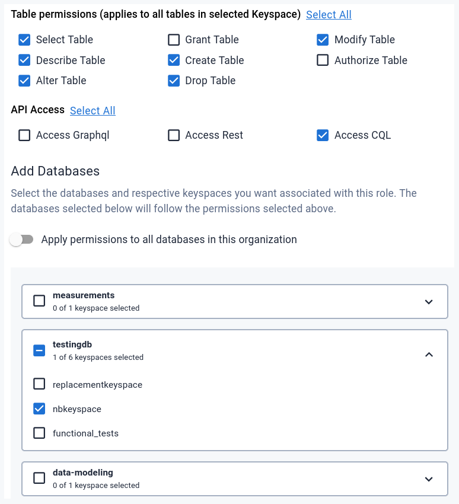

<div class="nosurface" markdown="1">


</div>

## Overview

<div class="nosurface" markdown="1">

- ℹ️ [NoSQLBench documentation](https://docs.nosqlbench.io/docs/nosqlbench/introduction/)
- ℹ️ [Astra Docs on NoSQLBench](https://docs.datastax.com/en/astra/docs/develop/dev-upload-data.html#_test_loading_data_with_nosqlbench)

</div>

### What is NoSQLBench ?

NoSQLBench is a powerful, state-of-the-art tool for emulating real application
workloads and direct them to actual target data stores for reliable,
reproducible benchmarking and population of a database with sophisticated synthetic data.

NoSQLBench is extremely customizable, yet comes with many pre-defined workloads,
ready for several types of distributed, NoSQL data systems. One of the target
databases is Cassandra/Astra DB, supported out-of-the-box by NoSQLBench and
complemented by some ready-made realistic workloads for benchmarking.

At the heart of NoSQLBench are a few principles:

- ease-of-use, meaning that one can start using it without learning all layers of customizability;
- modularity in the design: building a new driver is comparatively easy;
- workloads are reproducible down to the individual statement (no "actual randomness" involved);
- reliable performance timing, i.e. care is taken on the client side to avoid unexpected JVM pauses.

### NoSQLBench and Astra DB

NoSQLBench uses the (CQL-based) Cassandra Java Drivers, which means that it
supports Astra DB natively with its drivers. One just has to provide
access to an Astra DB instance, which is done via command-line parameters.

Keep in mind that, while benchmark workloads for OSS Cassandra
installation usually take care of creating the target keyspace,
with Astra DB you should **make sure the keyspace exists already**
(the keyspace name can be passed as a command-line parameter when launching
NoSQLBench). This is often handled in a typical NoSQLBench workload by having two
named scenario in the same yaml (e.g. `cassandra` and `astra`),
differing in their "schema" part only (with/without creation of the keyspace).

## Prerequisites

- You should have an [Astra account](https://astra.dev/3B7HcYo)
- You should [Create an Astra Database](https://awesome-astra.github.io/docs/pages/astra/create-instance/)
- You should [Have an Astra Token](https://awesome-astra.github.io/docs/pages/astra/create-token/)
- You should [Download your Secure bundle](https://awesome-astra.github.io/docs/pages/astra/download-scb/)

??? note "Minimal token permissions"

    While you can certainly use a standard "Database Administrator" token,
    you may want to use a least-privilege token to run your benchmarks.
    These are the specifications for a minimal Custom Role for this purpose:

    - limited to just the target database and the target keyspace in it;
    - Table permissions: **Select Table, Describe Table, Alter Table, Create Table, Drop Table, Modify Table**;
    - API Access: **Access CQL**.

    

## Installation

The following installation instructions are taken from
[the official NoSQLBench documentation](https://docs.nosqlbench.io/getting-started/00-get-nosqlbench/).
Please refer to it for more details and updates.

<div class="counterReset" markdown="1">

### <span class="nosurface">Step 1 :</span> Download the binaries

Go to the [project's "tags" listing on Github](https://github.com/nosqlbench/nosqlbench/tags)
and download the [latest version](https://github.com/nosqlbench/nosqlbench/releases/latest/).
The suggested option is to download the Linux binary (`nb5`),
but as an alternative the `nb5.jar` version can also be used:
here we assume the Linux binary is used -- please see the
[NoSQLBench documentation](https://docs.nosqlbench.io/getting-started/00-get-nosqlbench/)
for more options and details about installation.

### <span class="nosurface">Step 2 :</span> Make executable and put in search path

Once the file is downloaded, make it executable with `chmod +x nb5`
and put it (or make a symlink) somewhere in your system's search path,
such as `/home/${USER}/.local/bin/`.

As a quick test, try the command `nb --version`.

</div>

## Usage

<div class="counterReset" markdown="1">

### Command

If you already use NoSQLBench... then all you need to know is that invocations should include the following
parameters to locate an Astra DB instance and authenticate to it:

```bash
nb \
  [...]                                              \
  username=CLIENT_ID                                 \
  password=CLIENT_SECRET                             \
  secureconnectbundle=/PATH/TO/SECURE-CONNECT-DB.zip \
  keyspace=KEYSPACE_NAME                             \
  [...]
```

In the above, you should pass your Client ID and Client Secret as found in
the Astra DB Token, and the path to the Secure Bundle zipfile you obtained
earlier (see [Prerequisites](https://awesome-astra.github.io/docs/pages/data/load/nosqlbench/#b-prerequisites)). Please prepend `./` to
the bundle path if it is a relative path.

You may want to specify a keyspace, as seen in the sample command quoted here,
because, as Astra DB does not support the `CREATE KEYSPACE` CQL command,
it would be your responsibility to match the keyspace used in the benchmark
with the name of an existing one. Please inspect the contents of your
workload `yaml` file more closely for more details on the keyspace name used
by default.

### Quick-start

There is a comprehensive [Getting Started page](https://docs.nosqlbench.io/getting-started/02-scenarios/)
on NoSQLBench documentation, so here only a couple of sample full commands will be given.
Please consult the full documentation for more options and configurations.

Some of the ready-made workloads included with NoSQLBench are specific
for benchmarking realistic usage patterns of Cassandra/Astra DB.
A quick way to get started is to launch those workloads with the
"workload scenario" syntax (where the 'scenario' specifies that you are
targeting an Astra DB instance).

**"cql-keyvalue" workload**

The following will run the "cql-keyvalue" workload, specifically its "astra" scenario,
on an Astra DB instance:

```bash
nb5 cql-keyvalue astra                               \
  username=CLIENT_ID                                 \
  password=CLIENT_SECRET                             \
  secureconnectbundle=/PATH/TO/SECURE-CONNECT-DB.zip \
  keyspace=KEYSPACE_NAME
```

Alternatively, if you are using the `jar` version of the tool,

```bash
java -jar nb5.jar cql-keyvalue astra                 \
  username=CLIENT_ID                                 \
  password=CLIENT_SECRET                             \
  secureconnectbundle=/PATH/TO/SECURE-CONNECT-DB.zip \
  keyspace=KEYSPACE_NAME
```

This workload emulates usage of Astra DB/Cassandra as a simple key-value store,
and does so by alternating "random" reads and writes to a single table.
A preliminar "rampup" phase is run, consisting only of writes, and then the "main"
phase takes place (this structure is a rather universal features of these benchmarks).

(Note: most likely you may want to add further options, such as
[`cyclerate`](https://docs.nosqlbench.io/docs/reference/core-activity-parameters/#cyclerate),
`rampup-cycles`, `main-cycles` or
[`--progress console`](https://docs.nosqlbench.io/docs/reference/command-line/#execution-options).
See the NoSQLBench docs and inspect the workload `yaml` for more).

The above command, as things progress, will produce an output similar to:

```
cqlkeyvalue_astra_schema: 100.00%/Stopped (details: min=0 cycle=1 max=1) (last report)
cqlkeyvalue_astra_rampup: 15.60%/Running (details: min=0 cycle=234 max=1500)
cqlkeyvalue_astra_rampup: 32.40%/Running (details: min=0 cycle=486 max=1500)
[...]
cqlkeyvalue_astra_main: 96.67%/Running (details: min=0 cycle=1450 max=1500)
cqlkeyvalue_astra_main: 100.00%/Running (details: min=0 cycle=1500 max=1500) (last report)
```

followed by a final summary - reflected also in files in the `logs/` directory,
similar to:

```
-- Gauges ----------------------------------------------------------------------
cqlkeyvalue_astra_main.cycles.config.burstrate
             value = 55.00000000000001

[...]

cqlkeyvalue_astra_schema.tokenfiller
             count = 57086
         mean rate = 941.29 calls/second
     1-minute rate = 940.67 calls/second
     5-minute rate = 939.91 calls/second
    15-minute rate = 939.71 calls/second
```

You may want to check that at this point a new table has been created,
if it did not exist yet, in the keyspace.

**"cql-iot" workload**

Similar to the above for the "cql-iot" workload, aimed at emulating
time-series-based reads and writes for a hypothetical IoT system:

```bash
nb5 cql-iot astra                                    \
  username=CLIENT_ID                                 \
  password=CLIENT_SECRET                             \
  secureconnectbundle=/PATH/TO/SECURE-CONNECT-DB.zip \
  keyspace=KEYSPACE_NAME
```

**Other workloads**

You can inspect all available workloads with:

```bash
nb5 --list-scenarios
```

and look for `astra` in the output example scenario invocations there.

Moreover, you can [design your own workload](https://docs.nosqlbench.io/workloads-101/00-designing-workloads/).

</div>