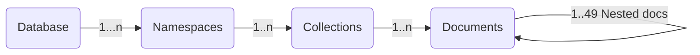

<link rel="stylesheet" href="https://maxcdn.bootstrapcdn.com/font-awesome/4.6.1/css/font-awesome.min.css">
<link rel="stylesheet" type="text/css" href="../../../../assets/stylesheets/formbase.min.css">

<link rel="stylesheet" type="text/css" href="https://unpkg.com/swagger-ui-dist@3.25.1/swagger-ui.css">
<script src="https://unpkg.com/swagger-ui-dist@3.25.1/swagger-ui-standalone-preset.js"></script>
<script src="https://unpkg.com/swagger-ui-dist@3.25.1/swagger-ui-bundle.js"></script>
<script src="../../../../assets/javascripts/swagger-sandbox.js"></script>

## Overview

The **Document Api** is an HTTP REST APi part of the open source component [Stargate.io](stargate.io). The idea is to provide an abstraction on top of Apache Cassandra™ to allow **document-oriented** access patterns.


## Design

- A `namespace` (replacement for keyspace) will hold multiple `collections` (not tables) to store `Documents`

- You interact with the database through `JSON documents` and no validation (sometimes called `_schemaless_` but better term would be validationless).

- Each documents has a unique identifier within the collection. Each insert is an upsert

- You can query on any field (_thanks to the support out of the box of the secondary index `SAI`_)



???+ abstract "Storage of data in Cassandra"

      The JSON document are stored using an internal data model. The table schema is generic and the same for each collection. The algorithm used tp transform the document is called **_document shredding_**. The schema is optimized for searches but also to limit tombstones on edits and deletes.

      ```sql
      create table <collection_name> (
        key       text,
        p0        text,
        ...
        p[N]       text,
        bool_value boolean,
        txt_value  text,
        dbl_value  double,
        leaf       text
      )
      ```

      A json like `{"a": { "b": 1 }, "c": 2}` will be stored like

      | key | p0 | p1 | dbl*value |
      |:--------------:|:--------------:|:-----------|:-----------|
      | {docid} | `a` | `b` | `1` |
      | {docid} | `c` | \_null* | `2` |

      This also work with arrays `{"a": { "b": 1 }, "c": [{"d": 2}]}`

      |   key   | p0  | p1    | p2     | dbl_value |
      | :-----: | :-: | :---- | :----- | :-------- |
      | {docid} | `a` | `b`   | _null_ | `1`       |
      | {docid} | `c` | `[0]` | `d`    | `2`       |

## Prerequesites

In order to use the **`Document Api`** for Astra DB in your application some prerequisites are mandatory.

- An **Astra account**, use the [tutorial](http://astra.datastax.com/) to create yours
- A running **Astra Database**, use the [tutorial](https://github.com/datastaxdevs/awesome-astra/wiki/Create-an-AstraDB-Instance) to create one
- An **authentication token**, use the [tutorial](https://github.com/datastaxdevs/awesome-astra/wiki/Create-an-Astra-Token) to create one
- A client, framework or tool to execute **Http Requests**. This page will provide your `SWAGGER` and `POSTMAN`

## Database Selector

<fieldset>
<legend>Astra DB Setup</legend>
<label class="label" for="astra_token"><i class="fa fa-key"></i> &nbsp;Authentication token</label>
<br/>
<input class="input" id="astra_token" name="astra_token" type="text" placeholder="AstraCS:...." style="width:70%">
<input type="submit" 
       class="md-button button-primary float-right" value="Lookup Databases" 
       onclick="dbSelectorListDatabases(document.getElementById('astra_token').value)" />

<div id="block_astra_db"></div>

<div id="block_astra_region"></div>

<div id="block_astra_namespace" ></div>

</fieldset>

## Swagger Sandbox

<div id="swagger-ui"></div>

<script>

function setupSwagger() {
  window.ui = SwaggerUIBundle({
    url: "/pages/develop/api/swagger-api-document.json",
    dom_id: '#swagger-ui',
    presets: [
      SwaggerUIBundle.presets.apis,
      SwaggerUIStandalonePreset
    ],
    plugins: [
      UrlMutatorPlugin
    ],
    layout: "StandaloneLayout",
    onComplete: () => {
       setupAstraDBEndpoint('ASTRA_DB_ID', 'ASTRA_DB_REGION')
    } 
  });
  document.querySelector(".topbar").hidden=true;
  // Add the populate field function Hook.
  setTimeout(hookSwagger, 100);
}

window.onload = setupSwagger;
  
</script>

## Postman

**Prerequisites [Development Environment]**

- You should install **[Postman](https://www.postman.com/downloads/)** to import some collections we provided.

**Setup Postman**

- Import the configuration File `Astra_Document_Api_Configuration.json` in postman. In the menu locate `File > Import` and drag the file in the box.


- Edit the values for you db:

| Parameter Name | parameter value                       | Description                                                                                                                                                                                                                                       |
| :------------: | :------------------------------------ | :------------------------------------------------------------------------------------------------------------------------------------------------------------------------------------------------------------------------------------------------ |
|     token      | `AstraCS:....`                        | _When you generate a new token it is the third field. Make sure you add enough privileges to use the APis, Database Administrator is a good choice to develop_                                                                                    |
|       db       | `00000000-0000-0000-0000-00000000000` | _Unique identifier of your DB, [you find on the main dashboard](https://github.com/datastaxdevs/awesome-astra/wiki/Astra-FAQ#where-should-i-find-a-database-identifier-)_                                                                         |
|     region     | `us-east1`                            | _region name, [you find on the datanase dashboard](https://github.com/datastaxdevs/awesome-astra/wiki/Astra-FAQ#where-should-i-find-a-database-region-name-)_                                                                                     |
|   namespace    | `demo`                                | _Namespaces are the same as keyspaces. They are created with the database or added from the database dashboard: [How to create a keyspace](https://github.com/datastaxdevs/awesome-astra/wiki/Astra-FAQ#how-to-create-a-namespace-or-keyspace-)]_ |
|   collection   | `person`                              | _Collection name (like table) to store one type of documents._                                                                                                                                                                                    |

- this is what it is look like


- Import the Document Api Collection `Astra_Document_Api.json` in postman. Same as before `File > Menu`


- That's it you have now access to a few dozens operations for `namespace`, `collections` and `documents`


## Working with CURL

- Working with CURL:You should have **curl** commands available either installing following steps [here](https://curl.se/download.html) or

```bash
curl --version
```

## Operations

!!! warning "Known Limitations"

      - As of today there are **no aggregation nor sorting** available in the Document Api.

      - Queries are paged with a **pagesize of `3` records by default**, you can increase up to a maximum of `20` records, then the payload would be to large.

### ‣ List Namespaces

!!! example "`GET /v2/namespaces/`"

      **Definition:**

      This operation list the namespaces inside a database. It will retrieve all keyspaces in the Cassandra database and for each one the different datacenters.

      **Sample Curl**

      ```bash
      curl -X GET https://{ASTRA_DB_ID}-{ASTRA_DB_REGION}}\
      .apps.astra.datastax.com/api/rest/v2/namespaces/ \
        -H 'accept: application/json' \
        -H 'X-Cassandra-Token: {TOKEN}}'
      ```

      **Sample Output**

      ```json

      ```

## Extra Resources

!!! abstract "Reference Documentation"

    <ol>
        <li><a href="https://stargate.io/2020/10/19/the-stargate-cassandra-documents-api.html">Document API reference Blogpost</a>
        <li><a href="https://stargate.io/2021/04/05/the-stargate-documents-api-storage-mechanisms-search-filters-and-performance-improvements.html">Design Improvements in 2021</a>
        <li><a href="https://stargate.io/docs/stargate/1.0/quickstart/quick_start-document.html">QuickStart</a>
    </ol>
