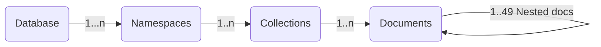

<link rel="stylesheet" href="https://maxcdn.bootstrapcdn.com/font-awesome/4.6.1/css/font-awesome.min.css">
<link rel="stylesheet" type="text/css" href="../../../../assets/stylesheets/formbase.min.css">

<link rel="stylesheet" type="text/css" href="https://unpkg.com/swagger-ui-dist@3.25.1/swagger-ui.css">
<script src="https://unpkg.com/swagger-ui-dist@3.25.1/swagger-ui-standalone-preset.js"></script>
<script src="https://unpkg.com/swagger-ui-dist@3.25.1/swagger-ui-bundle.js"></script>
<script src="../../../../assets/javascripts/swagger-sandbox.js"></script>

## 1. Overview

The **Document API** is an HTTP REST API and part of the open source [Stargate.io](https://stargate.io/). The idea is to provide an abstraction on top of Apache Cassandra™ to allow **document-oriented** access patterns.


- A `namespace` (replacement for keyspace) will hold multiple `collections` (not tables) to store `Documents`

- You interact with the database through `JSON documents` and no validation (sometimes called `_schemaless_` but a better term would be validationless).

- Each documents has a unique identifier within the collection. Each insert is an upsert.

- You can query on any field (_thanks to out of the box support for the secondary index `SAI`_)



??? abstract "How is the data stored in Cassandra?"

      The JSON documents are stored using an internal data model. The table schema is generic as is each collection. The algorithm used to transform the document is called **_document shredding_**. The schema is optimized for searches but also to limit tombstones on edits and deletes.

      ```sql
      create table <collection_name> (
        key       text,
        p0        text,
        ...
        p[N]       text,
        bool_value boolean,
        txt_value  text,
        dbl_value  double,
        leaf       text
      )
      ```

      A JSON like `{"a": { "b": 1 }, "c": 2}` will be stored like

      | key | p0 | p1 | dbl*value |
      |:--------------:|:--------------:|:-----------|:-----------|
      | {docid} | `a` | `b` | `1` |
      | {docid} | `c` | \_null* | `2` |

      This also works with arrays `{"a": { "b": 1 }, "c": [{"d": 2}]}`

      |   key   | p0  | p1    | p2     | dbl_value |
      | :-----: | :-: | :---- | :----- | :-------- |
      | {docid} | `a` | `b`   | _null_ | `1`       |
      | {docid} | `c` | `[0]` | `d`    | `2`       |

!!! warning "Known Limitations"

      - As of today there is **no aggregation or sorting** available in the Document Api.

      - Queries are paged with a **pagesize of `3` records by default** and you can increase up to a maximum of `20` records. Otherwise, the payload would be too large.

## 2. Prerequesites

- You should have an [Astra account](https://astra.dev/3B7HcYo)
- You should [Create an Astra Database](/docs/pages/astra/create-instance/)
- You should [Have an Astra Token](/docs/pages/astra/create-token/)

## 3. Browse Api with Swagger

### 3.1 Provide Database Details

<fieldset>
<legend>Astra DB Setup</legend>
<label class="label" for="astra_token"><i class="fa fa-key"></i> &nbsp;Authentication token&nbsp;<sup>*</sup></label>
<span id="astra_token_errors" style="color:red;font-style:italic;"></span>
<br/>
<input class="input" id="astra_token" name="astra_token" type="text" placeholder="AstraCS:...." style="width:70%">

<!-- Waiting for the Devops API to Allow CORS
<input type="submit"
       class="md-button button-primary float-right" value="Lookup Databases"
       onclick="dbSelectorListDatabases(document.getElementById('astra_token').value)" />
-->

<div id="block_astra_db">
  <label class="label" for="astra_db"><i class="fa fa-database"></i> &nbsp;Database identifier&nbsp;<sup>*</sup> <a href="/pages/astra/faq/#where-should-i-find-a-database-identifier">(Where find it ?)</a></label>
  <span id="astra_db_errors" style="color:red;font-style:italic;"></span>
  <br/>
  <input class="input" id="astra_db" name="astra_token" type="text" placeholder="Your Database id" style="width:70%">
</div>

<div id="block_astra_region">
  <label class="label" for="astra_region"><i class="fa fa-map"></i> &nbsp;Database Region&nbsp;<sup>*</sup>  <a href="/pages/astra/faq/#where-should-i-find-a-database-region-name">(Where find it ?)</a></label>
   <span id="astra_region_errors" style="color:red;font-style:italic;"></span>
  <br/>
  <select class="select" id="astra_region" 
    name="astra_region" style="width:70%" 
    onchange="dbSelectorShowKeyspaces(
      document.getElementById('astra_token').value, 
      document.getElementById('astra_db').value, 
      document.getElementById('astra_region').value)">
    <option selected disabled>Pick your region</option>
    <optgroup label="Google Cloud Platform">
      <option value="asia-south1">(GCP) asia-south1</option>
      <option value="europe-west1">(GCP) europe-west1</option>
      <option value="europe-west2">(GCP) europe-west2 </option>
      <option value="northamerica-northeast1">(GCP) northamerica-northeast1</option>
      <option value="southamerica-east1">(GCP) southamerica-east1</option>
      <option value="us-central1">(GCP) us-central1</option>
      <option value="us-east1">(GCP) us-east1</option>
      <option value="us-east4">(GCP) us-east4</option>
      <option value="us-west1">(GCP) us-west1</option>
    </optgroup>
    <optgroup label="AWS">
      <option value="ap-southeast-1">(AWS) ap-southeast-1</option>
      <option value="eu-central-1">(AWS) eu-central-1</option>
      <option value="eu-west-1">(AWS) eu-west-1</option>
      <option value="us-east-1">(AWS) us-east-1</option>
      <option value="us-east-2">(AWS) us-east-2</option>
      <option value="us-west-2">(AWS) us-west-2</option>
    </optgroup>
    <optgroup label="Azure">
      <option value="northeurope">(Azure) northeurope</option>
      <option value="westeurope">(Azure) westeurope</option>
      <option value="eastus">(Azure) eastus</option>
      <option value="eastus2">(Azure) eastus2</option>
      <option value="southcentralus">(Azure) southcentralus</option>
      <option value="westus2">(Azure) westus2</option>
      <option value="canadacentral">(Azure) canadacentral</option>
      <option value="brazilsouth">(Azure) brazilsouth</option>
      <option value="centralindia">(Azure) centralindia</option>
      <option value="australiaeast">(Azure) australiaeast</option>
    </optgroup>
  </select>
</div>

<div id="dbselector_errors" style="color:red;font-style:italic;"></div>

<div id="block_astra_namespace" >
</div>

</fieldset>

### 3.2 Use Swagger

The swagger client below will have fields pre-populated with your database details.

<div id="swagger-ui"></div>

<script>

function setupSwagger() {
  window.ui = SwaggerUIBundle({
    url: "../swagger-api-document.json",
    dom_id: '#swagger-ui',
    presets: [
      SwaggerUIBundle.presets.apis,
      SwaggerUIStandalonePreset
    ],
    plugins: [
      UrlMutatorPlugin
    ],
    layout: "StandaloneLayout",
    onComplete: () => {
       dbSelectorBuildStargateEndpoint('ASTRA_DB_ID', 'ASTRA_DB_REGION')
    } 
  });
  document.querySelector(".topbar").hidden=true;
  // Add the populate field function Hook.
  setTimeout(hookSwagger, 100);
}

window.onload = setupSwagger;
  
</script>

## 4. Browse Api with Postman

### 4.1 Installation

- Install **[Postman](https://www.postman.com/downloads/)** to import the sample collections that we have provided.

- You can also import the collection in [Hoppscotch.io](https://hoppscotch.io/) not to install anything.

<a href="../../../../assets/attachments/postman/Astra_Document_Api.json" class="md-button">
  <i class="fa fa-download" ></i>&nbsp;Postman Collection
</a>

### 4.2 Postman Setup

- Import the configuration File `Astra_Document_Api_Configuration.json` in postman. In the menu locate `File > Import` and drag the file in the box.

<a href="../../../../assets/attachments/postman/Astra_Document_Api_Configuration.json" class="md-button">
  <i class="fa fa-download" ></i>&nbsp;Postman Configuration
</a>


- Edit the values for your db:

| Parameter Name | parameter value                       | Description                                                                                                                                                                                                                          |
| :------------: | :------------------------------------ | :----------------------------------------------------------------------------------------------------------------------------------------------------------------------------------------------------------------------------------- |
|     token      | `AstraCS:....`                        | _When you generate a new token it is the third field. Make sure you add enough privileges to use the APis, Database Administrator is a good choice to develop_                                                                       |
|       db       | `00000000-0000-0000-0000-00000000000` | _Unique identifier of your DB, [you find on the main dashboard](https://awesome-astra.github.io/docs//Astra-FAQ#where-should-i-find-a-database-identifier-)_                                                                         |
|     region     | `us-east1`                            | _region name, [you find on the datanase dashboard](https://awesome-astra.github.io/docs//Astra-FAQ#where-should-i-find-a-database-region-name-)_                                                                                     |
|   namespace    | `demo`                                | _Namespaces are the same as keyspaces. They are created with the database or added from the database dashboard: [How to create a keyspace](https://awesome-astra.github.io/docs//Astra-FAQ#how-to-create-a-namespace-or-keyspace-)]_ |
|   collection   | `person`                              | _Collection name (like table) to store one type of documents._                                                                                                                                                                       |

- this is what it is looks like


- Import the Document Api Collection `Astra_Document_Api.json` in postman. Same as before `File > Menu`


- That's it! You have now access to a few dozens operations for `namespace`, `collections` and `documents`


### 4.3 Working with the Postman Workspace

Alternatively, you can access the collections for Document API in the Postman workspace below.


[](https://god.gw.postman.com/run-collection/12949543-caba2a02-6559-486a-9e4a-d5c0791fd296?action=collection%2Ffork&collection-url=entityId%3D12949543-caba2a02-6559-486a-9e4a-d5c0791fd296%26entityType%3Dcollection%26workspaceId%3Def3ed3ef-3a50-4651-8965-01519e15a9ba#?env%5BStargate%20v2%20%20Astra%20API%20Environment%20LIBRARY%5D=W3sia2V5IjoiQVNUUkFfREJfSUQiLCJ2YWx1ZSI6IkNIQU5HRV9NRSBUTyAkQVNUUkFfREJfSUQiLCJlbmFibGVkIjp0cnVlLCJzZXNzaW9uVmFsdWUiOiJDSEFOR0VfTUUgVE8gJEFTVFJBX0RCX0lEIiwic2Vzc2lvbkluZGV4IjowfSx7ImtleSI6IkFTVFJBX0RCX1JFR0lPTiIsInZhbHVlIjoiQ0hBTkdFX01FIFRPICRBU1RSQV9EQl9SRUdJT04iLCJlbmFibGVkIjp0cnVlLCJzZXNzaW9uVmFsdWUiOiJDSEFOR0VfTUUgVE8gJEFTVFJBX0RCX1JFR0lPTiIsInNlc3Npb25JbmRleCI6MX0seyJrZXkiOiJBVVRIX1RPS0VOIiwidmFsdWUiOiJDSEFOR0UgTUUgVE8gXG4kQVNUUkFfREJfQVBQTElDQVRJT05fVE9LRU4iLCJlbmFibGVkIjp0cnVlLCJzZXNzaW9uVmFsdWUiOiJDSEFOR0UgTUUgVE8gXG4kQVNUUkFfREJfQVBQTElDQVRJT05fVE9LRU4iLCJzZXNzaW9uSW5kZXgiOjJ9LHsia2V5IjoiYmFzZV91cmwiLCJ2YWx1ZSI6Imh0dHA6Ly97e0FTVFJBX0RCX0lCfX0te3tBU1RSQV9EQl9SRUdJT059fS5hcHBzLmFzdHJhLmRhdGFzdGF4LmNvbSIsImVuYWJsZWQiOnRydWUsInNlc3Npb25WYWx1ZSI6Imh0dHA6Ly97e0FTVFJBX0RCX0lCfX0te3tBU1RSQV9EQl9SRUdJT059fS5hcHBzLmFzdHJhLmRhdGFzdGF4LmNvbSIsInNlc3Npb25JbmRleCI6M30seyJrZXkiOiJncWxfYmFzZV91cmwiLCJ2YWx1ZSI6Imh0dHA6Ly97e0FTVFJBX0RCX0lCfX0te3tBU1RSQV9EQl9SRUdJT059fS5hcHBzLmFzdHJhLmRhdGFzdGF4LmNvbSIsImVuYWJsZWQiOnRydWUsInNlc3Npb25WYWx1ZSI6Imh0dHA6Ly97e0FTVFJBX0RCX0lCfX0te3tBU1RSQV9EQl9SRUdJT059fS5hcHBzLmFzdHJhLmRhdGFzdGF4LmNvbSIsInNlc3Npb25JbmRleCI6NH0seyJrZXkiOiJiYXNlX3Jlc3Rfc2NoZW1hIiwidmFsdWUiOiIvYXBpL3Jlc3QvdjIvc2NoZW1hcy9rZXlzcGFjZXMiLCJlbmFibGVkIjp0cnVlLCJzZXNzaW9uVmFsdWUiOiIvYXBpL3Jlc3QvdjIvc2NoZW1hcy9rZXlzcGFjZXMiLCJzZXNzaW9uSW5kZXgiOjV9LHsia2V5IjoiYmFzZV9kb2Nfc2NoZW1hIiwidmFsdWUiOiIvYXBpL3Jlc3QvdjIvc2NoZW1hcy9uYW1lc3BhY2VzIiwiZW5hYmxlZCI6dHJ1ZSwic2Vzc2lvblZhbHVlIjoiL2FwaS9yZXN0L3YyL3NjaGVtYXMvbmFtZXNwYWNlcyIsInNlc3Npb25JbmRleCI6Nn0seyJrZXkiOiJiYXNlX2dxbF9zY2hlbWEiLCJ2YWx1ZSI6Ii9hcGkvZ3JhcGhxbC1zY2hlbWEiLCJlbmFibGVkIjp0cnVlLCJzZXNzaW9uVmFsdWUiOiIvYXBpL2dyYXBocWwtc2NoZW1hIiwic2Vzc2lvbkluZGV4Ijo3fSx7ImtleSI6ImJhc2VfcmVzdF9hcGkiLCJ2YWx1ZSI6Ii9hcGkvcmVzdC92Mi9rZXlzcGFjZXMiLCJlbmFibGVkIjp0cnVlLCJzZXNzaW9uVmFsdWUiOiIvYXBpL3Jlc3QvdjIva2V5c3BhY2VzIiwic2Vzc2lvbkluZGV4Ijo4fSx7ImtleSI6ImJhc2VfZG9jX2FwaSIsInZhbHVlIjoiL2FwaS9yZXN0L3YyL25hbWVzcGFjZXMiLCJlbmFibGVkIjp0cnVlLCJzZXNzaW9uVmFsdWUiOiIvYXBpL3Jlc3QvdjIvbmFtZXNwYWNlcyIsInNlc3Npb25JbmRleCI6OX0seyJrZXkiOiJiYXNlX2dxbF9hcGkiLCJ2YWx1ZSI6Ii9hcGkvZ3JhcGhxbC9saWJyYXJ5IiwiZW5hYmxlZCI6dHJ1ZSwic2Vzc2lvblZhbHVlIjoiL2FwaS9ncmFwaHFsL2xpYnJhcnkiLCJzZXNzaW9uSW5kZXgiOjEwfSx7ImtleSI6InJrZXlzcGFjZSIsInZhbHVlIjoidXNlcnNfa2V5c3BhY2UiLCJlbmFibGVkIjp0cnVlLCJzZXNzaW9uVmFsdWUiOiJ1c2Vyc19rZXlzcGFjZSIsInNlc3Npb25JbmRleCI6MTF9LHsia2V5IjoicnRhYmxlIiwidmFsdWUiOiJ1c2VycyIsImVuYWJsZWQiOnRydWUsInNlc3Npb25WYWx1ZSI6InVzZXJzIiwic2Vzc2lvbkluZGV4IjoxMn0seyJrZXkiOiJ1c2VyMWZuIiwidmFsdWUiOiJNb29raWUiLCJlbmFibGVkIjp0cnVlLCJzZXNzaW9uVmFsdWUiOiJNb29raWUiLCJzZXNzaW9uSW5kZXgiOjEzfSx7ImtleSI6InVzZXIxbG4iLCJ2YWx1ZSI6IkJldHRzIiwiZW5hYmxlZCI6dHJ1ZSwic2Vzc2lvblZhbHVlIjoiQmV0dHMiLCJzZXNzaW9uSW5kZXgiOjE0fSx7ImtleSI6InVzZXIyZm4iLCJ2YWx1ZSI6IkphbmVzaGEiLCJlbmFibGVkIjp0cnVlLCJzZXNzaW9uVmFsdWUiOiJKYW5lc2hhIiwic2Vzc2lvbkluZGV4IjoxNX0seyJrZXkiOiJ1c2VyMmxuIiwidmFsdWUiOiJEb2VzaGEiLCJlbmFibGVkIjp0cnVlLCJzZXNzaW9uVmFsdWUiOiJEb2VzaGEiLCJzZXNzaW9uSW5kZXgiOjE2fSx7ImtleSI6Im5hbWVzcGFjZSIsInZhbHVlIjoidGVzdCIsImVuYWJsZWQiOnRydWUsInNlc3Npb25WYWx1ZSI6InRlc3QiLCJzZXNzaW9uSW5kZXgiOjE3fSx7ImtleSI6ImNvbGxlY3Rpb24iLCJ2YWx1ZSI6ImxpYnJhcnkiLCJlbmFibGVkIjp0cnVlLCJzZXNzaW9uVmFsdWUiOiJsaWJyYXJ5Iiwic2Vzc2lvbkluZGV4IjoxOH0seyJrZXkiOiJjb2xsZWN0aW9uMiIsInZhbHVlIjoibGlicmFyeTIiLCJlbmFibGVkIjp0cnVlLCJ0eXBlIjoiZGVmYXVsdCIsInNlc3Npb25WYWx1ZSI6ImxpYnJhcnkyIiwic2Vzc2lvbkluZGV4IjoxOX0seyJrZXkiOiJ1c2VyMSIsInZhbHVlIjoiSmFuZXQiLCJlbmFibGVkIjp0cnVlLCJzZXNzaW9uVmFsdWUiOiJKYW5ldCIsInNlc3Npb25JbmRleCI6MjB9LHsia2V5IjoidXNlcjJhIiwidmFsdWUiOiJKb3NlcGgiLCJlbmFibGVkIjp0cnVlLCJzZXNzaW9uVmFsdWUiOiJKb3NlcGgiLCJzZXNzaW9uSW5kZXgiOjIxfSx7ImtleSI6InVzZXIyIiwidmFsdWUiOiJKb2V5IiwiZW5hYmxlZCI6dHJ1ZSwic2Vzc2lvblZhbHVlIjoiSm9leSIsInNlc3Npb25JbmRleCI6MjJ9LHsia2V5IjoidXNlcjMiLCJ2YWx1ZSI6Ik1hcnRoYSIsImVuYWJsZWQiOnRydWUsInNlc3Npb25WYWx1ZSI6Ik1hcnRoYSIsInNlc3Npb25JbmRleCI6MjN9LHsia2V5IjoiZ2tleXNwYWNlIiwidmFsdWUiOiJsaWJyYXJ5IiwiZW5hYmxlZCI6dHJ1ZSwic2Vzc2lvblZhbHVlIjoibGlicmFyeSIsInNlc3Npb25JbmRleCI6MjR9LHsia2V5IjoiZ3RhYmxlMSIsInZhbHVlIjoiYm9vayIsImVuYWJsZWQiOnRydWUsInNlc3Npb25WYWx1ZSI6ImJvb2siLCJzZXNzaW9uSW5kZXgiOjI1fSx7ImtleSI6Imd0YWJsZTIiLCJ2YWx1ZSI6InJlYWRlciIsImVuYWJsZWQiOnRydWUsInNlc3Npb25WYWx1ZSI6InJlYWRlciIsInNlc3Npb25JbmRleCI6MjZ9LHsia2V5IjoiYm9va2RvY2lkIiwidmFsdWUiOiJuYXRpdmUtc29uLWRvYy1pZCIsImVuYWJsZWQiOnRydWUsInR5cGUiOiJkZWZhdWx0Iiwic2Vzc2lvblZhbHVlIjoibmF0aXZlLXNvbi1kb2MtaWQiLCJzZXNzaW9uSW5kZXgiOjI3fSx7ImtleSI6ImRvY2lkIiwidmFsdWUiOiIyNTQ1MzMxYS1hYWFkLTQ1ZDItYjA4NC05ZGEzZDhmNGMzMTEiLCJlbmFibGVkIjp0cnVlLCJ0eXBlIjoiZGVmYXVsdCIsInNlc3Npb25WYWx1ZSI6IjI1NDUzMzFhLWFhYWQtNDVkMi1iMDg0LTlkYTNkOGY0YzMxMSIsInNlc3Npb25JbmRleCI6Mjh9LHsia2V5IjoicmVhZGVyZG9jaWQiLCJ2YWx1ZSI6IkpvaG4tU21pdGgiLCJlbmFibGVkIjp0cnVlLCJ0eXBlIjoiZGVmYXVsdCIsInNlc3Npb25WYWx1ZSI6IkpvaG4tU21pdGgiLCJzZXNzaW9uSW5kZXgiOjI5fV0=)

## 5. Api Sandbox with Curl

Provide the parameters asked at the beginning and see a first set of commands in action.

<iframe frameborder="0" width="100%" height="800px" src="https://replit.com/@CedrickLunven/Sandbox-DocumentAPI?embed=true"></iframe>

## 6. Extra Resources

!!! abstract "Reference Documentation"

    <ol>
        <li><a href="https://stargate.io/2020/10/19/the-stargate-cassandra-documents-api.html">Document API reference Blogpost</a>
        <li><a href="https://stargate.io/2021/04/05/the-stargate-documents-api-storage-mechanisms-search-filters-and-performance-improvements.html">Design Improvements in 2021</a>
        <li><a href="https://stargate.io/docs/stargate/1.0/quickstart/quick_start-document.html">QuickStart</a>
    </ol>
