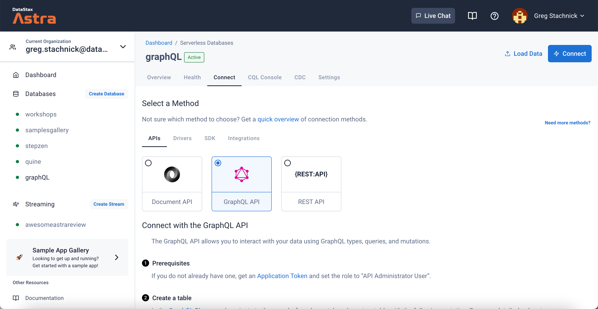
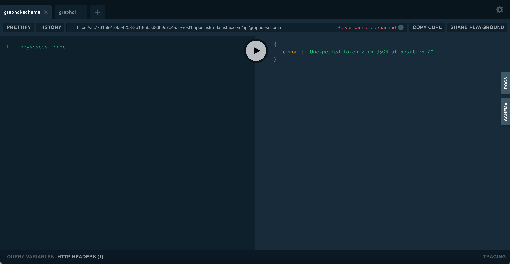
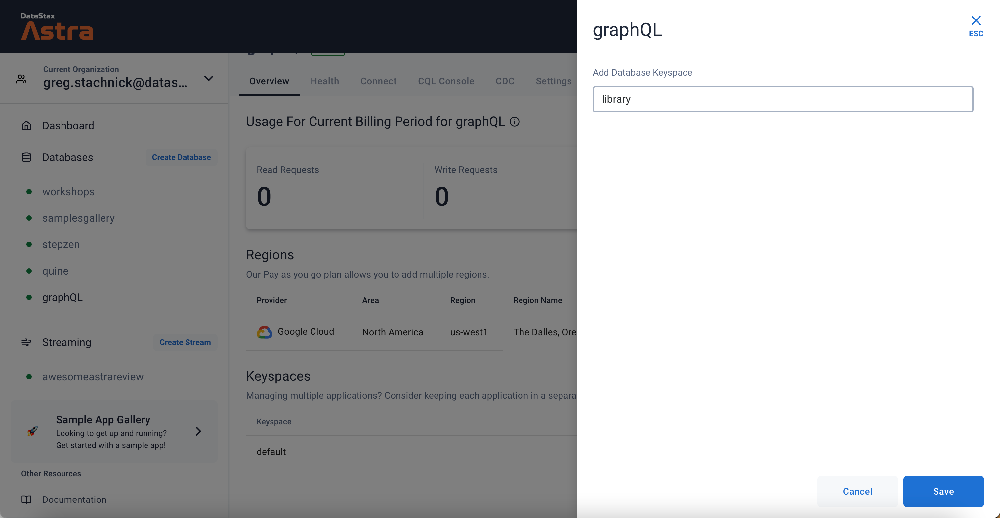
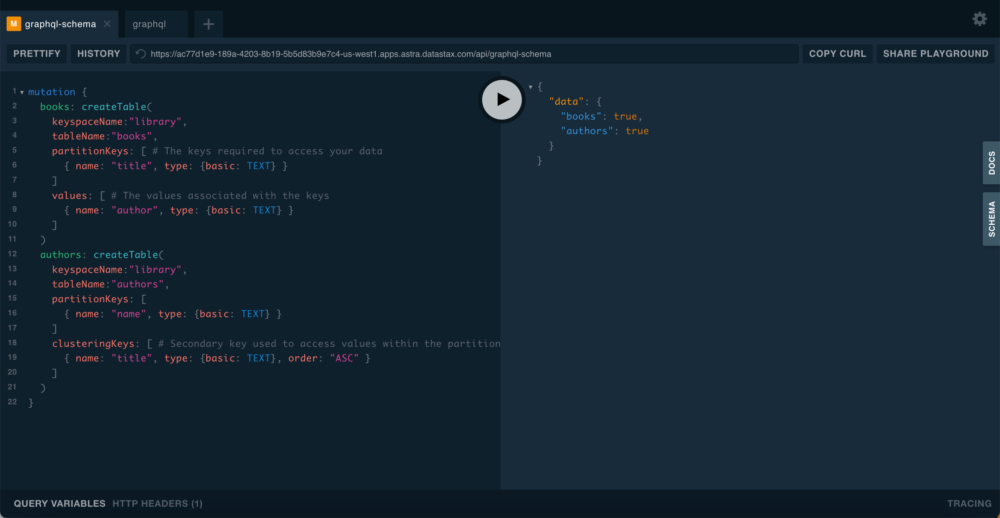
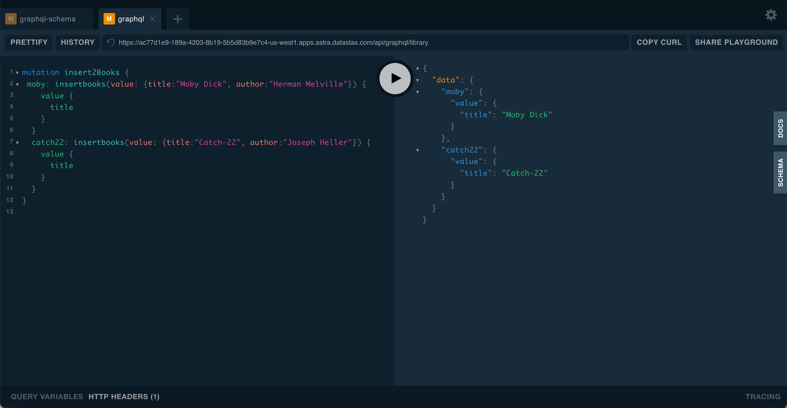
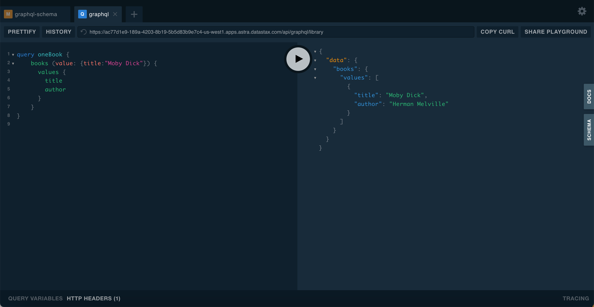

## Overview

**GraphQL** is a query language for APIs and a runtime for fulfilling those queries with existing data. [Stargate.io](https://stargate.io/) provides a graphQL interface which allows you to easily modify and query your table data using GraphQL types, mutations, and queries.

Stargate GraphQL API supports two modes of interaction:

- **schema-first** which allows you to create idiomatic GraphQL types, mutations, and queries in a manner familiar to GraphQL developers. The schema is deployed and can be updated by deploying a new schema without recreating the tables and columns directly.

- **cql-first** which translates CQL tables into GraphQL types, mutations, and queries. The GraphQL schema is automatically generated from the keyspace, tables, and columns defined, but no customization is allowed.


## Prerequisites

- You should have an [Astra account](https://astra.dev/3B7HcYo)
- You should [Create an Astra Database](/docs/pages/astra/create-instance/)
- You should [Have an Astra Token](/docs/pages/astra/create-token/)

## Exploring the GraphQL API with the GraphQL playground

A simple way to get started with GraphQL is to use the built-in GraphQL playground. The playground allows you to create new schema and interact with the GraphQL APIs. The server paths are structured to provide access to creating and querying your schemas, as well as querying and modifying your data. 


**✅ Open the GraphQL Playground**

Open the playground from the Connect tab in the APIs section.



Remember to add your token to the **HTTP HEADERS** at the bottom of the screen.



**✅ Creating a keyspace** :

Before you can start using the GraphQL API, you must first create a keyspace and at least one table in your database. If you are connecting to a database with an existing schema, you can skip this step.

For this example, we will use a keyspace called `library`:



**✅ Creating a Table** :

There are three Stargate GraphQL API endpoints, one for creating schema in cql-first, one for deploying a schema in the schema-first, and the third for querying or mutating a keyspace.

**Schema**

&nbsp;&nbsp;&nbsp;&nbsp;*https://$ASTRA_CLUSTER_ID-$ASTRA_REGION.apps.astra.datastax.com:8080/api/graphql-schema*

**Admin**

&nbsp;&nbsp;&nbsp;&nbsp;*https://$ASTRA_CLUSTER_ID-$ASTRA_REGION.apps.astra.datastax.com:8080/api/graphql-admin*

**Querying**

&nbsp;&nbsp;&nbsp;&nbsp;*https://$ASTRA_CLUSTER_ID-$ASTRA_REGION.apps.astra.datastax.com:8080/api/graphql/{keyspace}*

- In the `graphql-schema` endpoint, use this query to create a new table

```
mutation {
  books: createTable(
    keyspaceName:"library",
    tableName:"books",
    partitionKeys: [ # The keys required to access your data
      { name: "title", type: {basic: TEXT} }
    ]
    values: [ # The values associated with the keys
      { name: "author", type: {basic: TEXT} }
    ]
  )
  authors: createTable(
    keyspaceName:"library",
    tableName:"authors",
    partitionKeys: [
      { name: "name", type: {basic: TEXT} }
    ]
    clusteringKeys: [ # Secondary key used to access values within the partition
      { name: "title", type: {basic: TEXT}, order: "ASC" }
    ]
  )
}
```

You should see the following confirmation once the command executes.



**✅ Inserting Data** :

Any of the created APIs can be used to interact with the GraphQL data, to write or read data.

First, let’s navigate to your new keyspace `library` inside the playground. Switch to `graphql` tab and pick the url `/graphql/library`.

- Use this query

```
mutation insert2Books {
  moby: insertbooks(value: {title:"Moby Dick", author:"Herman Melville"}) {
    value {
      title
    }
  }
  catch22: insertbooks(value: {title:"Catch-22", author:"Joseph Heller"}) {
    value {
      title
    }
  }
}
```

- Don't forget to update the header again with your token details

```
{
  "x-cassandra-token":"your token"
}
```
- You should see that two books have been added to the table.




**✅ Querying Data** :

To query the data, switch to the `graphql/library` endpoint and execute the following

```
query oneBook {
    books (value: {title:"Moby Dick"}) {
      values {
        title
        author
      }
    }
}
```

The query results will look like the following




## Extra Resources

- Developing with [GraphQL](https://docs.datastax.com/en/astra-serverless/docs/develop/graphql.html)
- Introduction to [GraphQL Workshop](https://github.com/datastaxdevs/workshop-intro-to-graphql)
