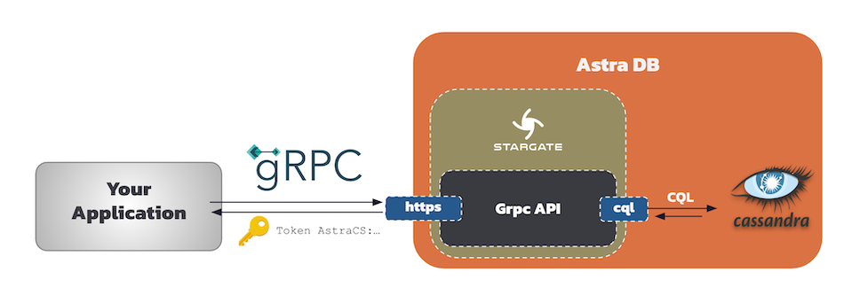

## 1. What is gRPC ?

### 1.1 Overview

[gRPC](http://grpc.io) is a modern open source high performance Remote Procedure Call (RPC) framework that can run in any environment. It can efficiently connect services in and across data centers with pluggable support for load balancing, tracing, health checking and authentication. It is also applicable in last mile of distributed computing to connect devices, mobile applications and browsers to backend services.

One of the primary benefits of using gRPC is for documentation; you can use your service configuration and API interface definition files to generate reference documentation for your API.

### 1.2 What you need to know

- gRPC underlying protocol is HTTP/2. It always blocking, asynchronous and reactive communications.

- Payloads are serialized in **binary** format call protocol buffers.

- Associated with protocol buffers the interfaces are define with `.proto` definitions files. From those definitions both server and clients are generated (stubbs).

Apache Cassandra is a NoSQL Distributed database built for performance. This fits very well use cases where this technology shines : when the performance requirements are demanding.


## 2. How is it exposed in Astra ?

The stargate team considers that gRPC could become the future of drivers for Apache Cassandra as describe in the [following blogpost](https://stargate.io/2022/01/15/stargate-grpc-the-better-way-to-cql.html).

As a consequence a grpc API layer is available within [Stargate](stargate.io). Stargate is deployed within Astra and this is how Astra can provides a gRPC Api.



## 3. Getting Started

### 3.1 Prerequisites

- [Create an Astra Database](https://awesome-astra.github.io/docs/pages/astra/create-instance/)
- [Create an Astra Token](https://awesome-astra.github.io/docs/pages/astra/create-token/)


### 3.2 Implementation

- Download to the `.proto` files. For Stargate they can be found [here]()

- Generate stubs base on the proto files. In the case of Stargate gRPC apis datastax has  generated those stubs for a couple of languages already
    - [Java grpcClient](https://github.com/stargate/stargate-grpc-java-client)
    - [Rust grpcClient](https://github.com/stargate/stargate-grpc-rust-client)
    - [Go grpcClient](https://github.com/stargate/stargate-grpc-go-client)
    - [Node grpcClient](https://github.com/stargate/stargate-grpc-node-client)

- To use those a [complete documentation](https://stargate.io/docs/latest/develop/dev-with-grpc.html) can be found on Stargate.io.

- A SDK has been implemented on top of those client to propose fluent Apis. Here are the different links
    - [Java SDK](https://github.com/datastax/astra-sdk-java/wiki)
    - [Python SDK](https://github.com/datastax/astrapy)
    - [JavaScript SDK](https://github.com/datastax/astrajs)
    - [Go SDK](https://github.com/datastax-ext/astra-go-sdk)

### 3.3 Sample codes

To illustrate the usage of the grpc againt astra with and without the SDK look at the following code

#### Code with gRPC client

```java
// Initialize Astra Client with token and database identifiers
        try(AstraClient astraClient = AstraClient.builder()
                .withDatabaseId(ASTRA_DB_ID)
                .withDatabaseRegion(ASTRA_DB_REGION)
                .withToken(ASTRA_DB_TOKEN)
                .enableGrpc()
                .build()) {
            
            // Accessin the gRPC API
            ApiGrpcClient cloudNativeClient = astraClient.apiStargateGrpc();
            
            // Reuse cql query
            String cqlQuery = "SELECT data_center from system.local";
            
            // Executing Query
            ResultSetGrpc rs = cloudNativeClient.execute(cqlQuery);
            
            // Accessing reulst
            String datacenterName = rs.one().getString("data_center");
            System.out.println("You are connected to '%s'".formatted(datacenterName));
            
            // Validating the test
            Assertions.assertNotNull(datacenterName);
        }
```        

#### Code with gRPC SDK

```java
// Open Grpc communicatino 
        ManagedChannel channel = ManagedChannelBuilder
            .forAddress(ASTRA_DB_ID + "-" + ASTRA_DB_REGION + ".apps.astra.datastax.com", 443)
            .useTransportSecurity()
            .build();
        
        // use Grpc Stub generated from .proto as a client
        StargateGrpc.StargateBlockingStub cloudNativeClient = StargateGrpc
                .newBlockingStub(channel)
                .withCallCredentials(new StargateBearerToken(ASTRA_DB_TOKEN))
                .withDeadlineAfter(5, TimeUnit.SECONDS);
        
        // create Query
        String cqlQuery = "SELECT data_center from system.local";
        
        // Execute the Query
        Response res = cloudNativeClient.executeQuery(QueryOuterClass
                        .Query.newBuilder().setCql(cqlQuery).build());

        // Accessing Row result
        QueryOuterClass.Row row = res.getResultSet().getRowsList().get(0);
        
        // Access the single value
        String datacenterName = row.getValues(0).getString();
        System.out.println("You are connected to '%s'".formatted(datacenterName));
        
        // Validating the test
        Assertions.assertNotNull(datacenterName);
```


