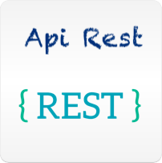

Dear <b>Developers</b>, so you have a running database ... now what ? In this page we provide you with the minimum amount of code needed to use Astra with the language or framework of your choice.

### 🛠️ Pick a language

Click the tile and learn how to interact with each language-specific interface exposed in Astra.

&nbsp;&nbsp;
&nbsp;&nbsp;
&nbsp;&nbsp;
&nbsp;&nbsp;

 
&nbsp;&nbsp;
&nbsp;&nbsp;

### 🛠️ Pick a framework

&nbsp;&nbsp;
&nbsp;&nbsp;

</a>&nbsp;&nbsp;

&nbsp;&nbsp;
&nbsp;&nbsp;
&nbsp;&nbsp;

### 🛠️ Learn about an API

Astra offers different Apis and interfaces. The choice of one against another will be driven by your use cases.

&nbsp;&nbsp;
&nbsp;&nbsp;
&nbsp;&nbsp;
&nbsp;&nbsp;
<!-- Placeholder for CQL section

-->

