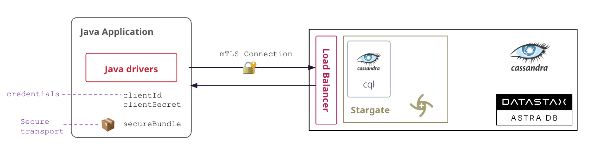

<link rel="stylesheet" href="https://maxcdn.bootstrapcdn.com/font-awesome/4.6.1/css/font-awesome.min.css">

---


Astra offers different Apis. Select the API you want to use below to get documentation.

<a href="#2-native-cassandra-drivers">
 
</a>&nbsp;&nbsp;
<a href="#3-api-rest">

</a>&nbsp;&nbsp;
<a href="#4-api-document">
 
</a>&nbsp;&nbsp;
<a href="#5-api-graphql">

</a>&nbsp;&nbsp;
<a href="#6-api-grpc">

</a>&nbsp;&nbsp;

## 1. Pre-requisites

??? abstract "Setup your Development environment"

      - [x] **Install Java Development Kit (JDK) 8+**
      
      Use [java reference documentation](https://docs.oracle.com/javase/8/docs/technotes/guides/install/install_overview.html) targetting your operating system to install a Java Development Kit. You can then validate your installation with the following command.

      ```bash
      java --version
      ```

      - [x] **Install Apache Maven (3.8+)**
      
      Samples and tutorials have been designed with `Apache Maven`. Use the [reference documentation](https://maven.apache.org/install.html) top install maven validate your installation with 

      ```bash
      mvn -version
      ```

??? abstract "Setup Datastax Astra"

    - [x] **Create your DataStax Astra account**: 
    
    <a href="https://astra.dev/3B7HcYo" class=md-button>Sign Up</a>

    - [x] **Create an Astra Token**
    
    An astra token acts as your credentials, it holds the different permissions. The scope of a token is the whole organization (tenant) but permissions can be edited to limit usage to a single database.

    To create a token, please follow [this guide](https://awesome-astra.github.io/docs/pages/astra/create-token/#c-procedure)

    The Token is in fact three separate strings: a `Client ID`, a `Client Secret` and the `token` proper. You will need some of these strings to access the database, depending on the type of access you plan. Although the Client ID, strictly speaking, is not a secret, you should regard this whole object as a secret and make sure not to share it inadvertently (e.g. committing it to a Git repository) as it grants access to your databases.

    ```json
    {
      "ClientId": "ROkiiDZdvPOvHRSgoZtyAapp",
      "ClientSecret": "fakedfaked",
      "Token":"AstraCS:fake"
    }
    ```

    It is handy to have your token declare as an environment variable (_replace with proper value_):

    ```
    export ASTRA_TOKEN="AstraCS:replace_me"
    ```

    - [x] **Create a Database and a keyspace**

    With your account you can run multiple databases, a Databases is an Apache Cassandra cluster. It can live in one or multiple regions (dc). In each Database you can have multiple keyspaces. In the page we will use the database name `db_demo` and the keyspace `keyspace_demo`.
    
    You can create the DB using the user interface and [here is a tutorial](https://awesome-astra.github.io/docs/pages/astra/create-instance/#c-procedure). You can also use Astra command line interface. To install and setup the CLI run the following:

    ```
    curl -Ls "https://dtsx.io/get-astra-cli" | bash
    source ~/.astra/cli/astra-init.sh
    astra setup --token ${ASTRA_TOKEN}
    ```

    To create DB and keyspace with the CLI:

    ```
    astra db create db_demo -k keyspace_demo --if-not-exists
    ```

    - [x] **Download the Secure Connect Bundle for current database**

    A _Secure Connect Bundle_ contains the certificates and endpoints informations to open a [mTLS connection](https://www.cloudflare.com/learning/access-management/what-is-mutual-tls/). Often mentionned as `scb` its scope is a database AND a region. If your database is deployed on multiple regions you will have to download the bundle for each one and initiate the connection accordingly. Instructions to [download Secure Connect Bundle are here](/docs/pages/astra/download-scb/)

    

     You can download the secure connect bundle from the user interface and [here is a tutorial](https://awesome-astra.github.io/docs/pages/astra/download-scb/). You can also use Astra command line interface.

     ```
     astra db download-scb db_demo -f /tmp/secure-connect-bundle-db-demo.zip
     ```

     With an account and a database running you are all set.


## 2. Cassandra Drivers

### 2.1 Drivers 4.x

> The official documentation for Cassandra drivers is available on [datastax documentation portal](https://docs.datastax.com/en/developer/java-driver/4.13/manual/cloud/)

> `4.x` is the **recommended** version of the cassandra drivers.

#### Quickstart

???+ note annotate "Project Setup"

      - Any version `4.x` should be compatible with Astra.

      - Update your `pom.xml` file with the latest version of the 4.x libraries: [](https://maven-badges.herokuapp.com/maven-central/com.datastax.oss/java-driver-core)

      ```xml
      <!-- (REQUIRED) -->
      <dependency>
      <groupId>com.datastax.oss</groupId>
      <artifactId>java-driver-core</artifactId>
      <version>${latest4x}</version>
      </dependency>

      <!-- OPTIONAL -->
      <dependency>
      <groupId>com.datastax.oss</groupId>
      <artifactId>java-driver-query-builder</artifactId>
      <version>${latest4x}</version>
      </dependency>
      <dependency>
      <groupId>com.datastax.oss</groupId>
      <artifactId>java-driver-mapper-runtime</artifactId>
      <version>${latest4x}</version>
      </dependency>
      ```

???+ example "Sample Code"

      - Create an [`AstraDriver4x.java`](https://github.com/awesome-astra/sample-java-driver4x/blob/main/src/main/java/com/datastax/astra/AstraDriver4x.java) class with the following code

      ``` java title="AstraDriver4x.java" linenums="1"
      --8<-- "https://raw.githubusercontent.com/awesome-astra/sample-java-driver4x/main/src/main/java/com/datastax/astra/AstraDriver4x.java"
      ```

      <a href="https://github.com/awesome-astra/sample-java-driver3x/archive/refs/heads/main.zip" class="md-button">
      <i class="fa fa-download" ></i>&nbsp;Download The project
      </a>

???+ info "What you need to know"

      **📦 About Secure Connect Bundle**

      - The path to the **secure connect bundle** for your Astra database is specified with `withCloudSecureConnectBundle()`, it accepts `String`, `File` and `URL`. 
      - An SSL connection will be established automatically. Manual SSL configuration is not allowed, any settings in the driver configuration (`advanced.ssl-engine-factory`) will be ignored.
      - The secure connect bundle contains all of the necessary contact information. Specifying contact points manually is not allowed, and will result in an error

      **⚙️ About Parameters**

      - The **authentication credentials** must be specified separately with `withAuthCredentials()`, and match the username and password that were configured when creating the Astra database.

      - Another pair is accepted for the credentials: `token` for the username and the value of the token starting by `AstraCS:...` is accepted

      ```java
      // Initialization with a token and not pair clientId/slientSecret
      CqlSession.builder().withAuthCredentials("token","AstraCS:....")
      ```

      - The keyspace is here required and provided with `.withKeyspace()`
      
      - if the driver configuration does not specify an explicit consistency level, it will default to `LOCAL_QUORUM` (instead of LOCAL_ONE when connecting to a normal Cassandra database).

      - Extra configuration can be provided in `application.conf` file. 

      **🔌 About `CqlSession`**

      - All operations of the drivers can be execute from this object.

      - It a stateful, `autocloseable`, object, and must be a **singleton** in your application.

**File-based configuration**

Alternatively, or complementary the connection information can be specified in the driver’s configuration file (`application.conf`). Merge the following options with any content already present. All keys available in the file are available in [reference.conf](https://docs.datastax.com/en/developer/java-driver/4.14/manual/core/configuration/reference/)

???+ example "Recommended `application.conf`"

      ```
      datastax-java-driver {
        basic {
          request {
    	      timeout     = 10 seconds
            consistency = LOCAL_QUORUM
          }
          # change this to match the target keyspace
          session-keyspace = keyspace_name
          cloud {
            secure-connect-bundle = /path/to/secure-connect-database_name.zip
          }
        }
        advanced {
          auth-provider {
            class = PlainTextAuthProvider
            username = user_name 
            password = password
          }
          connection {
            init-query-timeout = 10 seconds
            set-keyspace-timeout = 10 seconds
            pool {
              local-size = 1
            }
          }
          reconnection-policy {
            class = ExponentialReconnectionPolicy
            base-delay = 5 seconds
            max-delay = 60 seconds
          }
          control-connection.timeout = 10 seconds
        }
      }
      ```

      With the file in the classpath, the previous code is updated as the following:

      ```java
      import java.nio.file.Paths;
      import com.datastax.oss.driver.api.core.CqlSession;

      public class AstraDriver4x {
        public static void main(String[] args) {
          try (CqlSession cqlSession = CqlSession.builder().build()) {
            System.out.println("Hello keyspace {} !" + cqlSession.getKeyspace().get());
          }
        }
      }
      ```
     
???+ info "What you need to know"

      - The configuration file `application.conf` is automatically loaded when present on the classpath. It can be used in any java-based application with no difference (_spring, quarkus..._)
      - `dc-failover` is **NOT** available as a different secure connect bundles are required for different regions (1 region = 1 dc in Astra)

#### Sample Code Library

| Classname | Description        |
| :-------------: |:---------------------|
|  [ShowMetaData4x](https://github.com/DataStax-Examples/java-cassandra-driver-from3x-to4x/blob/master/example-4x/src/main/java/com/datastax/samples/SampleCode4x_CONNECT_ClusterShowMetaData.java) |  Connect to Astra and show keyspaces and metadata from the CqlSession |
| [CreateSchema4x](https://github.com/DataStax-Examples/java-cassandra-driver-from3x-to4x/blob/master/example-4x/src/main/java/com/datastax/samples/SampleCode4x_CONNECT_CreateSchema.java) | Create schema with different `table` and `type` (UDT) if they do not exist in keyspace |
| [DropSchema4x](https://github.com/DataStax-Examples/java-cassandra-driver-from3x-to4x/blob/master/example-4x/src/main/java/com/datastax/samples/SampleCode4x_CONNECT_DropSchema.java)|  Remove assets of the schema,`table` and `type` (UDT) if they exist in target keyspace |
| [ConfigurationFile4x](https://github.com/DataStax-Examples/java-cassandra-driver-from3x-to4x/blob/master/example-4x/src/main/java/com/datastax/samples/SampleCode4x_CONNECT_DriverConfigLoader.java) | Setup the driver to use customize configuration file and not default `application.conf` |
| [ProgrammaticConfiguration](https://github.com/DataStax-Examples/java-cassandra-driver-from3x-to4x/blob/master/example-4x/src/main/java/com/datastax/samples/SampleCode4x_CONNECT_ProgrammaticConfiguration.java) |  Setup the driver in a programmatic way and not reading `application.conf` |
| [Getting Started](https://github.com/DataStax-Examples/java-cassandra-driver-from3x-to4x/blob/master/example-4x/src/main/java/com/datastax/samples/SampleCode4x_CRUD_00_GettingStarted.java)| First touch with executing queries |
| [Simple4x](https://github.com/DataStax-Examples/java-cassandra-driver-from3x-to4x/blob/master/example-4x/src/main/java/com/datastax/samples/SampleCode4x_CRUD_01_Simple.java) |  Read, update, insert, delete operations using `QueryBuilder` |
| [Paging4x](https://github.com/DataStax-Examples/java-cassandra-driver-from3x-to4x/blob/master/example-4x/src/main/java/com/datastax/samples/SampleCode4x_CRUD_02_Paging.java) | Illustrating FetchSize and how to retrieve page by page |
| [Batches4x](https://github.com/DataStax-Examples/java-cassandra-driver-from3x-to4x/blob/master/example-4x/src/main/java/com/datastax/samples/SampleCode4x_CRUD_03_Batches.java) |  Group statements within batches|
| [ListSetMapUdt4x](https://github.com/DataStax-Examples/java-cassandra-driver-from3x-to4x/blob/master/example-4x/src/main/java/com/datastax/samples/SampleCode4x_CRUD_04_ListSetMapAndUdt.java) |  Advanced types insertions with `list`, `set`, `map` but also `User Defined Type` |
| [Json4x](https://github.com/DataStax-Examples/java-cassandra-driver-from3x-to4x/blob/master/example-4x/example-4x/src/main/java/com/datastax/samples/SampleCode4x_CRUD_05_Json.java) |  Work with columns or full record with `JSON` |
| [Async4x](https://github.com/DataStax-Examples/java-cassandra-driver-from3x-to4x/blob/master/example-4x/example-4x/src/main/java/com/datastax/samples/SampleCode4x_CRUD_06_Async.java) |  Sample operations as Simple in `Asynchronous` way |
| [ObjectMapping4x](https://github.com/DataStax-Examples/java-cassandra-driver-from3x-to4x/blob/master/example-4x/example-4x/src/main/java/com/datastax/samples/SampleCode4x_CRUD_07_ObjectMapping.java) | Map table record to Java POJO at driver level |
| [Counter4x](https://github.com/DataStax-Examples/java-cassandra-driver-from3x-to4x/blob/master/example-4x/example-4x/src/main/java/com/datastax/samples/SampleCode4x_CRUD_08_Counters.java) |  Working with `counters` increment/decrement|
| [Lwt4x](https://github.com/DataStax-Examples/java-cassandra-driver-from3x-to4x/blob/master/example-4x/example-4x/src/main/java/com/datastax/samples/SampleCode4x_CRUD_09_LightweightTransactions.java) |  Working for Lightweight transactions read-before-write|
| [BlobAndCodec4x](https://github.com/DataStax-Examples/java-cassandra-driver-from3x-to4x/blob/master/example-4x/example-4x/src/main/java/com/datastax/samples/SampleCode4x_CRUD_10_BlobAndCodec.java) |  Working with `BLOB` and binary data but also how to create your own `CustomCodec` |
| [CloudAstra4x](https://github.com/DataStax-Examples/java-cassandra-driver-from3x-to4x/blob/master/example-4x/example-4x/src/main/java/com/datastax/samples/SampleCode4x_CONNECT_ServiceCloudAstra.java) |  Working with `BLOB` and binary data but also how to create your own `CustomCodec` |
| [Reactive4x](https://github.com/DataStax-Examples/java-cassandra-driver-from3x-to4x/blob/master/example-4x/example-4x/src/main/java/com/datastax/samples/SampleCode4x_CRUD_11_Reactive.java) |  Working with the Reactive API introduce in driver 4.x|

#### Sample Projects Gallery

| Classname | Description        |
| :-------------: |:---------------------|
| [Spring PetClinic in Reactive](https://github.com/spring-petclinic/spring-petclinic-reactive) | Implementation of the `PetClinic` spring application using the reactive part of the drivers. Other frameworks used are `spring-data-cassandra` and `spring-boot`
| [Quarkus Todo application](https://github.com/datastaxdevs/quarkus-astra-intro-demo) | Leveraging Quarkus extension to build a quarkus application |
| [Better Reads](https://github.com/datastaxdevs/workshop-betterreads) | A clone of Good reads using Spring Boot and Spring Data Cassandra |
| [E-Commerce](https://github.com/datastaxdevs/workshop-ecommerce-app) | A full fledge e-commerce portal with catalog, shopping cart, payment and order processing with Spring Boot |
| [Build Microservices](https://github.com/datastaxdevs/workshop-microservices-java) | Microservices with Spring |
| [Devoxx 2022](https://github.com/datastaxdevs/conference-2022-devoxx) | 3h of deep dive on how to build java applications with Spring, Quarkus and Micronaut |
| [Java Native](https://github.com/datastaxdevs/workshop-spring-quarkus-micronaut-cassandra) | Build todo application in Java Native with Spring, Quarkus and Micronaut |
| [Stargate TV Show](https://github.com/datastaxdevs/workshop-spring-stargate) | Reproduce the wheel for Stargate TV Show with destinations saved in Astra |
| [Spring Data Cassandra](https://github.com/datastaxdevs/workshop-spring-data-cassandra) | Deep dive with Spring data cassandra |

### 2.2 Drivers 3.x

> The official documentation for the drivers can be found [here](https://docs.datastax.com/en/developer/java-driver/3.11/manual/cloud/)

> Version `3.x` is still maintained but not recommended version. It will not get evolutions in the future"

#### QuickStart

???+ note annotate "Project Setup"

      - Version **3.8+** or more is required to connect to Astra.
      - Update your `pom.xml` file with the latest version of the 3.x libraries: [](https://maven-badges.herokuapp.com/maven-central/com.datastax.cassandra/cassandra-driver-mapping/)

      ```xml
      <!-- Mandatory -->
      <dependency>
        <groupId>com.datastax.cassandra</groupId>
        <artifactId>cassandra-driver-core</artifactId>
       <version>${latest3x}</version> 
      </dependency>

      <!-- Optional, Used for object mapping-->
      <dependency>
        <groupId>com.datastax.cassandra</groupId>
        <artifactId>cassandra-driver-mapping</artifactId>
        <version>${latest3x}</version> 
      </dependency>
      <!-- Optional, Used for conversion ad-hoc-->
      <dependency>
        <groupId>com.datastax.cassandra</groupId>
        <artifactId>cassandra-driver-extra</artifactId>
        <version>${latest3x}</version> 
      </dependency>
      ```

???+ example "Sample Code"

      - Create class [`AstraDriver3x.java`](https://github.com/awesome-astra/sample-java-driver3x/blob/main/src/main/java/com/datastax/astra/AstraDriver3x.java) as followed:

      ``` java title="AstraDriver3x.java" linenums="1"
      --8<-- "https://raw.githubusercontent.com/awesome-astra/sample-java-driver3x/main/src/main/java/com/datastax/astra/AstraDriver3x.java"
      ```

      <a href="https://github.com/awesome-astra/sample-java-driver3x/archive/refs/heads/main.zip" class="md-button"><i class="fa fa-download" ></i>&nbsp;Download Project</a>

???+ info "What you need to know"

      - If you work with previous versions of the driver (lower than `3.8` ) the support of Astra is not Ad-hoc it is recommended to migrate. Yet it is possible to use the `SSL` options. [Documentation](https://docs.datastax.com/en/astra-serverless/docs/connect/drivers/legacy-drivers.html#_java_legacy_driver_versions) and sample codes can be found here. 

#### Sample Code Library

| Classname | Description        |
| :-------------: |:---------------------|
| [GettingStarted3x](https://github.com/DataStax-Examples/java-cassandra-driver-from3x-to4x/blob/master/example-3x/src/main/java/com/datastax/samples/SampleCode3x_CRUD_00_GettingStarted.java) | First touch with executing queries |
| [Simple3x](https://github.com/DataStax-Examples/java-cassandra-driver-from3x-to4x/blob/master/example-3x/src/main/java/com/datastax/samples/SampleCode3x_CRUD_01_Simple.java) |  Read, update, insert, delete operations using `QueryBuilder` |
| [ShowMetaData3x](https://github.com/DataStax-Examples/java-cassandra-driver-from3x-to4x/blob/master/example-3x/src/main/java/com/datastax/samples/SampleCode3x_CONNECT_ClusterShowMetaData.java) | Connect to cluster then show keyspaces and metadata |
| [CreateKeyspace3x](https://github.com/DataStax-Examples/java-cassandra-driver-from3x-to4x/blob/master/example-3x/src/main/java/com/datastax/samples/SampleCode3x_CONNECT_CreateKeyspace.java) |  Create the `killrvideo` keyspace using `SchemaBuilder` if not exist |
| [CreateSchema3x](https://github.com/DataStax-Examples/java-cassandra-driver-from3x-to4x/blob/master/example-3x/src/main/java/com/datastax/samples/SampleCode3x_CONNECT_CreateSchema.java) | Create `table` and `type` in `killrvideo` keyspace if they don't exist |
| [DropKeyspace3x](https://github.com/DataStax-Examples/java-cassandra-driver-from3x-to4x/blob/master/example-3x/src/main/java/com/datastax/samples/SampleCode3x_CONNECT_DropKeyspace.java) |  Drop the `killrvideo` keyspace if existis using  `SchemaBuilder` |
| [DropSchema3x](https://github.com/DataStax-Examples/java-cassandra-driver-from3x-to4x/blob/master/example-3x/src/main/java/com/datastax/samples/SampleCode3x_CONNECT_DropSchema.java) |  Drop all  `table` and `type` in `killrvideo` keyspace if they exist |
| [Paging3x](https://github.com/DataStax-Examples/java-cassandra-driver-from3x-to4x/blob/master/example-3x/src/main/java/com/datastax/samples/SampleCode3x_CRUD_02_Paging.java) | Illustrating FetchSize and how to retrieve page by page |
| [Batches3x](https://github.com/DataStax-Examples/java-cassandra-driver-from3x-to4x/blob/master/example-3x/src/main/java/com/datastax/samples/SampleCode3x_CRUD_03_Batches.java) | Group statements within batches|
| [ListSetMapUdt3x](https://github.com/DataStax-Examples/java-cassandra-driver-from3x-to4x/blob/master/example-3x/src/main/java/com/datastax/samples/SampleCode3x_CRUD_04_ListSetMapAndUdt.java) |  Advanced types insertions with `list`, `set`, `map` but also `User Defined Type` |
| [Json3x](https://github.com/DataStax-Examples/java-cassandra-driver-from3x-to4x/blob/master/example-3x/src/main/java/com/datastax/samples/SampleCode3x_CRUD_05_Json.java) | Work with columns or full record with `JSON` |
| [Async3x](https://github.com/DataStax-Examples/java-cassandra-driver-from3x-to4x/blob/master/example-3x/src/main/java/com/datastax/samples/SampleCode3x_CRUD_06_Async.java) | Sample operations as Simple in `Asynchronous` way |
| [ObjectMapping3x](https://github.com/DataStax-Examples/java-cassandra-driver-from3x-to4x/blob/master/example-3x/src/main/java/com/datastax/samples/SampleCode3x_CRUD_07_ObjectMapping.java) | Map table record to Java POJO at driver level |
| [Counter3x](https://github.com/DataStax-Examples/java-cassandra-driver-from3x-to4x/blob/master/example-3x/src/main/java/com/datastax/samples/SampleCode3x_CRUD_08_Counters.java) | Working with `counters` increment/decrement|
| [Lwt3x](https://github.com/DataStax-Examples/java-cassandra-driver-from3x-to4x/blob/master/example-3x/src/main/java/com/datastax/samples/SampleCode3x_CRUD_09_LightweightTransactions.java) | Working for Lightweight transactions read-before-write|
| [BlobAndCodec3x](https://github.com/DataStax-Examples/java-cassandra-driver-from3x-to4x/blob/master/example-3x/src/main/java/com/datastax/samples/SampleCode3x_CRUD_10_BlobAndCodec.java) | Working with `BLOB` and binary data but also how to create your own `CustomCodec` |
| [CloudAstra3x](https://github.com/DataStax-Examples/java-cassandra-driver-from3x-to4x/blob/master/example-3x/src/main/java/com/datastax/samples/SampleCode3x_CONNECT_ServiceCloudAstra.java) | Working with `BLOB` and binary data but also how to create your own `CustomCodec` |

### 2.3 Astra SDK

The `Astra` _Software Deployment Kit_, or `SDK`, allows developers to connect to Astra with all the different interfaces available. In this section we will detailed how to setup this client library to use the cassandra drivers interface.

#### Quickstart

???+ note annotate "Project Setup"

      - Update your `pom.xml` file with the latest version of the SDK [](https://maven-badges.herokuapp.com/maven-central/com.datastax.oss/java-driver-core)

      ```xml
      <dependencies>
       <dependency>
           <groupId>com.datastax.astra</groupId>
           <artifactId>astra-sdk</artifactId>
           <version>${latestSDK}</version>
       </dependency>
      </dependencies>
      ```

???+ example "Sample Code"

      - Create a class [`AstraSdkDrivers.java`](https://github.com/awesome-astra/sample-java-sdk/blob/main/src/main/java/com/datastax/astra/AstraSdkDrivers.java) with the following code.


      ``` java title="AstraSdkDrivers.java" linenums="1"
      --8<-- "https://raw.githubusercontent.com/awesome-astra/sample-java-sdk/main/src/main/java/com/datastax/astra/AstraSdkDrivers.java"
      ```

      <a href="https://github.com/awesome-astra/sample-java-sdk/archive/refs/heads/main.zip" class="md-button">
        <i class="fa fa-download" ></i>&nbsp;Download Project
      </a>

???+ abstract "What you need to know"

    **🔑 About Credentials**

     - The pair `clientId`/ `clientSecret` hold your credentials. It can be replaced by the value of the token only.

     ```java
     AstraClient.builder().withToken("AstraCS:...");
     ```

     - There is no need to download the cloud securebundle in advance as it will be downloaded for you in folder `~.astra/scb` by default. Stil, but you can also provide the file location with `.withCqlCloudSecureConnectBundle()`:

     ```java
     AstraClient.builder().withCqlCloudSecureConnectBundle("/tmp/scb.zio");
     ```

     - Notice than `enableCQL()` must be explictely provided. The `sdk` will open only the asked interfaces in order to limit the resource consumption.

    **⚙️ About Database identifiers**

     - `databaseId`/`databaseRegion` will be required to locate the proper endpoint. You can find them for a particular database with either the cli.

     ```
     $astra db list

     +---------------------+--------------------------------------+---------------------+-----------+
     | Name                | id                                   | Default Region      | Status    |
     +---------------------+--------------------------------------+---------------------+-----------+
     | db_demo             | 3043a40f-39bf-464e-8337-dc283167b2c3 | us-east1            | ACTIVE    |
     +---------------------+--------------------------------------+---------------------+-----------+

     $astra db describe db_demo

     +------------------------+-----------------------------------------+
     | Attribute              | Value                                   |
     +------------------------+-----------------------------------------+
     | Name                   | db_demo                                 |
     | id                     | 3043a40f-39bf-464e-8337-dc283167b2c3    |
     | Status                 | ACTIVE                                  |
     | Default Cloud Provider | GCP                                     |
     | Default Region         | us-east1                                |
     | Default Keyspace       | keyspace_demo                           |
     | Creation Time          | 2023-04-17T09:03:14Z                    |
     | Keyspaces              | [0] demo                                |
     | Regions                | [0] us-east1                            |
     +------------------------+-----------------------------------------+
     ```


## 4. Api Rest

!!! important "⚠️ We recommend to use version `V2` (_with V2 in the URL_) as it covers more features and the V1 would be deprecated sooner."

    

To know more regarding this interface specially you can have a look to [dedicated section of the wiki](https://awesome-astra.github.io/docs//Stargate-Api-Rest) or [reference Stargate Rest Api Quick Start Guide](https://stargate.io/docs/stargate/1.0/quickstart/quick_start-rest.html).

### 4.1 `Http Client`

You need an `HTTP Client` to use the Rest API. There are a lot of clients in the Java languages like [HttpURLConnection](https://docs.oracle.com/en/java/javase/11/docs/api/java.base/java/net/HttpURLConnection.html), [HttpClient introduced in Java 11](https://docs.oracle.com/en/java/javase/11/docs/api/java.net.http/java/net/http/HttpClient.html), [Apache HTTPClient](https://hc.apache.org/httpcomponents-client-5.0.x/index.html), [OkHttpClient](https://square.github.io/okhttp/), [Jetty HttpClient](https://www.eclipse.org/jetty/documentation/current/http-client.html). A comparison is provided is this [blogpost](https://www.mocklab.io/blog/which-java-http-client-should-i-use-in-2020/) to make your choice. In this tutorial, we will use the `Apache HttpClient`, which is included in the SDK. You should adapt the code depending on the framework you have chosen.

???+ note annotate "Import dependencies in your `pom.xml`"

    ```xml
    <dependency>
      <groupId>org.apache.httpcomponents.client5</groupId>
      <artifactId>httpclient5</artifactId>
      <version>5.1.3</version>
    </dependency>
    ```

???+ note "Standalone Code"
     
      ```java
      import java.io.File;
      public class AstraRestApiHttpClient {

          static final String ASTRA_TOKEN       = "<change_with_your_token>";
          static final String ASTRA_DB_ID       = "<change_with_your_database_identifier>";
          static final String ASTRA_DB_REGION   = "<change_with_your_database_region>";
          static final String ASTRA_DB_KEYSPACE = "<change_with_your_keyspace>";

          public static void main(String[] args) throws Exception {

              String apiRestEndpoint = new StringBuilder("https://")
                      .append(ASTRA_DB_ID).append("-")
                      .append(ASTRA_DB_REGION)
                      .append(".apps.astra.datastax.com/api/rest")
                      .toString();
              System.out.println("Rest Endpoint is " + apiRestEndpoint);

              try (CloseableHttpClient httpClient = HttpClients.createDefault()) {
                  // Work with HTTP CLIENT
                  listKeyspaces(httpClient, apiRestEndpoint);
                  createTable(httpClient, apiRestEndpoint);
              }
          }
      }
      ```

 - **Operations**

??? note "List Keyspaces"

     

     - Code

      ```java

      private static void listKeyspaces(CloseableHttpClient httpClient, String apiRestEndpoint)
      throws Exception {
              // Build Request
              HttpGet listKeyspacesReq = new HttpGet(apiRestEndpoint + "/v2/schemas/keyspaces");
              listKeyspacesReq.addHeader("X-Cassandra-Token", ASTRA_TOKEN);

              // Execute Request
              try(CloseableHttpResponse res = httpClient.execute(listKeyspacesReq)) {
              if (200 == res.getCode()) {
              logger.info("[OK] Keyspaces list retrieved");
              logger.info("Returned message: {}", EntityUtils.toString(res.getEntity()));
      }
      ```


??? note "Creating a table"

      

      - Sample `JSON` payload `createTableJson`.

      ```json
      {
        "name": "users",
        "columnDefinitions": [
          {  "name": "firstname", "typeDefinition": "text" },
          {  "name": "lastname",  "typeDefinition": "text" },
          {  "name": "email",     "typeDefinition": "text" },
          {  "name": "color",     "typeDefinition": "text" }
        ],
        "primaryKey": { 
          "partitionKey": ["firstname"],
          "clusteringKey": ["lastname"]
        },
        "tableOptions": {
          "defaultTimeToLive": 0,
          "clusteringExpression": [{ "column": "lastname", "order": "ASC" }]
        }
      }
      ```

      - Creating the http request using that payload

      ```java
      private static void createTable(CloseableHttpClient httpClient, String apiRestEndpoint)
      throws Exception {
        HttpPost createTableReq = new HttpPost(apiRestEndpoint
            + "/v2/schemas/keyspaces/" + ASTRA_DB_KEYSPACE + "/tables");
        createTableReq.addHeader("X-Cassandra-Token", ASTRA_TOKEN);
        String createTableJson = "{...JSON.....}";
        createTableReq.setEntity(new StringEntity(createTableJson, ContentType.APPLICATION_JSON));

        // Execute Request
        try(CloseableHttpResponse res = httpClient.execute(createTableReq)) {
          if (201 == res.getCode()) {
            logger.info("[OK] Table Created (if needed)");
            logger.info("Returned message: {}", EntityUtils.toString(res.getEntity()));
          }
        }
      }
      ```

??? note "Insert a new Row"

      

      ```java
      private static void insertRow(CloseableHttpClient httpClient, String apiRestEndpoint)
      throws Exception {
        HttpPost insertCedrick = new HttpPost(apiRestEndpoint + "/v2/keyspaces/"
        + ASTRA_DB_KEYSPACE + "/users" );
        insertCedrick.addHeader("X-Cassandra-Token", ASTRA_TOKEN);
        insertCedrick.setEntity(new StringEntity("{"
          + " \"firstname\": \"Cedrick\","
          + " \"lastname\" : \"Lunven\","
          + " \"email\"    : \"c.lunven@gmail.com\","
          + " \"color\"    : \"blue\" }", ContentType.APPLICATION_JSON));

        // Execute Request
        try(CloseableHttpResponse res = httpClient.execute(insertCedrick)) {
          if (201 == res.getCode()) {
            logger.info("[OK] Row inserted");
            logger.info("Returned message: {}", EntityUtils.toString(res.getEntity()));
          }
        }
      }
      ```

??? note "Retrieve a row"

      

      ```java
      private static void retrieveRow(CloseableHttpClient httpClient, String apiRestEndpoint)
      throws Exception {

        // Build Request
        HttpGet rowReq = new HttpGet(apiRestEndpoint + "/v2/keyspaces/"
          + ASTRA_DB_KEYSPACE + "/users/Cedrick/Lunven" );
        rowReq.addHeader("X-Cassandra-Token", ASTRA_TOKEN);

        // Execute Request
        try(CloseableHttpResponse res = httpClient.execute(rowReq)) {
          if (200 == res.getCode()) {
            String payload =  EntityUtils.toString(res.getEntity());
            logger.info("[OK] Row retrieved");
            logger.info("Row retrieved : {}", payload);
          }
        }
      }
      ```

???+ abstract "Resources"

      <a href="https://github.com/awesome-astra/sample-java-sdk/archive/refs/heads/main.zip" class="md-button">
        <i class="fa fa-download" ></i>&nbsp;Download REST HTTP CLIENT
      </a>

      - To get the full fledged information regarding the SDK check the [github repository](https://github.com/datastax/astra-sdk-java/wiki)


### 4.2 `Astra SDK`

The `Astra SDK` sets up the connection to work with the AstraDB cloud-based service. You will work with the class `AstraClient`, [Reference documentation](https://github.com/datastax/astra-sdk-java/wiki).

???+ note annotate "Import dependencies in your `pom.xml`"

      - Update your `pom.xml` file with the latest version of the SDK [](https://maven-badges.herokuapp.com/maven-central/com.datastax.oss/java-driver-core)

      ```xml
      <dependencies>
       <dependency>
           <groupId>com.datastax.astra</groupId>
           <artifactId>astra-sdk</artifactId>
           <version>${latestSDK}</version>
       </dependency>
      </dependencies>
      ```

???+ note "Standalone Code"

      ```java
      import java.io.File;
      import com.datastax.astra.sdk.AstraClient;
      import com.datastax.oss.driver.api.core.CqlSession;

      public class AstraSdk {

        // Define inputs
        static final String ASTRA_DB_TOKEN  = "<provide_a_clientSecret>";
        static final String ASTRA_DB_ID     = "<provide_your_database_id>";
        static final String ASTRA_DB_REGION = "<provide_your_database_region>";
        static final String ASTRA_KEYSPACE  = "<provide_your_keyspace>";

        // Init Astra Client
        public static void main(String[] args) {
            try(AstraClient cli = AstraClient.builder()
              .withToken(ASTRA_DB_TOKEN)
              .withDatabaseId(ASTRA_DB_ID)
              .withDatabaseRegion(ASTRA_DB_REGION)
              .withCqlKeyspace(ASTRA_DB_KEYSPACE)
              .build()) {
                System.out.println("+ List of Keyspaces: " + 
                  astraClient.apiStargateData()
                             .keyspaceNames()
                             .collect(Collectors.toList()));
            }
        }
      }
      ```

???+ abstract "Resources"

      <a href="https://github.com/awesome-astra/sample-java-sdk/archive/refs/heads/main.zip" class="md-button">
        <i class="fa fa-download" ></i>&nbsp;Download SDK Sample
      </a>

      - To get the full fledged information regarding the SDK check the [github repository](https://github.com/datastax/astra-sdk-java/wiki)

## 5. Api Document

The Document API is an HTTP REST API and part of the open source Stargate.io. The idea is to provide an abstraction on top of Apache Cassandra™ to allow document-oriented access patterns. To get familiar with it you can access [documentation and sandbox here](/docs/pages/develop/api/document/)

### 5.1 `Http Client`

???+ note annotate "Import dependencies in your `pom.xml`"

    ```xml
    <dependency>
      <groupId>org.apache.httpcomponents.client5</groupId>
      <artifactId>httpclient5</artifactId>
      <version>5.1.3</version>
    </dependency>
    ```

???+ note "Standalone Code"
     
      ```java
      static final String ASTRA_TOKEN       = "change_me";
      static final String ASTRA_DB_ID       = "change_me";
      static final String ASTRA_DB_REGION   = "change_me";
      static final String ASTRA_DB_KEYSPACE = "change_me";
      static  Logger logger = LoggerFactory.getLogger(AstraDocApiHttpClient.class);

      public static void main(String[] args) throws Exception {
         try (CloseableHttpClient httpClient = HttpClients.createDefault()) {

              // Build Request
              String apiRestEndpoint = new StringBuilder("https://")
                  .append(ASTRA_DB_ID).append("-")
                  .append(ASTRA_DB_REGION)
                  .append(".apps.astra.datastax.com/api/rest")
                  .toString();
              HttpGet req = new HttpGet(apiRestEndpoint + "/v2/schemas/namespaces");
              req.addHeader("X-Cassandra-Token", ASTRA_TOKEN);

              // Execute Request
              try(CloseableHttpResponse res = httpClient.execute(req)) {
                if (200 == res.getCode()) {
                  logger.info("[OK] Namespaces list retrieved");
                  logger.info("Returned message: {}", EntityUtils.toString(res.getEntity()));
                }
              }
         }
      }
      ```

???+ abstract "Resources"

      <a href="https://github.com/awesome-astra/sample-java-sdk/archive/refs/heads/main.zip" class="md-button">
        <i class="fa fa-download" ></i>&nbsp;Download SDK Sample
      </a>


### 5.2 `Astra SDK`

The `Astra SDK` sets up the connection to work with the AstraDB cloud-based service. You will work with the class `AstraClient`, [Reference documentation](https://github.com/datastax/astra-sdk-java/wiki).

???+ note annotate "Import dependencies in your `pom.xml`"

      - Update your `pom.xml` file with the latest version of the SDK [](https://maven-badges.herokuapp.com/maven-central/com.datastax.oss/java-driver-core)

      ```xml
      <dependencies>
       <dependency>
           <groupId>com.datastax.astra</groupId>
           <artifactId>astra-sdk</artifactId>
           <version>${latestSDK}</version>
       </dependency>
      </dependencies>
      ```

???+ note "Standalone Code"

      ```java
      import java.io.File;
      import com.datastax.astra.sdk.AstraClient;
      import com.datastax.oss.driver.api.core.CqlSession;

      public class AstraSdk {

        // Define inputs
        static final String ASTRA_DB_TOKEN  = "<provide_a_clientSecret>";
        static final String ASTRA_DB_ID     = "<provide_your_database_id>";
        static final String ASTRA_DB_REGION = "<provide_your_database_region>";
        static final String ASTRA_KEYSPACE  = "<provide_your_keyspace>";

        // Init Astra Client
        public static void main(String[] args) {
            try(AstraClient cli = AstraClient.builder()
              .withToken(ASTRA_DB_TOKEN)
              .withDatabaseId(ASTRA_DB_ID)
              .withDatabaseRegion(ASTRA_DB_REGION)
              .withCqlKeyspace(ASTRA_DB_KEYSPACE)
              .build()) {
                System.out.println("+ List of Keyspaces: " + 
                  astraClient.apiStargateDocument()
                             .namespaceNames()
                             .collect(Collectors.toList()));
            }
        }
      }
      ```

???+ abstract "Resources"

      <a href="https://github.com/awesome-astra/sample-java-sdk/archive/refs/heads/main.zip" class="md-button">
        <i class="fa fa-download" ></i>&nbsp;Download SDK Sample
      </a>

      - To get the full fledged information regarding the SDK check the [github repository](https://github.com/datastax/astra-sdk-java/wiki)

## 6 Api GraphQL

### 6.1 `Astra SDK`

The `Astra SDK` sets up the connection to work with the AstraDB cloud-based service. You will work with the class `AstraClient`, [Reference documentation](https://github.com/datastax/astra-sdk-java/wiki).

???+ note annotate "Import dependencies in your `pom.xml`"

      - Update your `pom.xml` file with the latest version of the SDK [](https://maven-badges.herokuapp.com/maven-central/com.datastax.astra/astra-sdk)

      ```xml
      <dependencies>
       <dependency>
           <groupId>com.datastax.astra</groupId>
           <artifactId>astra-sdk</artifactId>
           <version>${latestSDK}</version>
       </dependency>
      </dependencies>
      ```

???+ note "Standalone Code"

      ```java
      import java.io.File;
      import com.datastax.astra.sdk.AstraClient;
      import com.datastax.oss.driver.api.core.CqlSession;

      public class AstraSdk {

        // Define inputs
        static final String ASTRA_DB_TOKEN  = "<provide_a_clientSecret>";
        static final String ASTRA_DB_ID     = "<provide_your_database_id>";
        static final String ASTRA_DB_REGION = "<provide_your_database_region>";
        static final String ASTRA_KEYSPACE  = "<provide_your_keyspace>";

        // Init Astra Client
        public static void main(String[] args) {
            try(AstraClient cli = AstraClient.builder()
              .withToken(ASTRA_DB_TOKEN)
              .withDatabaseId(ASTRA_DB_ID)
              .withDatabaseRegion(ASTRA_DB_REGION)
              .withCqlKeyspace(ASTRA_DB_KEYSPACE)
              .build()) {
                 System.out.println("+ Keyspaces (graphQL) : " + astraClient
                    .apiStargateGraphQL()
                    .cqlSchema()
                    .keyspaces());
            }
        }
      }
      ```

???+ abstract "Resources"

      <a href="https://github.com/awesome-astra/sample-java-sdk/archive/refs/heads/main.zip" class="md-button">
        <i class="fa fa-download" ></i>&nbsp;Download SDK Sample
      </a>

      - To get the full fledged information regarding the SDK check the [github repository](https://github.com/datastax/astra-sdk-java/wiki)


## 7. Api gRPC

### 7.1 Grpc Client

???+ note annotate "Import dependencies in your `pom.xml`"

      - Update your `pom.xml` file with the latest version of the SDK [](https://maven-badges.herokuapp.com/maven-central/io.stargate.grpc/grpc-proto)

      ```xml
      <dependencies>
         <dependency>
            <groupId>io.stargate.grpc</groupId>
            <artifactId>grpc-proto</artifactId>
            <version>${latest-grpc-stargate}</version>
        </dependency>
        <dependency>
            <groupId>io.grpc</groupId>
            <artifactId>grpc-netty-shaded</artifactId>
        </dependency>
      </dependencies>
      ```


???+ note "Standalone Code"

      ```java
        public class GrpcClient {

          // Define inputs
          static final String ASTRA_DB_TOKEN  = "<provide_a_clientSecret>";
          static final String ASTRA_DB_ID     = "<provide_your_database_id>";
          static final String ASTRA_DB_REGION = "<provide_your_database_region>";
          
          // Open Grpc communicatino 
          ManagedChannel channel = ManagedChannelBuilder
            .forAddress(ASTRA_DB_ID + "-" + ASTRA_DB_REGION + ".apps.astra.datastax.com", 443)
            .useTransportSecurity()
            .build();
        
          // use Grpc Stub generated from .proto as a client
          StargateGrpc.StargateBlockingStub cloudNativeClient = StargateGrpc
                .newBlockingStub(channel)
                .withCallCredentials(new StargateBearerToken(ASTRA_DB_TOKEN))
                .withDeadlineAfter(5, TimeUnit.SECONDS);
        
        // create Query
        String cqlQuery = "SELECT data_center from system.local";
        
        // Execute the Query
        Response res = cloudNativeClient.executeQuery(QueryOuterClass
                        .Query.newBuilder().setCql(cqlQuery).build());

        // Accessing Row result
        QueryOuterClass.Row row = res.getResultSet().getRowsList().get(0);
        
        // Access the single value
        String datacenterName = row.getValues(0).getString();
        System.out.println("You are connected to '%s'".formatted(datacenterName));
      ```

### 7.2 Astra SDK

The `Astra SDK` sets up the connection to work with the AstraDB cloud-based service. You will work with the class `AstraClient`, [Reference documentation](https://github.com/datastax/astra-sdk-java/wiki).

???+ note annotate "Import dependencies in your `pom.xml`"

      - Update your `pom.xml` file with the latest version of the SDK [](https://maven-badges.herokuapp.com/maven-central/com.datastax.oss/java-driver-core)

      ```xml
      <dependencies>
       <dependency>
           <groupId>com.datastax.astra</groupId>
           <artifactId>astra-sdk</artifactId>
           <version>${latestSDK}</version>
       </dependency>
      </dependencies>
      ```

???+ note "Standalone Code"

      ```java
      // Initialize Astra Client with token and database identifiers
              try(AstraClient astraClient = AstraClient.builder()
                      .withDatabaseId(ASTRA_DB_ID)
                      .withDatabaseRegion(ASTRA_DB_REGION)
                      .withToken(ASTRA_DB_TOKEN)
                      .enableGrpc()
                      .build()) {
                  
                  // Accessin the gRPC API
                  ApiGrpcClient cloudNativeClient = astraClient.apiStargateGrpc();
                  
                  // Reuse cql query
                  String cqlQuery = "SELECT data_center from system.local";
                  
                  // Executing Query
                  ResultSetGrpc rs = cloudNativeClient.execute(cqlQuery);
                  
                  // Accessing reulst
                  String datacenterName = rs.one().getString("data_center");
                  System.out.println("You are connected to '%s'".formatted(datacenterName));
                  
                  // Validating the test
                  Assertions.assertNotNull(datacenterName);
              }
      ```      
