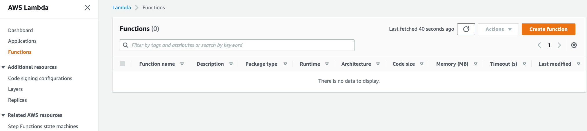
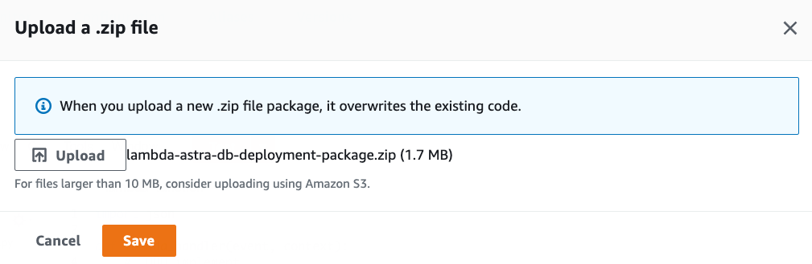

# AWS Lambda Functions

[🏠 Back to home](https://awesome-astra.github.io/docs/) | Written by **Artem Chebotko**

## A - Overview

[AWS Lambda](https://docs.aws.amazon.com/lambda/) is AWS' function-as-a-service offering that provides a serverless execution environment for your code. AWS Lambda functions are commonly used to:

- Extend Astra DB with additional data processing capabilities, such as aggregating, summarizing and validating data periodically;
- Connect Astra DB with other cloud services into data pipelines that move, process and analyze data.

## B - Prerequisites

- [Create an Astra Database](/docs/pages/astra/create-instance/)
- [Create an Astra Token](/docs/pages/astra/create-token/)
- [Download a Secure Connect Bundle](/docs/pages/astra/download-scb/)
- Optionally, if you are new to AWS Lambda, practice [creating a simpler function](https://docs.aws.amazon.com/lambda/latest/dg/getting-started.html) first

## C - Using Python Driver

### ✅ 1. Create a deployment package.

A deployment package is a `.zip` file with a function source code and dependencies. To access Astra DB from a function using Python Driver, we must add [**cassandra-driver**](https://github.com/datastax/python-driver), a Python client library for Apache Cassandra, DataStax Astra DB and DataStax Enterprise, as a dependency. In addition, as part of the deployment package, we need to include a secure connect bundle for a database in Astra DB that we want to query.

1. Open a command prompt and create a project directory:
```bash
mkdir lambda-astra-db-project
cd lambda-astra-db-project
```

2. Create file `lambda_function.py` with the function source code:
```python
from cassandra.cluster import Cluster
from cassandra.auth import PlainTextAuthProvider
import os

ASTRA_DB_CLIENT_ID = os.environ.get('ASTRA_DB_CLIENT_ID')
ASTRA_DB_CLIENT_SECRET = os.environ.get('ASTRA_DB_CLIENT_SECRET')

cloud_config= {
    'secure_connect_bundle': 'secure-connect-bundle-for-your-database.zip',
    'use_default_tempdir': True
}
auth_provider = PlainTextAuthProvider(ASTRA_DB_CLIENT_ID, ASTRA_DB_CLIENT_SECRET)
cluster = Cluster(cloud=cloud_config, auth_provider=auth_provider, protocol_version=4)
session = cluster.connect()

def lambda_handler(event, context):

    row = session.execute("SELECT cql_version FROM system.local WHERE key = 'local';").one()
    cql_version = row[0]

    print(cql_version) 
    print('Success')

    return cql_version
```
You can learn more about the code above by reading the [**cassandra-driver**](https://github.com/datastax/python-driver) documentation.

3. Install the [**cassandra-driver**](https://github.com/datastax/python-driver) library:
```bash
pip install --target . cassandra-driver
```

4. [Download the Secure Connect Bundle](/docs/pages/astra/download-scb/) for your database and copy it into the project directory.

5. Create a deployment package with `lambda_function.py`, `cassandra-driver`, and secure connect bundle:
```bash
zip -r lambda-astra-db-deployment-package.zip .
```

### ✅ 2. Create a function.

1. Go to [the Functions page](https://console.aws.amazon.com/lambda/home#/functions) of the Lambda console and click **Create function**.
<br/>

2. Choose **Author from scratch**.

3. Under the **Basic information** section, specify preferred **Function name**, **Runtime**, and **Architecture**.
<br/>

4. Click **Create function**.

5. Under the **Code** tab and the **Code source** section, select **Upload from** and upload the deployment package created in the previous steps.
<br/><br/>
<br/>
<br/>
<br/>
Since the deployment package exceeds 3 MBs, the Console Editor may not be available to view the source code:
<br/><br/>

6. Under the **Configuration** tab, select and create these **Environment variables**:
    - `ASTRA_DB_CLIENT_ID`: A **Client ID** is generated together with an application token (see the **Prerequisites** section above).
    - `ASTRA_DB_CLIENT_SECRET`: A **Client secret** is generated together with an application token (see the **Prerequisites** section above).
<br/><br/>
Note that, for better security, you can alternatively use the [AWS Secret Manager](https://docs.aws.amazon.com/secretsmanager/index.html) service to store and manage client id and secret, and then retrieve them programmatically. 

### ✅ 3. Test the function.

Under the **Test** tab, click the **Test** button and observe the output.
<br/><br/>
Notice the CQL version output and return value of **3.4.5**.

## D - Using Python SDK

### ✅ 1. Create a deployment package.

A deployment package is a `.zip` file with a function source code and dependencies. To access Astra DB from a function using REST API, we must add [**AstraPy**](https://github.com/datastax/astrapy), a Pythonic SDK for DataStax Astra and Stargate, as a dependency.

1. Open a command prompt and create a project directory:
```bash
mkdir lambda-astra-db-project
cd lambda-astra-db-project
```

2. Create file `lambda_function.py` with the function source code:
```python
from astrapy.rest import create_client, http_methods
import os

ASTRA_DB_ID = os.environ.get('ASTRA_DB_ID')
ASTRA_DB_REGION = os.environ.get('ASTRA_DB_REGION')
ASTRA_DB_APPLICATION_TOKEN = os.environ.get('ASTRA_DB_APPLICATION_TOKEN')

astra_http_client = create_client(astra_database_id=ASTRA_DB_ID,
                                  astra_database_region=ASTRA_DB_REGION,
                                  astra_application_token=ASTRA_DB_APPLICATION_TOKEN)

def lambda_handler(event, context):

    res = astra_http_client.request(
        method=http_methods.GET,
        path=f"/api/rest/v2/keyspaces/system/local/local"
    )
    cql_version = res["data"][0]['cql_version']

    print(cql_version) 
    print('Success')

    return cql_version
```
You can learn more about the code above by reading the [AstraPy](https://github.com/datastax/astrapy) documentation.

3. Install the [**AstraPy**](https://github.com/datastax/astrapy) library:
```bash
pip install --target . astrapy
```

4. Create a deployment package with `lambda_function.py` and `astrapy`:
```bash
zip -r lambda-astra-db-deployment-package.zip .
```

### ✅ 2. Create a function.

1. Go to [the Functions page](https://console.aws.amazon.com/lambda/home#/functions) of the Lambda console and click **Create function**.
<br/>

2. Choose **Author from scratch**.

3. Under the **Basic information** section, specify preferred **Function name**, **Runtime**, and **Architecture**.
<br/>

4. Click **Create function**.

5. Under the **Code** tab and the **Code source** section, select **Upload from** and upload the deployment package created in the previous steps.
<br/><br/>
<br/>

6. Verify that the uploaded function has the correct `lambda_function.py` and dependencies:
<br/><br/>
You can learn more about the code above by reading the [AstraPy](https://github.com/datastax/astrapy) documentation.

7. Click **Deploy** to deploy the function.

8. Under the **Configuration** tab, select and create these **Environment variables**:
    - `ASTRA_DB_ID`: A **Database ID** value can be found on the [Astra DB](https://astra.datastax.com/) dashboard.
    - `ASTRA_DB_REGION`: A **Region** name can be found on the overview page for a specific [Astra DB](https://astra.datastax.com/) database.
    - `ASTRA_DB_APPLICATION_TOKEN`: An **Application Token** can be generated for a specific [Astra DB](https://astra.datastax.com/) database (see the **Prerequisites** section above).
<br/><br/>
Note that, for better security, you can alternatively use the [AWS Secret Manager](https://docs.aws.amazon.com/secretsmanager/index.html) service to store and manage an application token as a secret. A secret can then be retrieved programmatically. 

### ✅ 3. Test the function.

Under the **Test** tab, click the **Test** button and observe the output.
<br/><br/>
Notice the CQL version output and return value of **3.4.5**.

## E - Using Java Driver

Coming soon.


