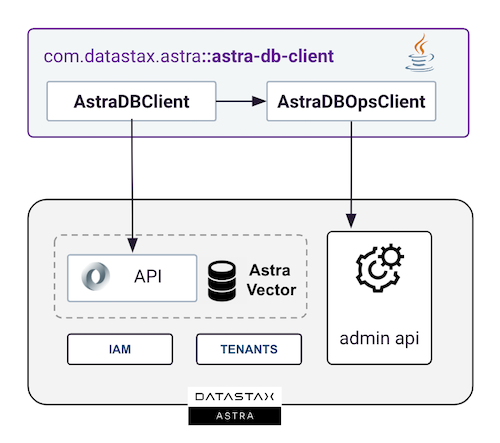

<link rel="stylesheet" href="https://maxcdn.bxootstrapcdn.com/font-awesome/4.6.1/css/font-awesome.min.css">

## 1. Overview

The Astra DB Client, as the name suggests, is a client library that interacts with the various APIs of the Astra DataStax Platform. It enables users to connect to, utilize, and administer the Astra Vector product. The library encompasses two distinct clients working in tandem:

- **AstraDBClient**: This is the primary entry point to the library and serves as the initial object to access all its features. The client supports both **schema operations** (such as adding and deleting vector stores and collections) and **data operations** (including insert, update, and delete functions). It notably offers advanced search capabilities, which encompass **similarity search, text-based search, and metadata filtering**.

- **AstraDBOpsClient**: This class is specifically designed for the **administration** of the Astra Vector platform. It facilitates the creation, deletion, and management of various **databases** within your tenant. Authentication is done via a token that is scoped to your tenant.



## 2. Prerequisites

- [x] **Install Java Development Kit (JDK) 11++**

Use the [java reference documentation](https://www.oracle.com/java/technologies/downloads/)  to install a Java Development Kit (JDK) tailored for your operating system. After installation, you can validate your setup with the following command:

```bash
java --version
```

- [x] **Install Apache Maven (3.9+) or Gradle**

Samples and tutorials are designed to be used with `Apache Maven`. Follow the instructions in the [reference documentation](https://maven.apache.org/install.html) to install Maven. To validate your installation, use the following command:

```bash
mvn -version
```

- [x] **Create your DataStax Astra account**:

<a href="https://astra.dev/3B7HcYo" class=md-button>Sign Up to Datastax Astra</a>

- [x] **Create an Astra Token**

Once logged into the user interface, select settings from the left menu and then click on the tokens tab to create a new token.


You want to pick the following role:

| Properties     | Values                       |
|----------------|------------------------------|
| **Token Role** | `Organization Administrator` |

The Token contains properties `Client ID`, `Client Secret` and the `token`. You will only need the third (starting with `AstraCS:`)

```
{
  "ClientId": "ROkiiDZdvPOvHRSgoZtyAapp",
  "ClientSecret": "fakedfaked",
  "Token":"AstraCS:fake" <========== use this field
}
```

## 3. Setup project

- [x] **If you are using `Maven` Update your `pom.xml` file with the latest version of the Vector SDK [](https://maven-badges.herokuapp.com/maven-central/com.datastax.astra/astra-db-client)**

```xml
<dependency>
  <groupId>com.datastax.astra</groupId>
  <artifactId>astra-db-client</artifactId>
  <version>${latest}</version>
</dependency>
```

- [x] **If you are using gradle change the `build.dgradle` with**

```typesafe
dependencies {
    compile 'com.datastax.astra:astra-db-client-1.0'
}
```

## 4. Getting Started

With a valid token, you can create an `AstraDBClient` object and start using the library.

```java
import com.dtsx.astra.sdk.AstraDB;
import io.stargate.sdk.json.CollectionClient;
import io.stargate.sdk.json.domain.JsonDocument;
import io.stargate.sdk.json.domain.JsonResult;

import java.util.List;

// [...]
void quickStart() {}

  // Initialization
  String token = "<replace_by_token>";
  String apiEndpoint = "https://<replace_by_db_id>-<replace_by_db_region>.db.astra.datastax.com/api/json";
  AstraDB myDb = new AstraDB(token, apiEndpoint);

  // Create a collection (if needed)
  CollectionClient demoCollection = db.createCollection("demo",14);
  
  // Insert a few vectors
  demoCollection.insertOne(new JsonDocument()
    .id("doc1") // generated if not set
    .vector(new float[]{1f, 0f, 1f, 1f, 1f, 1f, 0f, 0f, 0f, 0f, 0f, 0f, 0f, 0f})
    .put("product_name", "HealthyFresh - Beef raw dog food")
    .put("product_price", 12.99));
  demoCollection.insertOne(new JsonDocument()
    .id("doc2")
    .vector(new float[]{1f, 1f, 1f, 1f, 1f, 0f, 0f, 0f, 0f, 0f, 0f, 0f, 0f, 0f})
    .data("{"
     + "   \"product_name\": \"HealthyFresh - Chicken raw dog food\", "
     + "  \"product_price\": 9.99"
     + "}"));
  demoCollection.insertOne(new JsonDocument()
    .id("doc3")
    .vector(new float[]{1f, 1f, 1f, 1f, 1f, 0f, 0f, 0f, 0f, 0f, 0f, 0f, 0f, 0f})
    .data(Map.of("product_name", "HealthyFresh - Chicken raw dog food")));
  demoCollection.insertOne(new JsonDocument()
    .id("doc4")
    .vector(new float[]{1.0f, 1.0f, 1.0f, 1.0f, 1.0f, 0.0f, 0.0f, 0.0f, 0.0f, 0.0f, 0.0f, 0.0f, 0.0f, 0.0f})
    .put("product_name", "HealthyFresh - Chicken raw dog food")
    .put("product_price", 9.99));
  
  // Semantic/Vector Search
  float[] embeddings     = new float[] {1f, 1f, 1f, 1f, 1f, 0f, 0f, 0f, 0f, 0f, 0f, 0f, 0f, 0f};
  Filter  metadataFilter = new Filter().where("product_price").isEqualsTo(9.99);
  int maxRecord = 10;
  List<JsonResult> resultsSet = demoCollection.similaritySearch(embeddings, metadataFilter, maxRecord);
```

## 5. Reference Guide

### Connection

`AstraDB` class is the entry point of the SDK. It enables interactions with one particular database within your Astra environment. The initialization can be achieved in multiple ways:

- Using a `token` along with the `api_endpoint`. Both are retrieved from the Astra user interface.
- Using a `token` with the database identifier and eventually the region.

To establish this connection, you can generate a token via the user interface. This token will be assigned the `Database Administrator` permission level, which grants sufficient privileges for interacting with a specific database.

The `api_endpoint` is obtained from the user interface. It adheres to the following pattern: `https://{database-identifier}-{database-region}.apps.astra.datastax.com.`


```java
import com.dtsx.astra.sdk.AstraDB;
import java.util.UUID;

// [...]
void connection() {
  // Given valid tokens and api_endpoint
  String token = "<replace_with_token>";
  String apiEndpoint = "https://<database_id>-<database_region>.db.astra.datastax.com";

  // (1) Default Initialization
  AstraDB db = new AstraDB(token, apiEndpoint);

  // --- Other Initialization options ---

  // (2a) if keyspace is different from default_keyspace
  String keyspace =  "custom_keyspace";
  AstraDB db1 = new AstraDB(token, apiEndpoint, keyspace);

  // (2b) With a database identifier
  UUID databaseID = UUID.fromString("<database_id>");
  AstraDB db2 = new AstraDB(token, databaseID);
}
```

### Working with Collections

#### Overview

AstraDB is a vector database. It stores documents in collections. A collection is a group of documents that have the same fields. Documents in a collection can have different fields. The fields determine the structure of the documents in a collection. A collection is the equivalent of a table in a relational database.

There are 2 optional specialized fields :

- **$vector** : a vector field that contains the vector of the document. It is a required field.
- **$id** : a string field that contains the id of the document. It is a required field.

#### List Collections

A database can hold multiple collections. You can list all collections in a database using the `findAllCollections` method.

- [x] **List Collections with `findAllCollections`**

```java
import com.dtsx.astra.sdk.AstraDB;
import io.stargate.sdk.json.domain.CollectionDefinition;

// [...]
public void listCollections() {
  // Given an active db
  String token = "<token>";
  String apiEndpoint = "<api_endpoint>";
  AstraDB db = new AstraDB(token, apiEndpoint);

  db.findAllCollections().forEach(col -> {
    System.out.println("name=" + col.getName());
    if (col.getOptions() != null && col.getOptions().getVector() != null) {
      CollectionDefinition.Options.Vector vector = col.getOptions().getVector();
      System.out.println("dim=" + vector.getDimension());
      System.out.println("metric=" + vector.getMetric());
    }
  });
}
```

#### Create Collection
 
- [x] **Create Collection with `createCollection` with vector**

A collection can hold a vector of `float[]` representing the embeddings. The vector has a dimension and a metric. If the metric is not provided the default one is `cosine`.

```java
import com.dtsx.astra.sdk.AstraDB;

// [...]
public void createSimpleCollections() {
// Create a collection with vector
CollectionClient col2 = db.createCollection("vector_store", 1536);

// More information with the usage of the defintion
CollectionClient col3 = db.createCollection(CollectionDefinition.builder()
        .name("tmp_collection")
        .vector(14, cosine));
```

- [x] **Create Collection with `createCollection` and NO vector**

A collection can hold a vector of `float[]` representing the embeddings but this field is optional. A collection with no vector cannot be used for similarity search.

```java
// Create a collection without vector
CollectionClient col1 = db.createCollection("store_name");
```


A vector has a **dimension** that cannot be changed once it has be defined. The dimension is the number of elements in the vector.
The vector metric can be of type `cosine` or `euclidean`. The default type is `cosine`.


#### Find Collection

- [x] **Does a collection exists**

```java
boolean demo  = db.isCollectionExists("collection1");
```

- [x] **Find a collection from its name**

```java
Optional<CollectionDefinition> collection  = db.findCollection("collection1");
```

#### Delete Collection

- [x] **Delete a collection from its name**

```java
db.deleteCollection("collection1");
```

- [x] **Use same method providing a bean you get `CollectionRepository`**


```java
// Create a collection without vector
CollectionRepository<Product> col1 = db
   .createCollection("store_name", Product.class);

// Create a collection with vector
CollectionRepository<Product> col2 = db
   .createCollection("vector_store", 1536, Product.class);

// More information with the usage of the defintion
CollectionRepository<Product>  col3 = db
   .createCollection(CollectionDefinition
     .builder()
     .name("tmp_collection")
     .vector(14, cosine), 
    Product.class);
```

- [x] **If collection already exist**

```java
// Accessing CollectionClient
CollectionClient col1 = db
    .collection(name)
        
// Accessing CollectionRepository
CollectionRepository<Product> repo = db
   .collectionRepository("demo", Product.class);
```


### Working with Documents

#### Insert One

#### Insert Many

#### Find One

```java
Boolean isDocumentExists(id)

Optional<JsonResult> findOne(SelectQuery)
Optional<Result<DOC>> findOne(SelectQuery, Class<T>)
Optional<Result<DOC>> findOne(SelectQuery, ResultMapper<T>)

Optional<JsonResult>  findById(id)
Optional<Result<DOC>> findById(id, Class<T>)
Optional<Result<DOC>> findById(id, ResultMapper<T>)

Optional<JsonResult> findOneByVector(float[] vector)
Optional<Result<DOC>> findOneByVector(float[] vector, Class<T>)
Optional<Result<DOC>> findOneByVector(float[] vector, ResultMapper<T>)
```

#### Queries

#### Paging

#### Update One

#### Update Many

#### Delete One

#### Delete Many

#### Clear

        
- [x] **Insertions**

- If no id is provide when inserting the system will generate on for you

```java
// Insert with key/values
col1.insert(new JsonDocument()
  .id("doc1") // generated if not set
  .vector(new float[]{1f, 0f, 1f, 1f, 1f, 1f, 0f, 0f, 0f, 0f, 0f, 0f, 0f, 0f})
  .put("product_name", "HealthyFresh - Beef raw dog food")
  .put("product_price", 12.99));
 
// Insert with payload as Json
col1.insert(new JsonDocument()
  .id("doc2")
  .vector(new float[]{1f, 1f, 1f, 1f, 1f, 0f, 0f, 0f, 0f, 0f, 0f, 0f, 0f, 0f})
  .data("{"
       +"   \"product_name\": \"HealthyFresh - Chicken raw dog food\", "
       + "  \"product_price\": 9.99"
       + "}")
);

// Insert with payload as a Map
col1.insert(new JsonDocument()
   .id("doc3")
   .vector(new float[]{1f, 1f, 1f, 1f, 1f, 0f, 0f, 0f, 0f, 0f, 0f, 0f, 0f, 0f})
   .data(Map.of("product_name", "HealthyFresh - Chicken raw dog food"))
);

// Insert as a Json
col1.insert("{"
    + "   \"_id\":\"doc4\","
    + "   \"$vector\":[1.0, 1.0, 1.0, 1.0, 1.0, 0.0, 0.0, 0.0, 0.0, 0.0, 0.0, 0.0, 0.0, 0.0],"
    + "   \"product_name\": \"HealthyFresh - Chicken raw dog food\", "
    + "   \"product_price\": 9.99"
    + "}");
```

You can retrieve vector documents from their `id` of their `vector`. It is not really a search 
but rather a `findById`.

- [x] **Find By Id**

Retrieve a document from its id (if exists)

```java
// Assuming you have a VectorStore<MyBean>
Optional<MyBean> result = col1.findById("doc1");

// When working with JsonVectorStore to returned raw 'JsonResult'
Optional<JsonResult> result = col1.findByIdJson("doc1");
```

- [x] **Find By Vector**

Retrieve a document from its vector (if exists)

```java
// Assuming you have a VectorStore<MyBean>
Optional<MyBean> result = col1
        .findByVector(new float[]{1f, 1f, 1f, 1f, 1f, 0f, 0f, 0f, 0f, 0f, 0f, 0f, 0f, 0f});

// When working with JsonVectorStore to returned raw 'JsonResult'
Optional<JsonResult> result = col1
        .findByVectorJson(new float[]{1f, 1f, 1f, 1f, 1f, 0f, 0f, 0f, 0f, 0f, 0f, 0f, 0f, 0f});
```

- [x] **Find all**

You can retrieve all vectors from your store but it might be slow and consume a lot of memory, 
prefered paed request except when in development.

```java
// Find All for VectorStore<MyBean>
Stream<JsonResult> all = col1.findAll();
```

- [x] **Find with a query**

You can search on any field of the document. All fields are indexed. Using a `SelectQuery` populated through
builder you can get some precise results.

```java
Stream<JsonResult> all = col1.findAll(SelectQuery.builder()
  .where("product_price")
  .isEqualsTo(9.99)
  .build());
```

- [x] **Find Page**

Find Page works the same as `findAll(Query)` where you can pass a `SelectQuery` as input. In the object `Page` the field `pagingState` should be provided from page to another.

```java

// VectorStore<MyBean>
// JsonVectorStore
Page<JsonResult> page1 = vectorStore.findPage(SelectQuery.builder().build());
page1.getPageState().ifPresent(pagingState -> {
  Page<JsonResult> page2 = vectorStore
    .findPageJson(SelectQuery
    .builder().withPagingState(pagingState).build());
});
```

In the query ou can then add filter with the builder.

A similarity search is a query that will find records where vectors are the closest to a given vector. 
It is done by providing a vector and a number of results to return. The result is a list of `JsonResult` that contains the payload and the distance.

- [x] **Simple Search**

```java
float[] embeddings = 
   new float[]{1f, 1f, 1f, 1f, 1f, 0f, 0f, 0f, 0f, 0f, 0f, 0f, 0f, 0f};
int limit = 2;
List<JsonDocument> results = col1.similaritySearch(embeddings, limit);
```

- [x] **Search with filter**

```java
float[] embeddings = 
   new float[]{1f, 1f, 1f, 1f, 1f, 0f, 0f, 0f, 0f, 0f, 0f, 0f, 0f, 0f};
int limit = 2;
Filter  metadataFilter = new Filter().where("product_price").isEqualsTo(9.99);
List<JsonDocument> results = col1
        .similaritySearch(embeddings, metadataFilter, limit);
```

- When a limit is provided the service return a list of Results.
- When no limit is provided the service return a Page of results and paging is enabled.
- The limit must be between 1 and 20.

### Object Mapping

Instead of interacting with the database with key/values you may want to
associate an object to each record in the collection for this you can use `CollectionRepository`. If we reproduce the sample before

#### Overview

```java
static class Product {
  
  @JsonProperty("product_name")
  private String name;
  
  @JsonProperty("product_price")
  private Double price;
  
  // getters and setters
}
```

#### Create collection

- [x] **Similarity Search**

```java
// 1) Initialization
AstraDB db = new AstraDBClient("AstraCS:....")
        .database("getting_started");

// 2) Create or select collection
CollectionRepository<Product> productRepository = db
        .collectionRepository(collectionName, Product.class);

// 3) Insert a few vectors
productRepository.insert(new Document<>("doc5",
        new Product("HealthyFresh - Beef raw dog food", 12.99),
        new float[]{1f, 1f, 1f, 1f, 1f, 0f, 0f, 0f, 0f, 0f, 0f, 0f, 0f, 0f}));
productRepository.insert(new Document<>("doc6",
        new Product("Another Product", 9.99),
        new float[]{1f, 1f, 1f, 0f, 1f, 0f, 0f, 0f, 0f, 0f, 0f, 0f, 0f, 0f}));

// 4) Similarity Search
float[] embeddings     = 
        new float[] {1f, 1f, 1f, 1f, 1f, 0f, 0f, 0f, 0f, 0f, 0f, 0f, 0f, 0f};
Filter  metadataFilter = 
        new Filter().where("product_price").isEqualsTo(9.99);
int maxRecord = 10;
List<Result<Product>> results = productRepository
        .similaritySearch(embeddings, metadataFilter, maxRecord);
```

#### Insert One

#### Insert Many

#### Find One

```java
Boolean isDocumentExists(id)

Optional<JsonResult> findOne(SelectQuery)
Optional<Result<DOC>> findOne(SelectQuery, Class<T>)
Optional<Result<DOC>> findOne(SelectQuery, ResultMapper<T>)

Optional<JsonResult>  findById(id)
Optional<Result<DOC>> findById(id, Class<T>)
Optional<Result<DOC>> findById(id, ResultMapper<T>)

Optional<JsonResult> findOneByVector(float[] vector)
Optional<Result<DOC>> findOneByVector(float[] vector, Class<T>)
Optional<Result<DOC>> findOneByVector(float[] vector, ResultMapper<T>)
```

#### Queries

#### Paging

#### Update One

#### Update Many

#### Delete One

#### Delete Many

#### Clear


### Working with databases

#### Connection

To work with Databases you need to use a token with organization level permissions. You will work with the class `AstraDBClient`

To establish a connection with AstraDB using the client SDK, you are required to supply a token. This token enables two primary connection modes:

- **Direct database-level connection**, facilitating access to a specific database. It is the one decribe above and primay way of working with the SDK.

- **Organization-level connection**, which allows interaction with multiple databases under your organization. This is what we will detailed now

`AstraDBClient` class is used to facilitate interactions with all components within your Astra organization, rather than limiting operations to a single database.
This approach enables a broader scope of management and control across the organization's databases. The token used for this connection must be scoped to the organization with

| Properties     | Values                       |
|----------------|------------------------------|
| **Token Role** | `Organization Administrator` |


```java
import com.dtsx.astra.sdk.AstraDBClient;

// [...]

public void connectionToOrganization() {
  // Given a valid token 'AstraCS:...'
  String token="<replace_by_token>";

  // Initialization with a token
  AstraDBClient client=new AstraDBClient(token);

  /*
    * You can omit the token if you defined the environment variable
    * `ASTRA_DB_APPLICATION_TOKEN` or you if are using the Astra CLI.
    */
  AstraDBClient defaultClient=new AstraDBClient();
}
```

#### List databases


```java
import com.dtsx.astra.sdk.AstraDBClient;
import com.dtsx.astra.sdk.db.domain.Database;

import java.util.Optional;
import java.util.UUID;
import java.util.stream.Stream;

// [...]
public void listDatabases() {
    
 AstraDBClient client = new AstraDBClient("<replace_by_token>");

 // list all databases in your organization
 Stream<Database> allDbs = client.findAllDatabases();

 // find a database from its unique identifier
 UUID databaseID = UUID.fromString("<replace_by_db_id>");
 Optional<Database> oneDb = client.findDatabaseById(databaseID);
        
 // Find databases from a name (unicity is not garantees)
 String databaseName = "<replace_by_db_name>";
 Stream<Database> result = client.findDatabaseByName(databaseName);
}
```

#### Create database

To create a database you need to use a token with organization level permissions. You will work with the class `AstraDBClient`

```java
import com.dtsx.astra.sdk.AstraDBClient;
import com.dtsx.astra.sdk.db.domain.CloudProviderType;
import java.util.UUID;
// [...]

public void createDatabase() {

  AstraDBClient client = new AstraDBClient("<replace_with_token>");

  String databaseName = "<replace_with_db_name>";
  CloudProviderType cloudProvider = CloudProviderType.GCP; // GCP, AZURE or AWS
  String cloudRegion = "us-east1"; // list of region provided below
  UUID newDbId = client.createDatabase(databaseName, cloudProvider, cloudRegion);
  
  // If not provide cloudProvider and cloudRegion are defaulted to GCP and us-east1 (free tier)
  String databaseName2 = "<replace_with_db_name>";
  UUID newDbId2 = client.createDatabase(databaseName2);
  
}
```

#### Find database

To create a database you need to use a token with organization level permissions. You will work with the class `AstraDBClient`


```java
// Retrieve from an id
UUID id = UUID.randomUUID();
Optional<Database> db2 = findDatabaseById(id);

// Retrieve from  its name
Optional<Database> db2 = findDatabaseByName(name)
```

#### Delete database


- [x] **Delete Databases with `deleteDatabase`**

The function can take a database identifier (uuid) or the database name.
```java
client.deleteDatabase("db1");
```

- [x] **Access database from its `name` or `id`**


- [x] **Check a database exists**

```java
boolean isDatabaseExists(id)
```

- [x] **Accessing devops API**

```java
AstraDBOpsClient devops = clientgetAstraDbOps();
```

- [x] **Accessing object `AstraDB`**

```java
AstraDB myDB = client.database("getting_started");
```

## 6. Class Diagram


## 7. Troubleshooting

- [x] Common Errors and Solutions

List typical issues users might face and their resolutions.

- [x] 6.2. FAQ

Address frequently asked questions.

## 8. Best Practices

- [x]  7.1. Performance Tips

Offer guidance on optimizing usage for better performance.

- [x]  7.2. Security Recommendations

Share advice on secure practices when using the library.

## 9. Contribution Guide

- [x] 8.1. Code of Conduct

Outline the behavior expected from contributors.

- [x] 8.2. Contribution Steps

Describe how one can contribute to the library, e.g., via pull requests.

## 10. Release Notes/Changelog

Track changes made in each version of the library.

## 11. Contact and Support

- [x] 10.1. Reporting Bugs

Provide a link or method for users to report issues.

- [x] 10.2. Getting Help

Point users to forums, support channels, or other resources.