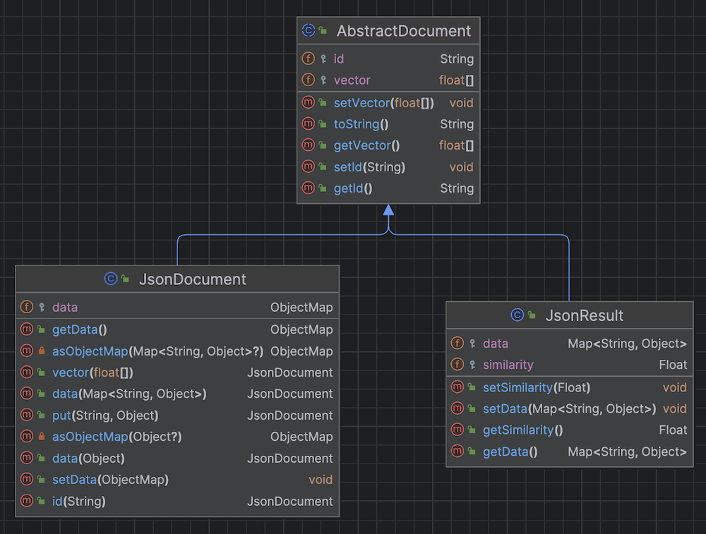

<link rel="stylesheet" href="https://maxcdn.bxootstrapcdn.com/font-awesome/4.6.1/css/font-awesome.min.css">

## 1. Overview


The Astra DB Client, as the name suggests, is a client library that interacts with the various APIs of the Astra DataStax Platform. It enables users to connect to, utilize, and administer the Astra Vector product. The library encompasses two distinct clients working in tandem:

- **AstraDB**: This is the primary endpoint, connecting exclusively to a single database to perform all operations for your applications. It requires initialization with a database administrator token and also necessitates the API endpoint of your database.

- **AstraDBAmin**: This class is initialized exclusively using an organization administrator token and enables the creation and deletion of databases via the DevOps API (`AstraDBOpsClient`). It facilitates automation and administration within your organization's tenant.

???+ info annotate "Reference Architecture"

    

## 2. Prerequisites

???+ success annotate "Installation"

    - [x] **Install Java Development Kit (JDK) 11++**
        
    Use the [java reference documentation](https://www.oracle.com/java/technologies/downloads/)  to install a Java Development Kit (JDK) tailored for your operating system. After installation, you can validate your setup with the following command:
        
    ```bash
    java --version
    ```
        
    - [x] **Install Apache Maven (3.9+) or Gradle**
        
    Samples and tutorials are designed to be used with `Apache Maven`. Follow the instructions in the [reference documentation](https://maven.apache.org/install.html) to install Maven. To validate your installation, use the following command:
        
    ```bash
    mvn -version
    ```

???+ info annotate "Astra Environment Setup"

    - [x] **Create your DataStax Astra account**:
        
    <a href="https://astra.dev/3B7HcYo" class=md-button>Sign Up to Datastax Astra</a>
        
    - [x] **Create an Astra Token**
        
    Once logged into the user interface, select settings from the left menu and then click on the tokens tab to create a new token.
        
    

    You want to pick the following role:
    
    | Properties     | Values                       |
    |----------------|------------------------------|
    | **Token Role** | `Organization Administrator` |
    
    The Token contains properties `Client ID`, `Client Secret` and the `token`. You will only need the third (starting with `AstraCS:`)
    
    ```
    {
      "ClientId": "ROkiiDZdvPOvHRSgoZtyAapp",
      "ClientSecret": "fakedfaked",
      "Token":"AstraCS:fake" <========== use this field
    }
    ```

## 3. Getting Started

???+ info annotate "Setup Project"

    - [x] **If you are using `Maven` Update your `pom.xml` file with the latest version of the Vector SDK [](https://maven-badges.herokuapp.com/maven-central/com.datastax.astra/astra-db-client)**
    
    ```xml
    <dependency>
      <groupId>com.datastax.astra</groupId>
      <artifactId>astra-db-client</artifactId>
      <version>${latest}</version>
    </dependency>
    ```
    
    - [x] **If you are using gradle change the `build.dgradle` with**
    
    ```typesafe
    dependencies {
        compile 'com.datastax.astra:astra-db-client-1.0'
    }
    ```

``` java title="Quickstart.java" linenums="1"
--8<-- "https://raw.githubusercontent.com/datastax/astra-sdk-java/main/astra-db-client/src/test/java/com/dtsx/astra/sdk/documentation/QuickStart.java"
```

## 5. Reference Guide

### Connection

???+ info annotate "Getting your token and Api Endpoint"

    `AstraDB` class is the entry point of the SDK. It enables interactions with one particular database within your Astra environment. The initialization can be achieved in multiple ways:
    
    - Using a `token` along with the `api_endpoint`. Both are retrieved from the Astra user interface.
    - Using a `token` with the database identifier and eventually the region.
    
    To establish this connection, you can generate a token via the user interface. This token will be assigned the `Database Administrator` permission level, which grants sufficient privileges for interacting with a specific database.
    
    The `api_endpoint` is obtained from the user interface. It adheres to the following pattern: `https://{database-identifier}-{database-region}.apps.astra.datastax.com.`
    
    

Please find below how to initialize the `AstraDB` class and connect.

``` java title="Connection.java" linenums="1"
--8<-- "https://raw.githubusercontent.com/datastax/astra-sdk-java/main/astra-db-client/src/test/java/com/dtsx/astra/sdk/documentation/Connecting.java"
```

### Working with Collections

#### Overview

???+ info annotate "Overview"

    AstraDB is a vector database that manages multiple collections. Each collection (AstraDBCollection) is identified by a name and stores schema-less documents. It is capable of holding any JSON document, each uniquely identified by an _id. Additionally, a JSON document within AstraDB can contain a vector. It is important to note that all documents within the same collection should utilize vectors of the same type, characterized by consistent dimensions and metrics.

    

#### Create Collection

A collection can hold a vector of `float[]` representing the embeddings.  

The vector metric can be of type `cosine` , `euclidean` or `dot_product`. If the metric is not provided the default one is `cosine`.

???+ info annotate "Rules"

    - The collection name is its unique identifier
    - Your collection name should match `[A-Za-z_]`
    - The `createCollection()` method returns an instance of `AstraDBCollection`
    - The collection will be created if not exists
    - If collection exists method is checking for vector dimension and metric
    - There are a maximum of 5 collections per database
    - If not provided the default metric is `cosine`
    - The vector `dimension` and a `metric` are set at creation and cannot be changed after
    
- [x] **To create collection use `createCollection()`**

``` java title="CreateCollection.java" linenums="1"
--8<-- "https://raw.githubusercontent.com/datastax/astra-sdk-java/main/astra-db-client/src/test/java/com/dtsx/astra/sdk/documentation/CreateCollection.java"
```

#### List Collections

A database is capable of containing multiple collections. These collections can be listed along with their detailed attributes. It is important to remember the specifications of the vector dimension and the metric used, as these parameters cannot be altered after the creation of the collection.

- [x] **To list Collections use `findAllCollections()`**

``` java title="FindAllCollections.java" linenums="1"
--8<-- "https://raw.githubusercontent.com/datastax/astra-sdk-java/main/astra-db-client/src/test/java/com/dtsx/astra/sdk/documentation/FindAllCollections.java"
```

#### Find Collection

To get detailed information about a specific collection, you can use the `findCollection()` method. 
This method takes the name of the collection as input and returns a `CollectionDefinition` object.

- [x] **To retrieve a single collections use `findCollection()`**

``` java title="FindCollection.java" linenums="1"
--8<-- "https://raw.githubusercontent.com/datastax/astra-sdk-java/main/astra-db-client/src/test/java/com/dtsx/astra/sdk/documentation/FindCollection.java"
```

#### Delete Collection

To delete a collection, you can use the `deleteCollection()` method. If the collection does not exist, the method will not fail.

- [x] **To delete a single collections use `deleteCollection()`**

``` java title="DeleteCollection.java" linenums="1"
--8<-- "https://raw.githubusercontent.com/datastax/astra-sdk-java/main/astra-db-client/src/test/java/com/dtsx/astra/sdk/documentation/DeleteCollection.java"
```

### Working with Documents

#### Insert One

You can insert unitary record with the function `insertOne()`. Multiple signatures are available to insert a document.

???+ info annotate "Rules"

    - If not provided, the identifier is generated as a java UUID
    - The method always return the document identifier.
    - All attributes are optional (schemaless)
    - You attribute names should match `[A-Za-z_]`
    - All Java simple standard types are supported
    - Nested object are supported
    - A field value should not exceed 5Kb
    - Each attribute is indexed and searchable
    - A vector cannot be filled only with 0s, it would lead to division by 0

- [x] **To insert an unitary vector use `insertOne()`**

``` java title="InsertOne.java" linenums="1"
--8<-- "https://raw.githubusercontent.com/datastax/astra-sdk-java/main/astra-db-client/src/test/java/com/dtsx/astra/sdk/documentation/InsertOne.java"
```

#### Insert Many

To insert multiple documents, utilize the insertMany() method. This method accepts a list of JsonDocument objects as input and returns a corresponding list of identifiers. 
The insertions are batched in groups of 20, aligning with the maximum number of documents permitted for insertion in a single request.

- [x] **To insert multiple vectors use `insertMany()`**

``` java title="InsertMany.java" linenums="1"
--8<-- "https://raw.githubusercontent.com/datastax/astra-sdk-java/main/astra-db-client/src/test/java/com/dtsx/astra/sdk/documentation/InsertMany.java"
```

#### Find One

???+ info annotate "`JsonResult` and `Result<T>`"

    You can retrieve documents with multiple type of filters. Each time it will return a `JsonResult` which is similar to `JsonDocument` 
    enriched with the `similariry` field.

    ```java
    Optional<JsonResult> findById(String id);
    ```
 
    This is what the classes look like:

    

    In java you might me interested in getting back your OWN OBJECT of a `JsonResult`. For this you can use the generic `Result<T>` class. 
    It is a generic class that will hold your object and the `similarity` field. 

    - If you provide a Class<T> the payload will be automatically mapped to your object. 
    - If you provide a `ResultMapper<T>` you can map the payload to your object as you like.

    ```java
    Optional<Result<T>> findById(String id, Class<T> clazz);
    Optional<Result<T>> findById(String id, ResultMapper<T> mapper);
    ```

    This is what the classes look like:

    ```mermaid
    classDiagram
    class ResultMapper~T~ {
        Result&lt;T&gt; map(JsonResult)
    }
    <<interface>> ResultMapper

    class Result~T~ {
       float similarity
    }
    class Document~T~ {
       String id
       T data
       float[] vector
    }
    Document~T~ <|-- Result~T~
    ```

- [x] **Find By Id**

You can retrieve a document from its `id` if it exists. You will get the following methods

```java
Optional<JsonResult>  findById(String id);
Optional<Result<DOC>> findById(Stringid, Class<T> clazz);
Optional<Result<DOC>> findById(Stringid, ResultMapper<T> mapper);

boolean isDocumentExists(String id)
```

Here is a sample class detailing the usage of the `findById` method.

``` java title="FindById.java" linenums="1"
--8<-- "https://raw.githubusercontent.com/datastax/astra-sdk-java/main/astra-db-client/src/test/java/com/dtsx/astra/sdk/documentation/FindById.java"
```

- [x] **Find By Vector**

If the document hold a vector you can retrieve it from its `vector`. You will get the following methods

```java
Optional<JsonResult> findOneByVector(float[] vector);
Optional<Result<DOC>> findOneByVector(float[] vector, Class<T> clazz);
Optional<Result<DOC>> findOneByVector(float[] vector, ResultMapper<T> mapper);
```

Here is a sample class detailing the usage of the `findById` method.

``` java title="FindByVector.java" linenums="1"
--8<-- "https://raw.githubusercontent.com/datastax/astra-sdk-java/main/astra-db-client/src/test/java/com/dtsx/astra/sdk/documentation/FindByVector.java"
```

- [x] **Find One**

???+ info annotate "Introducing `SelectQuery`"

    Under the hood every search against the REST Api is done by providing 4 parameters:

    - **`$filter`**: which are your criteria (where clause)
    - **`$projection`**: which list the fields you want to retrieve (select)
    - **`$sort`**: which order the results in memory (order by) or the vector search (order by ANN)
    - **`$options`**: that will contains all information like paging, limit, etc.

    The `SelectQuery` class is a builder that will help you to build the query. It is a fluent API that will help you to build the query.

    ```java
     SelectQuery.builder()
     .where("product_price")
     .isEqualsTo(9.99)
     .build();
    ```

    

As for `findById` and `findByVector` there are 3 methods available to retrieve a document. If the `SelectQuery` has multiple
matches objects only the first will be returned. In doubt use `find()` or even better `findPage()` not to exhaust all the
collection.

```java
Optional<JsonResult> findOne(SelectQuery query);
Optional<Result<DOC>> findOne(SelectQuery query, Class<T> clazz);
Optional<Result<DOC>> findOne(SelectQuery query, ResultMapper<T> mapper);
```

Here is a sample class detailing the usage of the `findOne` method.

``` java title="FindOne.java" linenums="1"
--8<-- "https://raw.githubusercontent.com/datastax/astra-sdk-java/main/astra-db-client/src/test/java/com/dtsx/astra/sdk/documentation/FindOne.java"
```

#### Find

- [x] **Find all**

You can retrieve all vectors from your store but it might be slow and consume a lot of memory,
preferred paging request except when in development.

```java
// Find All for VectorStore<MyBean>
Stream<JsonResult> all = col1.findAll();
```

- [x] **Find with a `SQLQuery`**

You can search on any field of the document. All fields are indexed. Using a `SelectQuery` populated through
builder you can get some precise results.

```java
Stream<JsonResult> all = col1.findAll(SelectQuery.builder()
  .where("product_price")
  .isEqualsTo(9.99)
  .build());
```
More examples in the following class:

``` java title="FindOne.java" linenums="1"
--8<-- "https://raw.githubusercontent.com/datastax/astra-sdk-java/main/astra-db-client/src/test/java/com/dtsx/astra/sdk/documentation/Find.java"
```

- [x] **Find Page**

Find Page works the same as `findAll(Query)` where you can pass a `SelectQuery` as input. In the object `Page` the field `pagingState` should be provided from page to another.

```java

// VectorStore<MyBean>
// JsonVectorStore
Page<JsonResult> page1 = vectorStore.findPage(SelectQuery.builder().build());
page1.getPageState().ifPresent(pagingState -> {
  Page<JsonResult> page2 = vectorStore
    .findPageJson(SelectQuery
    .builder().withPagingState(pagingState).build());
});
```


In the query ou can then add filter with the builder.

A similarity search is a query that will find records where vectors are the closest to a given vector.
It is done by providing a vector and a number of results to return. The result is a list of `JsonResult` that contains the payload and the distance.

- [x] **Simple Search**

```java
float[] embeddings = 
   new float[]{1f, 1f, 1f, 1f, 1f, 0f, 0f, 0f, 0f, 0f, 0f, 0f, 0f, 0f};
int limit = 2;
List<JsonDocument> results = col1.similaritySearch(embeddings, limit);
```

- [x] **Search with filter**

```java
float[] embeddings = 
   new float[]{1f, 1f, 1f, 1f, 1f, 0f, 0f, 0f, 0f, 0f, 0f, 0f, 0f, 0f};
int limit = 2;
Filter  metadataFilter = new Filter().where("product_price").isEqualsTo(9.99);
List<JsonDocument> results = col1
        .similaritySearch(embeddings, metadataFilter, limit);
```

- When a limit is provided the service return a list of Results.
- When no limit is provided the service return a Page of results and paging is enabled.
- The limit must be between 1 and 20.


#### Paging

#### Update One

#### Update Many

#### Delete One

#### Delete Many

#### Clear


### Object Mapping

Instead of interacting with the database with key/values you may want to
associate an object to each record in the collection for this you can use `CollectionRepository`. If we reproduce the sample before


#### Overview

```java
static class Product {
  
  @JsonProperty("product_name")
  private String name;
  
  @JsonProperty("product_price")
  private Double price;
  
  // getters and setters
}
```

#### Create collection

- [x] **Similarity Search**

```java
// 1) Initialization
AstraDB db = new AstraDBClient("AstraCS:....")
        .database("getting_started");

// 2) Create or select collection
CollectionRepository<Product> productRepository = db
        .collectionRepository(collectionName, Product.class);

// 3) Insert a few vectors
productRepository.insert(new Document<>("doc5",
        new Product("HealthyFresh - Beef raw dog food", 12.99),
        new float[]{1f, 1f, 1f, 1f, 1f, 0f, 0f, 0f, 0f, 0f, 0f, 0f, 0f, 0f}));
productRepository.insert(new Document<>("doc6",
        new Product("Another Product", 9.99),
        new float[]{1f, 1f, 1f, 0f, 1f, 0f, 0f, 0f, 0f, 0f, 0f, 0f, 0f, 0f}));

// 4) Similarity Search
float[] embeddings     = 
        new float[] {1f, 1f, 1f, 1f, 1f, 0f, 0f, 0f, 0f, 0f, 0f, 0f, 0f, 0f};
Filter  metadataFilter = 
        new Filter().where("product_price").isEqualsTo(9.99);
int maxRecord = 10;
List<Result<Product>> results = productRepository
        .similaritySearch(embeddings, metadataFilter, maxRecord);
```

#### Insert One


- [x] **Use same method providing a bean you get `CollectionRepository`**


```java
// Create a collection without vector
CollectionRepository<Product> col1 = db
   .createCollection("store_name", Product.class);

// Create a collection with vector
CollectionRepository<Product> col2 = db
   .createCollection("vector_store", 1536, Product.class);

// More information with the usage of the defintion
CollectionRepository<Product>  col3 = db
   .createCollection(CollectionDefinition
     .builder()
     .name("tmp_collection")
     .vector(14, cosine), 
    Product.class);
```
#### Insert Many

#### Find One

```java
Boolean isDocumentExists(id)

Optional<JsonResult> findOne(SelectQuery)
Optional<Result<DOC>> findOne(SelectQuery, Class<T>)
Optional<Result<DOC>> findOne(SelectQuery, ResultMapper<T>)

Optional<JsonResult>  findById(id)
Optional<Result<DOC>> findById(id, Class<T>)
Optional<Result<DOC>> findById(id, ResultMapper<T>)

Optional<JsonResult> findOneByVector(float[] vector)
Optional<Result<DOC>> findOneByVector(float[] vector, Class<T>)
Optional<Result<DOC>> findOneByVector(float[] vector, ResultMapper<T>)
```

#### Queries

#### Paging

#### Update One

#### Update Many

#### Delete One

#### Delete Many

#### Clear


### Working with databases

#### Connection

To work with Databases you need to use a token with organization level permissions. You will work with the class `AstraDBClient`

To establish a connection with AstraDB using the client SDK, you are required to supply a token. This token enables two primary connection modes:

- **Direct database-level connection**, facilitating access to a specific database. It is the one decribe above and primay way of working with the SDK.

- **Organization-level connection**, which allows interaction with multiple databases under your organization. This is what we will detailed now

`AstraDBClient` class is used to facilitate interactions with all components within your Astra organization, rather than limiting operations to a single database.
This approach enables a broader scope of management and control across the organization's databases. The token used for this connection must be scoped to the organization with

| Properties     | Values                       |
|----------------|------------------------------|
| **Token Role** | `Organization Administrator` |


```java
import com.dtsx.astra.sdk.AstraDBClient;

// [...]

public void connectionToOrganization() {
  // Given a valid token 'AstraCS:...'
  String token="<replace_by_token>";

  // Initialization with a token
  AstraDBClient client=new AstraDBClient(token);

  /*
    * You can omit the token if you defined the environment variable
    * `ASTRA_DB_APPLICATION_TOKEN` or you if are using the Astra CLI.
    */
  AstraDBClient defaultClient=new AstraDBClient();
}
```

#### List databases


```java
import com.dtsx.astra.sdk.AstraDBClient;
import com.dtsx.astra.sdk.db.domain.Database;

import java.util.Optional;
import java.util.UUID;
import java.util.stream.Stream;

// [...]
public void listDatabases() {
    
 AstraDBClient client = new AstraDBClient("<replace_by_token>");

 // list all databases in your organization
 Stream<Database> allDbs = client.findAllDatabases();

 // find a database from its unique identifier
 UUID databaseID = UUID.fromString("<replace_by_db_id>");
 Optional<Database> oneDb = client.findDatabaseById(databaseID);
        
 // Find databases from a name (unicity is not garantees)
 String databaseName = "<replace_by_db_name>";
 Stream<Database> result = client.findDatabaseByName(databaseName);
}
```

#### Create database

To create a database you need to use a token with organization level permissions. You will work with the class `AstraDBClient`

```java
import com.dtsx.astra.sdk.AstraDBClient;
import com.dtsx.astra.sdk.db.domain.CloudProviderType;
import java.util.UUID;
// [...]

public void createDatabase() {

  AstraDBClient client = new AstraDBClient("<replace_with_token>");

  String databaseName = "<replace_with_db_name>";
  CloudProviderType cloudProvider = CloudProviderType.GCP; // GCP, AZURE or AWS
  String cloudRegion = "us-east1"; // list of region provided below
  UUID newDbId = client.createDatabase(databaseName, cloudProvider, cloudRegion);
  
  // If not provide cloudProvider and cloudRegion are defaulted to GCP and us-east1 (free tier)
  String databaseName2 = "<replace_with_db_name>";
  UUID newDbId2 = client.createDatabase(databaseName2);
  
}
```

#### Find database

To create a database you need to use a token with organization level permissions. You will work with the class `AstraDBClient`


```java
// Retrieve from an id
UUID id = UUID.randomUUID();
Optional<Database> db2 = findDatabaseById(id);

// Retrieve from  its name
Optional<Database> db2 = findDatabaseByName(name)
```

#### Delete database


- [x] **Delete Databases with `deleteDatabase`**

The function can take a database identifier (uuid) or the database name.
```java
client.deleteDatabase("db1");
```

- [x] **Access database from its `name` or `id`**


- [x] **Check a database exists**

```java
boolean isDatabaseExists(id)
```

- [x] **Accessing devops API**

```java
AstraDBOpsClient devops = clientgetAstraDbOps();
```

- [x] **Accessing object `AstraDB`**

```java
AstraDB myDB = client.database("getting_started");
```

## 6. Class Diagram


## 7. Troubleshooting

- [x] Common Errors and Solutions

List typical issues users might face and their resolutions.

- [x] 6.2. FAQ

Address frequently asked questions.

## 8. Best Practices

- [x]  7.1. Performance Tips

Offer guidance on optimizing usage for better performance.

- [x]  7.2. Security Recommendations

Share advice on secure practices when using the library.

## 9. Contribution Guide

- [x] 8.1. Code of Conduct

Outline the behavior expected from contributors.

- [x] 8.2. Contribution Steps

Describe how one can contribute to the library, e.g., via pull requests.

## 10. Release Notes/Changelog

Track changes made in each version of the library.

## 11. Contact and Support

- [x] 10.1. Reporting Bugs

Provide a link or method for users to report issues.

- [x] 10.2. Getting Help

Point users to forums, support channels, or other resources.