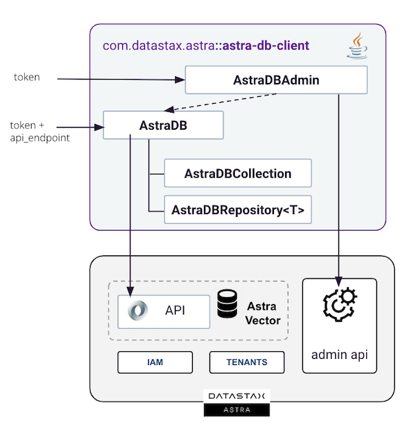
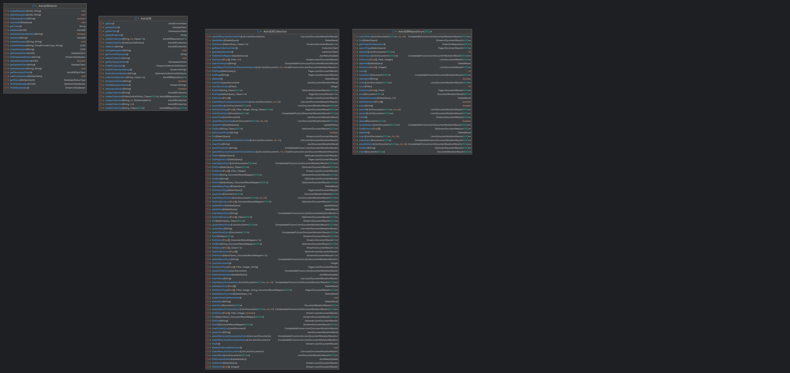

<link rel="stylesheet" href="https://maxcdn.bxootstrapcdn.com/font-awesome/4.6.1/css/font-awesome.min.css">

## 1. Overview


The Astra DB Client, as the name suggests, is a client library that interacts with the various APIs of the Astra DataStax Platform. It enables users to connect to, utilize, and administer the Astra Vector product. The library encompasses two distinct clients working in tandem:

- **AstraDBAmin**: This class is initialized exclusively using an organization administrator token and enables the creation and deletion of databases via the DevOps API. It facilitates automation and administration within your organization's tenant.

- **AstraDB**: This is the primary endpoint, connecting exclusively to a single database to perform all operations for your applications. It requires initialization with a database administrator token and also necessitates the API endpoint of your database.

- **AstraDBCollection**: This client class facilitates all operations at the collection level, including find(), insert(), and delete(). It is instantiated through the AstraDB class and accommodates operations on both vector and non-vector collections.

- **AstraDBRepository<T>**:  This class represents a specialized form of AstraDBCollection designed for use with Java beans (T). It embodies the repository pattern, streamlining the management and access of domain entities.

???+ info annotate "Reference Architecture"

    

## 2. Prerequisites

???+ success annotate "Java and Apache Maven/Gradle Setup"

    - [x] **Install Java Development Kit (JDK) 11++**
        
    Use the [java reference documentation](https://www.oracle.com/java/technologies/downloads/)  to install a Java Development Kit (JDK) tailored for your operating system. After installation, you can validate your setup with the following command:
        
    ```bash
    java --version
    ```
        
    - [x] **Install Apache Maven (3.9+) or Gradle**
        
    Samples and tutorials are designed to be used with `Apache Maven`. Follow the instructions in the [reference documentation](https://maven.apache.org/install.html) to install Maven. To validate your installation, use the following command:
        
    ```bash
    mvn -version
    ```

???+ info annotate "Astra Environment Setup"

    - [x] **Create your DataStax Astra account**:
        
    <a href="https://astra.dev/3B7HcYo" class=md-button>Sign Up to Datastax Astra</a>
        
    - [x] **Create an organization level Astra Token**
        
    Once logged into the user interface, select settings from the left menu and then click on the tokens tab to create a new token.
        
    

    You want to pick the following role:
    
    | Properties     | Values                       |
    |----------------|------------------------------|
    | **Token Role** | `Organization Administrator` |
    
    The Token contains properties `Client ID`, `Client Secret` and the `token`. You will only need the third (starting with `AstraCS:`)
    
    ```
    {
      "ClientId": "ROkiiDZdvPOvHRSgoZtyAapp",
      "ClientSecret": "fakedfaked",
      "Token":"AstraCS:fake" <========== use this field
    }
    ```

    To operate with `AstraDBAdmin`, this specific organization-level token is required. For tasks involving AstraDB at the database level, a database-level token suffices. The procedure for creating such a token is detailed in subsequent sections.

## 3. Getting Started

### Project Setup

???+ info annotate "Project Setup"

    - [x] **If you are using `Maven` Update your `pom.xml` file with the latest version of the Vector SDK [](https://maven-badges.herokuapp.com/maven-central/com.datastax.astra/astra-db-client)**
    
    ```xml
    <dependency>
      <groupId>com.datastax.astra</groupId>
      <artifactId>astra-db-client</artifactId>
      <version>${latest}</version>
    </dependency>
    ```
    
    - [x] **If you are using gradle change the `build.dgradle` with**
    
    ```typesafe
    dependencies {
        compile 'com.datastax.astra:astra-db-client-1.0'
    }
    ```

### Quickstart

???+ info annotate "Getting your token and Api Endpoint"

    `AstraDB` class is the entry point of the SDK. It enables interactions with one particular database within your Astra environment. The initialization can be achieved in multiple ways:
    
    - Using a `token` along with the `api_endpoint`. Both are retrieved from the Astra user interface.
    - Using a `token` with the database identifier and eventually the region.
    
    To establish this connection, you can generate a token via the user interface. This token will be assigned the `Database Administrator` permission level, which grants sufficient privileges for interacting with a specific database.
    
    The `api_endpoint` is obtained from the user interface. It adheres to the following pattern: `https://{database-identifier}-{database-region}.apps.astra.datastax.com.`
    
    

``` java title="Quickstart.java" linenums="1"
--8<-- "https://raw.githubusercontent.com/datastax/astra-sdk-java/main/astra-db-client/src/test/java/com/dtsx/astra/sdk/documentation/QuickStart.java"
```

## 4. Reference Guide

### Connection

Connect to AstraDB Vector by instantiating `AstraDB` class.

???+ abstract annotate "General Information"

    - Connection is stateless and thread safe, we initialize an HTTP client.
    - At initialization a check is performed to ensure enpoint and token are valid.
    - If not provided default keyspace is `default_keyspace`.
    - Database UUID and region are part of the endpoint URL.

- [x] **Signatures and [JavaDoc](https://datastaxdevs.github.io/astra-db-client/1.2.4/com/dtsx/astra/sdk/AstraDB.html#%3Cinit%3E(java.lang.String,java.lang.String,java.lang.String))**

```java
AstraDB(String token, String apiEndpoint);
AstraDB(String token, String apiEndpoint, String keyspace);
AstraDB(String token, UUID databaseId);
AstraDB(String token, UUID databaseId, String keyspace);
AstraDB(String token, UUID databaseId, String region, String keyspace);
AstraDB(String token, UUID databaseId, String region, AstraEnvironment env, String keyspace);
```

- [x] **Sample Code**

``` java title="Connection.java" linenums="1"
--8<-- "https://raw.githubusercontent.com/datastax/astra-sdk-java/main/astra-db-client/src/test/java/com/dtsx/astra/sdk/documentation/Connecting.java"
```

### Working with Collections

#### Overview

???+ info annotate "Overview"

    AstraDB is a vector database that manages multiple collections. Each collection (AstraDBCollection) is identified by a name and stores schema-less documents. It is capable of holding any JSON document, each uniquely identified by an _id. Additionally, a JSON document within AstraDB can contain a vector. It is important to note that all documents within the same collection should utilize vectors of the same type, characterized by consistent dimensions and metrics.

    

#### Create Collection

Create a collection in the current database.

???+ abstract annotate "General Information"

    - A collection name is unique for a database
    - A collection name should match `[A-Za-z_]`
    - Method `createCollection()` method returns an instance of `AstraDBCollection`
    - Collection is created only if it does not exist
    - If collection exists, a check is performed for vector dimension and metric
    - There are a maximum of 5 collections per database
    - If not provided, default metric is `cosine`
    - Vector `dimension` and a `metric` are set at creation and cannot be changed later
    - The `dimension` is the size of the vector
    - The `metric` is the way the vector will be compared. It can be `cosine`, `euclidean` or `dot_product`

- [x] **Signature and [Javadoc 🔗](https://datastaxdevs.github.io/astra-db-client/latest/com/dtsx/astra/sdk/AstraDB.html#createCollection(io.stargate.sdk.data.domain.CollectionDefinition))**

```java
AstraDBCollection createCollection(String name);
AstraDBCollection createCollection(String name, int vectorDimension);
AstraDBCollection createCollection(String name, int vectorDimension, SimilarityMetric metric);
AstraDBCollection createCollection(CollectionDefinition def);
```

- [x] **Sample Code**

``` java title="CreateCollection.java" linenums="1"
--8<-- "https://raw.githubusercontent.com/datastax/astra-sdk-java/main/astra-db-client/src/test/java/com/dtsx/astra/sdk/documentation/CreateCollection.java"
```

- [x] **Data API**

Below is the associated REST API payload

```json
{
  "createCollection": {
    "name": "collection_vector",
    "options": {
      "vector": {
        "dimension": 14,
        "metric": "cosine"
      }
    }
  }
}
```

#### List Collections

List collections in the current database with their attributes. _(similarity, dimension, indexing...)_

???+ abstract annotate "General Information"

    - A database can have up to 5 collections.
    - A collection with a vector has a set of options like dimension, similarity and indexing.

- [x] **Signature and [Javadoc 🔗](https://datastaxdevs.github.io/astra-db-client/1.2.4/com/dtsx/astra/sdk/AstraDB.html#findAllCollections())**

```java
Stream<String> findAllCollectionNames();
Stream<CollectionDefinition> findAllCollections();
```

- [x] **Sample Code**

``` java title="FindAllCollections.java" linenums="1"
--8<-- "https://raw.githubusercontent.com/datastax/astra-sdk-java/main/astra-db-client/src/test/java/com/dtsx/astra/sdk/documentation/FindAllCollections.java"
```

- [x] **Data API**

Below is the associated REST API payload

```json
{
  "findCollections": {
    "options": {
      "explain": true
    }
  }
}
```

#### Find Collection

Retrieve collection definition from its name.

???+ abstract annotate "General Information"

    - name is the identifier of the collection.

- [x] **Signature and [Javadoc 🔗](https://datastaxdevs.github.io/astra-db-client/1.2.4/com/dtsx/astra/sdk/AstraDB.html#isCollectionExists(java.lang.String))**

```java
Optional<CollectionDefinition> findCollectionByName(String name);
boolean isCollectionExists(String name);
```

- [x] **Sample Code**

``` java title="FindCollection.java" linenums="1"
--8<-- "https://raw.githubusercontent.com/datastax/astra-sdk-java/main/astra-db-client/src/test/java/com/dtsx/astra/sdk/documentation/FindCollection.java"
```

- [x] **Data API**

Below is the associated REST API payload.

```json
{
  "findCollections": {
    "options": {
      "explain": true
    }
  }
}
```

#### Delete Collection

Delete a collection from its name

???+ abstract annotate "General Information"

    - If the collection does not exist, the method will not return any error.

- [x] **Signature and [Javadoc 🔗](https://datastaxdevs.github.io/astra-db-client/1.2.4/com/dtsx/astra/sdk/AstraDB.html#deleteCollection(java.lang.String))**

```java
void deleteCollection(String name);
```

- [x] **Sample Code**

``` java title="DeleteCollection.java" linenums="1"
--8<-- "https://raw.githubusercontent.com/datastax/astra-sdk-java/main/astra-db-client/src/test/java/com/dtsx/astra/sdk/documentation/DeleteCollection.java"
```

- [x] **Data API**

Below is the associated REST API payload.

```json
{
  "deleteCollection": {
    "name": "collection_vector2"
  }
}
```

### Working with Documents

#### Insert One

You can insert unitary record with the function `insertOne()`. Multiple signatures are available to insert a document.

???+ abstract annotate "General Informations"

    - If not provided, the identifier is generated as a java UUID
    - The method always return the document identifier.
    - All attributes are optional (schemaless)
    - You attribute names should match `[A-Za-z_]`
    - All Java simple standard types are supported
    - Nested object are supported
    - A field value should not exceed 5Kb
    - Each attribute is indexed and searchable
    - A vector cannot be filled only with 0s, it would lead to division by 0

- [x] **Signature**

```java
JsonDocumentMutationResult 
  insertOne(JsonDocument doc);

CompletableFuture<JsonDocumentMutationResult> 
  insertOneASync(JsonDocument doc);

DocumentMutationResult<DOC> 
  insertOne(Document<DOC> document);

CompletableFuture<DocumentMutationResult<DOC>> 
  insertOneASync(Document<DOC> document);
```

- [x] **Sample Code**

``` java title="InsertOne.java" linenums="1"
--8<-- "https://raw.githubusercontent.com/datastax/astra-sdk-java/main/astra-db-client/src/test/java/com/dtsx/astra/sdk/documentation/InsertOne.java"
```

#### Upsert One

???+ abstract annotate "General Informations"

    - `insert*` will give you an error when id that already exist in the collection is provided.
    - `upsert*` will update the document if it exists or insert it if it does not.
    
- [x] **Signatures**

```java
JsonDocumentMutationResult 
  upsertOne(JsonDocument doc);

CompletableFuture<JsonDocumentMutationResult>  
  upsertOneASync(JsonDocument doc);

DocumentMutationResult<DOC>  
  upsertOne(Document<DOC> document);

CompletableFuture<DocumentMutationResult<DOC>>  
  upsertOneASync(Document<DOC> document);
```

- [x] **Sample Code**

``` java title="InsertOne.java" linenums="1"
--8<-- "https://raw.githubusercontent.com/datastax/astra-sdk-java/main/astra-db-client/src/test/java/com/dtsx/astra/sdk/documentation/UpsertOne.java"
```

#### Insert Many

???+ abstract annotate "General Informations"

    - The underlying REST API is paged. The maximum page size is 20.
    - To perform bulk loading, distribution of the workload is recommended
    - `insertMany**Chunked**` are a helper to distribute the workload
    - If more than 20 documents are provided chunking is applied under the hood

- [x] **Signatures**

```java
// Use a json String
List<JsonDocumentMutationResult> 
   insertMany(String json);
CompletableFuture<List<JsonDocumentMutationResult>> 
   insertManyASync(String json);

// Use an Array of JsonDocuments
List<JsonDocumentMutationResult>
   insertMany(JsonDocument... documents);
CompletableFuture<List<JsonDocumentMutationResult>>
   insertManyASync(JsonDocument... documents);

// Use a list of JsonDocument
List<JsonDocumentMutationResult> 
   insertManyJsonDocuments(List<JsonDocument> documents);
CompletableFuture<List<JsonDocumentMutationResult>> 
   insertManyJsonDocumentsASync(List<JsonDocument> documents);

// Use an Array of Document<T>
List<DocumentMutationResult<DOC>> 
   insertMany(Document<DOC>... documents);
CompletableFuture<List<DocumentMutationResult<DOC>>>
   insertManyASync(Document<DOC>... documents);

// Use a list of Document<T>
List<DocumentMutationResult<DOC>> 
   insertMany(List<Document<DOC>> documents);
CompletableFuture<List<DocumentMutationResult<DOC>>>
    insertManyASync(List<Document<DOC>> documents);
```

- [x] **Sample Code**

``` java title="InsertMany.java" linenums="1"
--8<-- "https://raw.githubusercontent.com/datastax/astra-sdk-java/main/astra-db-client/src/test/java/com/dtsx/astra/sdk/documentation/InsertMany.java"
```

#### Insert Many Chunked

- [x] **Signatures**

```java
// Insert a list of json documents
List<JsonDocumentMutationResult> 
  insertManyChunkedJsonDocuments(List<JsonDocument> documents, int chunkSize, int concurrency);
CompletableFuture<List<JsonDocumentMutationResult>> 
  insertManyChunkedJsonDocumentsAsync(List<JsonDocument> documents, int chunkSize, int concurrency);

// Insert a list of documents
List<DocumentMutationResult<DOC>> 
  insertManyChunked(List<Document<DOC>> documents, int chunkSize, int concurrency);
CompletableFuture<List<DocumentMutationResult<DOC>>> 
  insertManyChunkedASync(List<Document<DOC>> documents, int chunkSize, int concurrency);
```

#### Upsert Many

- [x] **Signatures**

```java
// Use a json String
List<JsonDocumentMutationResult>
   upsertMany(String json);
CompletableFuture<List<JsonDocumentMutationResult>>
   upsertManyASync(String json);

// Use a list of JsonDocument
List<JsonDocumentMutationResult>
   upsertManyJsonDocuments(List<JsonDocument> documents);
CompletableFuture<List<JsonDocumentMutationResult>>
   upsertManyJsonDocumentsASync(List<JsonDocument> documents);

// Use a list of Document<T>
List<DocumentMutationResult<DOC>>
   upsertMany(List<Document<DOC>> documents);
CompletableFuture<List<DocumentMutationResult<DOC>>>
   upsertManyASync(List<Document<DOC>> documents);
```

#### Find By Id

- [x] **Signatures**

```java
Optional<JsonDocumentResult> findById(String id);
Optional<DocumentResult<T>> findById(String id, Class<T> bean);
Optional<DocumentResult<T>> findById(String id, DocumentResultMapper<T> mapper);
boolean isDocumentExists(String id);
```

- [x] **Sample Code**

``` java title="FindById.java" linenums="1"
--8<-- "https://raw.githubusercontent.com/datastax/astra-sdk-java/main/astra-db-client/src/test/java/com/dtsx/astra/sdk/documentation/FindById.java"
```

#### Find By Vector

- [x] **Signatures**

```java
Optional<JsonDocumentResult> findOneByVector(float[] vector);
Optional<DocumentResult<T>> findOneByVector(float[] vector, Class<T> bean);
Optional<DocumentResult<T>> findOneByVector(float[] vector, DocumentResultMapper<T> mapper);
```

- [x] **Sample Code**

``` java title="FindByVector.java" linenums="1"
--8<-- "https://raw.githubusercontent.com/datastax/astra-sdk-java/main/astra-db-client/src/test/java/com/dtsx/astra/sdk/documentation/FindByVector.java"
```

#### Find One

???+ info annotate "Introducing `SelectQuery`"

    Under the hood every search against the REST Api is done by providing 4 parameters:

    - **`$filter`**: which are your criteria (where clause)
    - **`$projection`**: which list the fields you want to retrieve (select)
    - **`$sort`**: which order the results in memory (order by) or the vector search (order by ANN)
    - **`$options`**: that will contains all information like paging, limit, etc.

    The `SelectQuery` class is a builder that will help you to build the query. It is a fluent API that will help you to build the query.

As for `findById` and `findByVector` there are 3 methods available to retrieve a document. If the `SelectQuery` has multiple
matches objects only the first will be returned. In doubt use `find()` or even better `findPage()` not to exhaust all the
collection.

```java
Optional<JsonDocumentResult> findOne(SelectQuery query);
Optional<DocumentResult<DOC>> findOne(SelectQuery query, Class<T> clazz);
Optional<DocumentResult<DOC>> findOne(SelectQuery query, ResultMapper<T> mapper);
```

Here is a sample class detailing the usage of the `findOne` method.

``` java title="FindOne.java" linenums="1"
--8<-- "https://raw.githubusercontent.com/datastax/astra-sdk-java/main/astra-db-client/src/test/java/com/dtsx/astra/sdk/documentation/FindOne.java"
```

#### Find Filters


#### Find

???+ info annotate "Reminders on `SelectQuery`"

    Under the hood every search against the REST Api is done by providing 4 parameters:

    - **`$filter`**: which are your criteria (where clause)
    - **`$projection`**: which list the fields you want to retrieve (select)
    - **`$sort`**: which order the results in memory (order by) or the vector search (order by ANN)
    - **`$options`**: that will contains all information like paging, limit, etc.

    The `SelectQuery` class is a builder that will help you to build the query. It is a fluent API that will help you to build the query.

    ```java
     SelectQuery.builder()
     .where("product_price")
     .isEqualsTo(9.99)
     .build();
    ```

    


???+ warning annotate "Important"

    With the Json API all queries are paged. The maximum page size is 20. The method findAll() and find() will fetch the
    pages one after the other until `pagingState` is null. Use those functions with caution. 

- [x] **To retrieve every document of a collection use `findAll()`**

```java
// Find All for VectorStore<MyBean>
Stream<JsonResult> all = col1.findAll();
```

- [x] **Find with a `ResultQuery`**

You can search on any field of the document. All fields are indexed. Using a `SelectQuery` populated through
builder you can get some precise results.

```java
Stream<JsonResult> all = col1.findAll(SelectQuery.builder()
  .where("product_price")
  .isEqualsTo(9.99)
  .build());
```
More examples in the following class:

``` java title="Find.java" linenums="1"
--8<-- "https://raw.githubusercontent.com/datastax/astra-sdk-java/main/astra-db-client/src/test/java/com/dtsx/astra/sdk/documentation/Find.java"
```

- [x] **To perform semantic search use `findVector()`**

``` java title="FindOne.java" linenums="1"
--8<-- "https://raw.githubusercontent.com/datastax/astra-sdk-java/main/astra-db-client/src/test/java/com/dtsx/astra/sdk/documentation/FindVector.java"
```

#### Paging

Every request is paged with the Json API and the maximum page size is 20. The methods return Page<JsonResult> that contains the data but also a field called `pagingState

- [x] **Find Page**

The signature are close to the `find()`. Reason is that `find()` is using findPage under the hood. The difference is that it will exhaust all the pages 
and return a `Stream<JsonResult>`.


```java
Page<JsonResult> jsonResult = findPage(SelectQuery query);
Page<Result<T>> jsonResult2 = findPage(SelectQuery query, Class<T> clazz);
Page<Result<T>> jsonResult3 = findPage(SelectQuery query, ResultMapper<T> clazz);
```

``` java title="FindPage.java" linenums="1"
--8<-- "https://raw.githubusercontent.com/datastax/astra-sdk-java/main/astra-db-client/src/test/java/com/dtsx/astra/sdk/documentation/FindPage.java"
```

#### Update One

Allow to update an existing document:

``` java title="UpdateOne.java" linenums="1"
--8<-- "https://raw.githubusercontent.com/datastax/astra-sdk-java/main/astra-db-client/src/test/java/com/dtsx/astra/sdk/documentation/UpdateOne.java"
```

#### Update Many

Allow to update a set of document matching a request.

``` java title="UpdateMany.java" linenums="1"
--8<-- "https://raw.githubusercontent.com/datastax/astra-sdk-java/main/astra-db-client/src/test/java/com/dtsx/astra/sdk/documentation/UpdateMany.java"
```

#### Delete One

Use to delete an existing document.

``` java title="DeleteOne.java" linenums="1"
--8<-- "https://raw.githubusercontent.com/datastax/astra-sdk-java/main/astra-db-client/src/test/java/com/dtsx/astra/sdk/documentation/DeleteOne.java"
```


#### Delete Many

Used to delete a set of document matching a request.

``` java title="DeleteMany.java" linenums="1"
--8<-- "https://raw.githubusercontent.com/datastax/astra-sdk-java/main/astra-db-client/src/test/java/com/dtsx/astra/sdk/documentation/DeleteMany.java"
```


#### Clear

Used to empty a collection

``` java title="ClearCollection.java" linenums="1"
--8<-- "https://raw.githubusercontent.com/datastax/astra-sdk-java/main/astra-db-client/src/test/java/com/dtsx/astra/sdk/documentation/ClearCollection.java"
```

### Object Mapping

???+ info annotate "Overview"

    Instead of interacting with the database with key/values you may want to
    associate an object to each record in the collection for this you can use `CollectionRepository`. If we reproduce the sample before
    
    

#### Repository Pattern

Instead of working with raw `JsonDocument` you can work with your own object. The object will be serialized to JSON and stored in the database. You do not want to provide a `ResultMapper` each time but rather use the repository pattern.
We will follow the [signature of the `CrudRepository` from Spring Data](https://docs.spring.io/spring-data/commons/docs/current/api/org/springframework/data/repository/CrudRepository.html). 
 
```java
long count();
void delete(T entity);
void deleteAll();
void deleteAll(Iterable<? extends T> entities);
void deleteAllById(Iterable<? extends ID> ids);
void deleteById(ID id);
boolean existsById(ID id);
Iterable<T> findAll();
Iterable<T> findAllById(Iterable<ID> ids);
Optional<T> findById(ID id);
<S extends T> S  save(S entity);
Iterable<S> saveAll(Iterable<S> entities);
```

#### Create collection


``` java title="ObjectMappingCreateCollection.java" linenums="1"
--8<-- "https://raw.githubusercontent.com/datastax/astra-sdk-java/main/astra-db-client/src/test/java/com/dtsx/astra/sdk/documentation/ObjectMappingCreateCollection.java"
```

#### Insert One

``` java title="ObjectMappingInsertOne.java" linenums="1"
--8<-- "https://raw.githubusercontent.com/datastax/astra-sdk-java/main/astra-db-client/src/test/java/com/dtsx/astra/sdk/documentation/ObjectMappingInsertOne.java"
```

#### Insert Many

``` java title="ObjectMappingInsertMany.java" linenums="1"
--8<-- "https://raw.githubusercontent.com/datastax/astra-sdk-java/main/astra-db-client/src/test/java/com/dtsx/astra/sdk/documentation/ObjectMappingInsertMany.java"
```

#### Find One

- [x] **To get a single document use `findById()` or `findByVector()`**

``` java title="ObjectMappingFindOne.java" linenums="1"
--8<-- "https://raw.githubusercontent.com/datastax/astra-sdk-java/main/astra-db-client/src/test/java/com/dtsx/astra/sdk/documentation/ObjectMappingFindOne.java"
```

#### Find

- [x] **To perform search use `find()`**

``` java title="ObjectMappingFind.java" linenums="1"
--8<-- "https://raw.githubusercontent.com/datastax/astra-sdk-java/main/astra-db-client/src/test/java/com/dtsx/astra/sdk/documentation/ObjectMappingFind.java"
```

- [x] **To perform semantic search use `findVector()`**

``` java title="ObjectMappingFindVector.java" linenums="1"
--8<-- "https://raw.githubusercontent.com/datastax/astra-sdk-java/main/astra-db-client/src/test/java/com/dtsx/astra/sdk/documentation/ObjectMappingFindVector.java"
```

#### Update One

``` java title="ObjectMappingUpdateOne.java" linenums="1"
--8<-- "https://raw.githubusercontent.com/datastax/astra-sdk-java/main/astra-db-client/src/test/java/com/dtsx/astra/sdk/documentation/ObjectMappingUpdateOne.java"
```

#### Update Many

``` java title="ObjectMappingUpdateMany.java" linenums="1"
--8<-- "https://raw.githubusercontent.com/datastax/astra-sdk-java/main/astra-db-client/src/test/java/com/dtsx/astra/sdk/documentation/ObjectMappingUpdateMany.java"
```

#### Delete One

``` java title="ObjectMappingDeleteOne.java" linenums="1"
--8<-- "https://raw.githubusercontent.com/datastax/astra-sdk-java/main/astra-db-client/src/test/java/com/dtsx/astra/sdk/documentation/ObjectMappingDeleteOne.java"
```

#### Delete Many

``` java title="ObjectMappingDeleteMany.java" linenums="1"
--8<-- "https://raw.githubusercontent.com/datastax/astra-sdk-java/main/astra-db-client/src/test/java/com/dtsx/astra/sdk/documentation/ObjectMappingDeleteMany.java"
```

#### Clear

``` java title="ObjectMappingClearCollection.java" linenums="1"
--8<-- "https://raw.githubusercontent.com/datastax/astra-sdk-java/main/astra-db-client/src/test/java/com/dtsx/astra/sdk/documentation/ObjectMappingClearCollection.java"
```

### Working with databases

#### Connection

???+ info annotate "About token permissions"

    To work with Databases you need to use a token with organization level permissions. You will work with the class `AstraDBClient`
    
    To establish a connection with AstraDB using the client SDK, you are required to supply a token. This token enables two primary connection modes:
    
    - **Direct database-level connection**, facilitating access to a specific database. It is the one decribe above and primay way of working with the SDK.
    
    - **Organization-level connection**, which allows interaction with multiple databases under your organization. This is what we will detailed now
    
    `AstraDBClient` class is used to facilitate interactions with all components within your Astra organization, rather than limiting operations to a single database.
    This approach enables a broader scope of management and control across the organization's databases. The token used for this connection must be scoped to the organization with
    
    | Properties     | Values                       |
    |----------------|------------------------------|
    | **Token Role** | `Organization Administrator` |

``` java title="ConnectingAdmin.java" linenums="1"
--8<-- "https://raw.githubusercontent.com/datastax/astra-sdk-java/main/astra-db-client/src/test/java/com/dtsx/astra/sdk/documentation/ConnectingAdmin.java"
```

#### List databases

``` java title="FindAllDatabases.java" linenums="1"
--8<-- "https://raw.githubusercontent.com/datastax/astra-sdk-java/main/astra-db-client/src/test/java/com/dtsx/astra/sdk/documentation/FindAllDatabases.java"
```

#### Create database

To create a database you need to use a token with organization level permissions. You will work with the class `AstraDBClient`

``` java title="CreateDatabase.java" linenums="1"
--8<-- "https://raw.githubusercontent.com/datastax/astra-sdk-java/main/astra-db-client/src/test/java/com/dtsx/astra/sdk/documentation/CreateDatabase.java"
```

#### Find database

``` java title="FindDatabase.java" linenums="1"
--8<-- "https://raw.githubusercontent.com/datastax/astra-sdk-java/main/astra-db-client/src/test/java/com/dtsx/astra/sdk/documentation/FindDatabase.java"
```

- [x] **Accessing object `AstraDB`**

```java
AstraDB myDB = client.database("getting_started");
```

#### Delete database


- [x] **Delete Databases with `deleteDatabase`**

The function can take a database identifier (uuid) or the database name.

``` java title="DeleteDatabase.java" linenums="1"
--8<-- "https://raw.githubusercontent.com/datastax/astra-sdk-java/main/astra-db-client/src/test/java/com/dtsx/astra/sdk/documentation/DeleteDatabase.java"
```

### Working with Keyspaces

#### Create Keyspace

Create a keyspace in the current database with the given name.

???+ abstract annotate "General Information"

    - Default keyspace is `default_keyspace`
    - If the keyspace already exist, the method will return 'KeyspaceAlreadyExistException'

- [x] **Signature and [Javadoc 🔗](#)**

```java
void createKeyspace(String databaseName, String keyspaceName);
void createKeyspace(UUID databaseId, String keyspaceName);
```

- [x] **Sample Code**

``` java title="CreateKeyspace.java" linenums="1"
--8<-- "https://raw.githubusercontent.com/datastax/astra-sdk-java/main/astra-db-client/src/test/java/com/dtsx/astra/sdk/documentation/CreateKeyspace.java"
```

#### Delete Keyspace

Delete a keyspace in the current database from its name.

???+ abstract annotate "General Information"

    - Default keyspace is `default_keyspace`
    - If the keyspace does not exist, the method will return 'KeyspaceNotFoundException'

- [x] **Signature and [Javadoc 🔗](#)**

```java
void deleteKeyspace(String databaseName, String keyspaceName);
void deleteKeyspace(UUID databaseId, String keyspaceName);
```

- [x] **Sample Code**

``` java title="DeleteKeyspace.java" linenums="1"
--8<-- "https://raw.githubusercontent.com/datastax/astra-sdk-java/main/astra-db-client/src/test/java/com/dtsx/astra/sdk/documentation/DeleteKeyspace.java"
```

#### Find Keyspace

???+ abstract annotate "General Information"

    - A database is not limited in number of keyspaces.
    - A keyspace is a logical grouping of collections.
    - Default keyspace name is `default_keyspace`

- [x] **Signature and [Javadoc 🔗](#)**

```java
boolean isKeyspaceExists(String keyspaceName);
Stream<String> findAllKeyspaceNames();
String getCurrentKeyspace(String keyspaceName);
void changeKeyspace(String keyspaceName);
```

- [x] **Sample Code**

``` java title="FindKeyspace.java" linenums="1"
--8<-- "https://raw.githubusercontent.com/datastax/astra-sdk-java/main/astra-db-client/src/test/java/com/dtsx/astra/sdk/documentation/DeleteKeyspace.java"
```

## 6. Class Diagram



## 7. Working with CassIO

[Cassio](cassio.org) is framework originally implement in Python to use Open Source Cassandra as a Vector Store.
It has been partially ported in Java. Idea is java to use the same table created by CassIO.

### Connection

???+ abstract annotate "General Information"

    - CassIO is a framework to use Open Source Cassandra as a Vector Store.
    - Java portage is only 2 tables `metadata_vector` and `clustered_metadata_vector`
    - The tables are created with a specific schema to store vectors and metadata
    - The indices are created to perform efficient search on the vector

- [x] **Signature and [Javadoc 🔗](#)**

```java
CqlSession init(String token, UUID databaseId, String databaseRegion, String keyspace);
```

- [x] **Sample Code**

``` java title="CassIOConnection.java" linenums="1"
--8<-- "https://raw.githubusercontent.com/datastax/astra-sdk-java/main/astra-db-client/src/test/java/com/dtsx/astra/sdk/documentation/CassIOConnection.java"
```

### MetadataVectorTable

???+ abstract annotate "General Information"

    - Creating a Cassandra table with the following schema and associated indices

    ```sql
    CREATE TABLE vector_store (
     row_id          timeuuid,
     attributes_blob text,
     body_blob       text,
     metadata_s      map<text, text>,
     vector          vector<float, 1536>,
     PRIMARY KEY (row_id)
    );
    ```

- [x] **Sample Code**

``` java title="CassIOMetadataVectorTable.java" linenums="1"
--8<-- "https://raw.githubusercontent.com/datastax/astra-sdk-java/main/astra-db-client/src/test/java/com/dtsx/astra/sdk/documentation/CassIOMetadataVectorTable.java"
```


### ClusteredMetadataVectorTable

???+ abstract annotate "General Information"

    - Creating a Cassandra table

    ```sql
    CREATE TABLE goodbards.vector_store_openai_by_tenant (
    partition_id text,
    row_id timeuuid,
    attributes_blob text,
    body_blob text,
    metadata_s map<text, text>,
    vector vector<float, 1536>,
    PRIMARY KEY (partition_id, row_id)
    ) WITH CLUSTERING ORDER BY (row_id DESC)
    ```

- [x] **Sample Code**

``` java title="CassIOClusteredMetadataVectorTable.java" linenums="1"
--8<-- "https://raw.githubusercontent.com/datastax/astra-sdk-java/main/astra-db-client/src/test/java/com/dtsx/astra/sdk/documentation/CassIOClusteredMetadataVectorTable.java"
```

## 8. Working with Langchain4j


```java

```