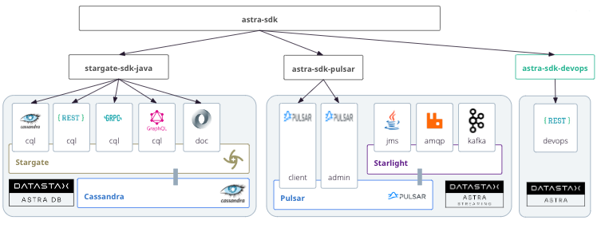

<link rel="stylesheet" href="https://maxcdn.bootstrapcdn.com/font-awesome/4.6.1/css/font-awesome.min.css">

---

Astra Java SDK is a framework that wraps different apis and interfaces exposed by Astra and provides fluent API and ease of usage.




## 1. Pre-requisites

<!-- Prequisites for Java And Maven -->
--8<-- "https://raw.githubusercontent.com/awesome-astra/docs/main/docs/templates/prerequisites-java-maven.md"

<!-- Prequisite Astra DB including SCB -->
--8<-- "https://raw.githubusercontent.com/awesome-astra/docs/main/docs/templates/prerequisites-astra-db-scb.md"

## 2. Astra DB

### 2.1 - Project Setup

???+ note annotate "Project Setup"

    - [x] **If you create a project from scratch you can start with our template that include the `astra-sdk` dependency.**: 

    ```
    mvn archetype:generate \
      -DarchetypeGroupId=com.datastax.astra \
      -DarchetypeArtifactId=astra-sdk-quickstart \
      -DarchetypeVersion=0.6.2 \
      -DinteractiveMode=false \
      -DgroupId=foo.bar \
      -DartifactId=astra-quickstart\
      -Dversion=1.0-SNAPSHOT
    ```

    - [x] OR, if you already have a project simple **Update your `pom.xml` file with the latest version of the SDK [](https://maven-badges.herokuapp.com/maven-central/com.datastax.astra/astra-sdk)**

      ```xml
      <dependencies>
       <dependency>
           <groupId>com.datastax.astra</groupId>
           <artifactId>astra-sdk</artifactId>
           <version>${latestSDK}</version>
       </dependency>
      </dependencies>
      ```


### 2.2 - CQL Native Drivers

???+ example "Sample Code"

      - [x] Create a class [`AstraSdkDrivers.java`](https://github.com/awesome-astra/sample-java-sdk/blob/main/src/main/java/com/datastax/astra/AstraSdkDrivers.java) with the following code.


      ``` java title="AstraSdkDrivers.java" linenums="1"
      --8<-- "https://raw.githubusercontent.com/awesome-astra/sample-java-sdk/main/src/main/java/com/datastax/astra/AstraSdkDrivers.java"
      ```

      <a href="https://github.com/awesome-astra/sample-java-sdk/archive/refs/heads/main.zip" class="md-button">
        <i class="fa fa-download" ></i>&nbsp;Download Project
      </a>

???+ abstract "What you need to know"

    **🔑 About Credentials**

     - The pair `clientId`/ `clientSecret` hold your credentials. It can be replaced by the value of the token only.

     ```java
     AstraClient.builder().withToken("AstraCS:...");
     ```

     - There is no need to download the cloud securebundle in advance as it will be downloaded for you in folder `~.astra/scb` by default. Stil, but you can also provide the file location with `.withCqlCloudSecureConnectBundle()`:

     ```java
     AstraClient.builder().withCqlCloudSecureConnectBundle("/tmp/scb.zio");
     ```

     - Notice than `enableCQL()` must be explictely provided. The `sdk` will open only the asked interfaces in order to limit the resource consumption.

    **⚙️ About Database identifiers**

     - `databaseId`/`databaseRegion` will be required to locate the proper endpoint. You can find them for a particular database with either the cli.

     ```
     $astra db list

     +---------------------+--------------------------------------+---------------------+-----------+
     | Name                | id                                   | Default Region      | Status    |
     +---------------------+--------------------------------------+---------------------+-----------+
     | db_demo             | 3043a40f-39bf-464e-8337-dc283167b2c3 | us-east1            | ACTIVE    |
     +---------------------+--------------------------------------+---------------------+-----------+

     $astra db describe db_demo

     +------------------------+-----------------------------------------+
     | Attribute              | Value                                   |
     +------------------------+-----------------------------------------+
     | Name                   | db_demo                                 |
     | id                     | 3043a40f-39bf-464e-8337-dc283167b2c3    |
     | Status                 | ACTIVE                                  |
     | Default Cloud Provider | GCP                                     |
     | Default Region         | us-east1                                |
     | Default Keyspace       | keyspace_demo                           |
     | Creation Time          | 2023-04-17T09:03:14Z                    |
     | Keyspaces              | [0] demo                                |
     | Regions                | [0] us-east1                            |
     +------------------------+-----------------------------------------+
     ```


### 2.3 - Stargate Rest API

The `REST API` (also known as `api Data`) is wrapping exposing CQL language as Rest Resources. To get more information about this API check the [dedicated page](../api/rest.md)


???+ example "Sample Code"

      - [x] Create a class [`AstraSdkRestApi.java`](https://github.com/awesome-astra/sample-java-sdk/blob/main/src/main/java/com/datastax/astra/AstraSdkRestApi.java) with the following code.


      ``` java title="AstraSdkDrivers.java" linenums="1"
      --8<-- "https://raw.githubusercontent.com/awesome-astra/sample-java-sdk/main/src/main/java/com/datastax/astra/AstraSdkRestApi.java"
      ```

      <a href="https://github.com/awesome-astra/sample-java-sdk/archive/refs/heads/main.zip" class="md-button">
        <i class="fa fa-download" ></i>&nbsp;Download Project
      </a>


[More information about Rest API](https://github.com/datastax/astra-sdk-java/wiki/Rest-API)


### 2.4 - Stargate Document API

The `DOCUMENT API` exposes an Rest Resources to use Cassandra as a document-oriented database To get more information about this API check the [dedicated page](../api/document.md).

???+ example "Sample Code"

      - [x] Create a class [`AstraSdkDocApi.java`](https://github.com/awesome-astra/sample-java-sdk/blob/main/src/main/java/com/datastax/astra/AstraSdkDocApi.java) with the following code.


      ``` java title="AstraSdkDrivers.java" linenums="1"
      --8<-- "https://raw.githubusercontent.com/awesome-astra/sample-java-sdk/main/src/main/java/com/datastax/astra/AstraSdkDocApi.java"
      ```

      <a href="https://github.com/awesome-astra/sample-java-sdk/archive/refs/heads/main.zip" class="md-button">
        <i class="fa fa-download" ></i>&nbsp;Download Project
      </a>


**Document Repository**

With modern java applications you want to interact with the DB using the repository pattern where most operations have been implemented for you `findAll(), findById()...`. Astra SDK provide this feature for the document API.

???+ example "Sample Document Repository"

      - [x] Create a class [`AstraSdkDocRepository.java`](https://github.com/awesome-astra/sample-java-sdk/blob/main/src/main/java/com/datastax/astra/AstraSdkDocRepository.java) with the following code.


      ``` java title="AstraSdkDrivers.java" linenums="1"
      --8<-- "https://raw.githubusercontent.com/awesome-astra/sample-java-sdk/main/src/main/java/com/datastax/astra/AstraSdkDocRepository.java"
      ```

      <a href="https://github.com/awesome-astra/sample-java-sdk/archive/refs/heads/main.zip" class="md-button">
        <i class="fa fa-download" ></i>&nbsp;Download Project
      </a>


### 2.5 - Stargate Grpc APi

The `GRPC API` exposes a grpc endpoint to query some CQL. From there it is very similar from native drivers. To know more about it check the [dedicated page](../api/grpc.md).

???+ example "Sample Code"

      - [x] Create a class [`AstraSdkGrpcApi.java`](https://github.com/awesome-astra/sample-java-sdk/blob/main/src/main/java/com/datastax/astra/AstraSdkGrpcApi.java) with the following code.


      ``` java title="AstraSdkGrpcApi.java" linenums="1"
      --8<-- "https://raw.githubusercontent.com/awesome-astra/sample-java-sdk/main/src/main/java/com/datastax/astra/AstraSdkGrpcApi.java"
      ```

      <a href="https://github.com/awesome-astra/sample-java-sdk/archive/refs/heads/main.zip" class="md-button">
        <i class="fa fa-download" ></i>&nbsp;Download Project
      </a>  


### 2.6 - Stargate GraphQL Api

The `GRAPHQL API` exposes a graphQL endpoint to query CQL over graphQL. To know more about this api please check the [dedicated page](../api/graphql.md).


???+ example "Sample Code"

      - [x] Create a class [`AstraSdkGraphQLApi.java`](https://github.com/awesome-astra/sample-java-sdk/blob/main/src/main/java/com/datastax/astra/AstraSdkGraphQLApi.java) with the following code.


      ```java title="AstraSdkGraphQLApi.java" linenums="1"
      --8<-- "https://raw.githubusercontent.com/awesome-astra/sample-java-sdk/main/src/main/java/com/datastax/astra/AstraSdkGraphQLApi.java"
      ```

      <a href="https://github.com/awesome-astra/sample-java-sdk/archive/refs/heads/main.zip" class="md-button">
        <i class="fa fa-download" ></i>&nbsp;Download Project
      </a>

## 3. Astra Streaming

### 3.1 - Project setup

???+ note annotate "Project Setup"

     - [x] **Update your `pom.xml` file with the latest version of the SDK [](https://maven-badges.herokuapp.com/maven-central/com.datastax.astra/astra-sdk)**

      ```xml
      <dependencies>
       <dependency>
           <groupId>com.datastax.astra</groupId>
           <artifactId>astra-sdk-pulsar</artifactId>
           <version>${latestSDK}</version>
       </dependency>
      </dependencies>
      ```

### 3.2 - PulsarClient 

Pulsar Api are very simple and the need of an sdk is limited. It could be used to get the proper version of `pulsar-client`, there are no extra setup steps.

???+ example "PulsarClient Setup"

      ```java
      String pulsarUrl   = "pulsar+ssl://<cluster>.streaming.datastax.com:6651";
      String pulsarToken = "<your_token>"
      try(PulsarClient cli = new PulsarClientProvider(pulsarUrl, pulsarToken).get()) {
        // work with client
      };
      ```

### 3.3 - Pulsar Admin

Pulsar Api are very simple and the need of an sdk is limited. It could be used to to setup the `pulsar-admin` for you.

???+ example "Pulsar Admin Setup"

      ```java
      String pulsarUrlAdmin = "https://<cluster>.api.streaming.datastax.com";
      String pulsarToken = "<your_token>"
      PulsarAdmin pa = new PulsarAdminProvider(pulsarUrlAdmin,pulsarToken).get();

      // Get Infos
      System.out.println(pa.tenants().getTenantInfo("tenant_name").toString());

      // List Namespaces
      pa.namespaces().getNamespaces("clun-gcp-east1").forEach(System.out::println);

      // List Topics
      pa.topics().getList("clun-gcp-east1/astracdc").forEach(System.out::println);

      // Details on a topic
      PersistentTopicInternalStats stats = pa.topics()
           .getInternalStats("persistent://<tenant>/<namespace>/<topic>");
      System.out.println(stats.totalSize);
      ```

### 4.3 - Producer

The Astra user interface already shows the expected code. There is very little an SDK can provide here. A sample to code to copy.

???+ example "Sample Code"

      ```java
      import org.apache.pulsar.client.api.*;
      import java.io.IOException;

      public class SimpleProducer {

          private static final String CLUSTER      = "<cluster>";
          private static final String TENANT       = "<yourtenant>";
          private static final String NAMESPACE    = "<yournamespace>";
          private static final String TOPIC        = "<your_topic>";
          private static final String PULSAR_TOKEN = "<your_token>";
          private static final String SERVICE_URL  = 
            "pulsar+ssl://" + CLUSTER + "streaming.datastax.com:6651";

          public static void main(String[] args) throws IOException {
              try(PulsarClient cli = new PulsarClientProvider(pulsarUrl, pulsarToken).get()) {
                  try( Producer<byte[]> producer = cli
                      .newProducer()
                      .topic("persistent://" + TENANT + "/"+NAMESPACE+"/" + TOPIC)
                      .create()) {
                        // Send a message to the topic
                        producer.send("Hello World".getBytes());
                      }
              };
          }
      }
      ```

### 4.4 - Consumer

The Astra user interface already shows the expected code. There is very little an SDK can provide here. A sample to code to copy.

???+ example "Sample Consumer"

      ```java
      import org.apache.pulsar.client.api.*;
      import java.io.IOException;
      import java.util.concurrent.TimeUnit;

      public class SimpleConsumer {

        private static final String CLUSTER      = "<cluster>";
        private static final String TENANT       = "<yourtenant>";
        private static final String NAMESPACE    = "<yournamespace>";
        private static final String TOPIC        = "<your_topic>";
        private static final String SUBSCRIPTION = "<your_subscription>";
        private static final String PULSAR_TOKEN = "<your_token>";
         
        public static void main(String[] args) throws IOException {
          try(PulsarClient cli = new PulsarClientProvider(
            "pulsar+ssl://" + CLUSTER + "streaming.datastax.com:6651", pulsarToken).get()) {
              try(Consumer consumer = cli
                  .newConsumer()
                  .topic("persistent://" + TENANT + "/"+NAMESPACE+"/" + TOPIC)
                  .subscriptionName(SUBSCRIPTION)
                  .subscribe()) {

                  boolean receivedMsg = false;
                  // Loop until a message is received
                  do {
                      // Block for up to 1 second for a message
                      Message msg = consumer.receive(1, TimeUnit.SECONDS);

                      if(msg != null){
                          System.out.printf("Message received: %s", new String(msg.getData()));

                          // Acknowledge the message to remove it from the message backlog
                          consumer.acknowledge(msg);

                          receivedMsg = true;
                      }

                  } while (!receivedMsg);
              }
          }
      }
      ```
## 4. Spring Boot

### 4.1 - Create Project

???+ note annotate "Spring Boot 2x"

    - [x] **To Create a project from scratch start with our template**:

    The 3 last parameters in this command define your project _groupId_, _artifactId_ and _version_. 
    
    `0.6` is the latest version of the starter [](https://maven-badges.herokuapp.com/maven-central/com.datastax.astra/spring-boot-2x-archetype) 

    ```bash
    mvn archetype:generate \
      -DarchetypeGroupId=com.datastax.astra \
      -DarchetypeArtifactId=spring-boot-2x-archetype \
      -DarchetypeVersion=0.6 \
      -DinteractiveMode=false \
      -DgroupId=fr.clunven \
      -DartifactId=my-demo-springboot2x \
      -Dversion=1.0-SNAPSHOT
    ```

???+ note annotate "Spring Boot 3x"

    - [x] **To Create a project from scratch start with our template**:

    The 3 last parameters in this command define your project _groupId_, _artifactId_ and _version_. 
    
    `0.6` is the latest version of the starter [](https://maven-badges.herokuapp.com/maven-central/com.datastax.astra/spring-boot-3x-archetype) 

    ```bash
    mvn archetype:generate \
      -DarchetypeGroupId=com.datastax.astra \
      -DarchetypeArtifactId=spring-boot-3x-archetype \
      -DarchetypeVersion=0.6 \
      -DinteractiveMode=false \
      -DgroupId=fr.clunven \
      -DartifactId=my-demo-springboot3x \
      -Dversion=1.0-SNAPSHOT
    ```

### 4.2 - Setup Project

???+ note annotate "Spring Boot 2x"
    
    > _If you created your project with the archetypes the `pom.xml` is already correct._ 

    - [x] **Update your `pom.xml` file with the latest version of the SDK [](https://maven-badges.herokuapp.com/maven-central/com.datastax.astra/astra-spring-boot-starter)**

      ```xml
      <dependencies>
        <dependency>
            <groupId>com.datastax.astra</groupId>
            <artifactId>astra-spring-boot-starter</artifactId>
            <version>${latest-stater}</version>
        </dependency>
      </dependencies>
      ```

???+ note annotate "Spring Boot 3x"
    
    > _If you created your project with the archetypes the `pom.xml` is already correct._ 

    - [x] **Update your `pom.xml` file with the latest version of the SDK [](https://maven-badges.herokuapp.com/maven-central/com.datastax.astra/astra-spring-boot-3x-starter)**

      ```xml
      <dependencies>
        <dependency>
            <groupId>com.datastax.astra</groupId>
            <artifactId>astra-spring-boot-3x-starter</artifactId>
            <version>${latest-stater}</version>
        </dependency>
      </dependencies>
      ```      

### 4.3 - Configuration

???+ note annotate "Configuration of  `application.xml`"

    > _If you created the project with the archetypes the file is already populated._ 
    
    - [x] **Update your `application.xml` with the following keys**

      ```yaml
      astra:
        api:
          application-token: ${ASTRA_DB_APPLICATION_TOKEN}
          database-id: ${ASTRA_DB_ID}
          database-region: ${ASTRA_DB_REGION}
          cross-region-failback: false
        cql:
          enabled: true
          download-scb:
            enabled: true
          driver-config:
            basic:
              session-keyspace: ${ASTRA_DB_KEYSPACE}
      ```

    As you notice there are 4 variables to be replaced to point to your Astra Database. You can create environment variables or do the substition manually.

    | Param | Description |
    | :------: | :---------- |
    | `ASTRA_DB_APPLICATION_TOKEN` | Your authentication token starting with `AstraCS:..` It **MUST HAVE ADMINISTRATION PRIVILEGES** in order to download the secure connect bundle from devops API.|
    | `ASTRA_DB_ID` | Your database identifier, it is a UUID available at the top of your db page in the user interface or in the CLI with `astra db list` |
    | `ASTRA_DB_REGION` | Your database main region. Even if the database lives in multiple region you need to provide the main one (to reduce latency). The id of the region also provides information on the cloud provide in used. There is no need for an extra parameter. It is a value available in the details database page in the user interface or in the CLI with `astra db list` |
    | `ASTRA_DB_KEYSPACE` | The keyspace where to connect your application. |

    The ASTRA CLI can help you defining those environment variables with the following:

    ```bash
    # Create a file .env with all needed keys
    astra db create-dotenv demo -d `pwd`

    # Load Those keys as environment variables
    set -a
    source .env
    set +a

    # Display variables in the console
    env | grep ASTRA_DB
    ```

### 4.4 - Run Application

You can now start your application with:

```bash
mvn spring-boot:run
```

If you created the application with archetype a firs table `todos` has been created and populated. An REST APi is also available for your

```bash
curl localhost:8080/todos
```

## 5. Astra Devops Api

???+ note "Reminders"

      To work with the devops Apis it is recommanded to have an `Organization Administrator` role token. Most of the operation indeed required an high level of permissions.

       - [x] **Create an Astra Token**
    
      To create a token, please follow [this guide](https://awesome-astra.github.io/docs/pages/astra/create-token/#c-procedure)

???+ note "Project Setup"

      If you added the `astra-sdk` dependency your are good to go. Now if you want to work **only** work with the Devops API and not the stargate APis you might want to only import this subset. 

      - [x] **Update your `pom.xml` file with the latest version of the SDK [](https://maven-badges.herokuapp.com/maven-central/com.datastax.oss/java-driver-core)**

      ```xml
      <dependencies>
       <dependency>
           <groupId>com.datastax.astra</groupId>
           <artifactId>astra-sdk-devops</artifactId>
           <version>${latestSDK}</version>
       </dependency>
      </dependencies>
      ```

      - [x] **Initializing the Devopis Api Client**

      ```java
      // It can be accessed from the global AstraClient
      AstraClient          astraClient = ....;
      AstraDevopsApiClient apiDevopsClient          =  astraClient.apiDevops();
      AstraDbClient        apiDevopsClientDb        = astraClient.apiDevopsDatabases();
      AstraStreamingClient apiDevopsClientStreaming = astraClient.apiDevopsStreaming();

      // You can only setup the devops part
      AstraDevopsApiClient apiDevopsDirect = new AstraDevopsApiClient(getToken());
      ```

### 5.1 - Astra DB

The SDK is extensively tested a lot of samples can be found in the [database unit tests](https://github.com/datastax/astra-sdk-java/tree/main/astra-sdk-devops/src/test/java/com/dtsx/astra/sdk/db)


???+ example "Sample Code"

    ```java
    String token = "<your_token>";
    AstraDbClient devopsDbsClient = new AstraDbClient(token);

    // Create DB
    devopsDbsClient.create(DatabaseCreationRequest
                        .builder()
                        .name("my_db")
                        .keyspace("my_keyspace")
                        .cloudRegion("my_region")
                        //.withVector() to enable vector preview
                        .build());

    Stream<Database> dbList = devopsDbsClient.findByName("my_db");
    
    // Working with 1 db
    DatabaseClient dbCli = devopsDbsClient.databaseByName("my_db"));

    // Keyspaces
    dbCli.keyspaces().exist(SDK_TEST_KEYSPACE2)
    dbCli.keyspaces().create(SDK_TEST_KEYSPACE2)
    dbCli.keyspaces().delete("invalid")
    
    // Scb
    dbCli.downloadDefaultSecureConnectBundle(randomFile);
    dbCli.downloadSecureConnectBundle(SDK_TEST_DB_REGION, randomFile);
    dbCli.downloadAllSecureConnectBundles("/invalid"));

     // Multi-Regions
     dbCli.datacenters().create("serverless", CloudProviderType.AWS, "eu-central-1");
     dbCli.datacenters().delete("eu-central-1");

     // Classic Ops
     dbCli.park()
     dbCli.unpark()
     dbCli.resize(2)
     dbCli.resetPassword("token", "cedrick1")
     
     // Access-list
     dbCli.accessLists().addAddress(a1, a2);
    ```

### 5.2 - Astra Streaming

The SDK is extensively tested a lot of samples can be found in the [streaming unit tests](https://github.com/datastax/astra-sdk-java/tree/main/astra-sdk-devops/src/test/java/com/dtsx/astra/sdk/streaming)

???+ example "Sample Code"

    ```java
    // Lists Tenants for a users
     Set<String> tenants = cli.findAll()
                .map(Tenant::getTenantName)
                .collect(Collectors.toSet());
    ```

### 5.3 - Organization

The SDK is extensively tested a lot of samples can be found in the [control unit tests](https://github.com/datastax/astra-sdk-java/tree/main/astra-sdk-devops/src/test/java/com/dtsx/astra/sdk/iam)

???+ example "Sample Code"

    ```java
    Organization org = getApiDevopsClient().getOrganization();
    ```

## 6. Extra Resources

### 6.1 - Source Code and Issues

- The source code is open and available at [https://github.com/datastax/astra-sdk-java](https://github.com/datastax/astra-sdk-java). If you like the solution please give consider to give us a star on github.

- To open an issue please use the [Github Repository Issues](https://github.com/datastax/astra-sdk-java/issues/new/choose)

### 6.2 - JavaDoc

The javadocs are available here:

- [0.6.2 (latest)](https://datastaxdevs.github.io/astra-sdk-java/0.6.2/index.html)

- [0.6.1](https://datastaxdevs.github.io/astra-sdk-java/0.6.1/index.html)


