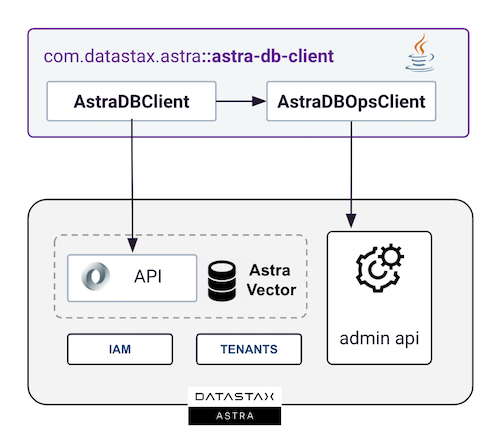

<link rel="stylesheet" href="https://maxcdn.bxootstrapcdn.com/font-awesome/4.6.1/css/font-awesome.min.css">

## 1. Overview

The Astra SDK Vector is a client library that interacts with the various APIs of the Astra DataStax Platform, allowing users to connect, utilize, and administer the Astra Vector product. It encompasses two distinct clients working one with the other:

- **AstraVectorClient**: This is the primary entry point to the library and serves as the initial object to access all its features. The client supports both **schema operations** (such as adding and deleting vector stores and collections) and **data operations** (including insert, update, and delete). It particularly offers advanced search capabilities which encompass **similarity search, text-based search, and metadata filtering**.

- **AstraDevopsClient**: This class is specifically designed for the **administration** of the Astra Vector platform. It facilitates the creation, deletion, and management of various **databases** within your tenant. Authentication is done via a token that is scoped to your tenant.



## 2. Prerequisites

- [x] **Install Java Development Kit (JDK) 11++**

Use [java reference documentation](https://www.oracle.com/java/technologies/downloads/) targetting your operating system to install a Java Development Kit. You can then validate your installation with the following command. 

```bash
java --version
```

- [x] **Install Apache Maven (3.9+) or Gradle**
      
Samples and tutorials have been designed with `Apache Maven`. Use the [reference documentation](https://maven.apache.org/install.html) top install maven validate your installation with 

```bash
mvn -version
```

- [x] **Create your DataStax Astra account**:

<a href="https://astra.dev/3B7HcYo" class=md-button>Sign Up to Datastax Astra</a>

- [x] **Create an Astra Token**

Once connected on the user interface, select `settings` on the left menu and tab `tokens` to create a new token.


You want to pick the following role:

| Properties     | Values                       |
|----------------|------------------------------|
| **Token Role** | `Organization Administrator` |

The Token contains properties `Client ID`, `Client Secret` and the `token`. You will only need the third (starting with `AstraCS:`)

```
{
  "ClientId": "ROkiiDZdvPOvHRSgoZtyAapp",
  
  "ClientSecret": "fakedfaked",
  
  "Token":"AstraCS:fake" <========== use this field
}
```

## 3. Setup project

- [x] **If you are using `Maven` Update your `pom.xml` file with the latest version of the Vector SDK [](https://maven-badges.herokuapp.com/maven-central/com.datastax.astra/astra-sdk-vector)**

```xml
<dependency>
  <groupId>com.datastax.astra</groupId>
  <artifactId>astra-sdk-vector</artifactId>
  <version>${latest}</version>
</dependency>
```

- [x] **If you are using gradle change the `build.dgradle` with**

```typesafe
dependencies {
    compile 'com.datastax.astra:astra-sdk-vector-0.7.0'
}
```

## 4. Getting Started

With a valid token, you can create an `AstraVectorClient` object and start using the library.

> _If you already have a database running, you can skip step `#2` 

```java
/*
 * 1) Initialization
 */
AstraVectorClient vectorClient = new AstraVectorClient("AstraCS:....");

/*
 * 2) Create a Vector Database
 * 
 * - Database is created only if it does not exist
 * - This method is blocking until db is available
 * - If database was hibernated, it is resumed.
 */
vectorClient.createDatabase("getting_started");

/*
 * 3) Create a Vector Store
 * 
 * - select the create database
 * - Vector dimension is required
 * - Create if not exists
 */
VectorDatabase vectorDb = vectorClient.database("getting_started");
vectorDb.createVectorStore("demo_store", 14);

/*
 * 4) Insert a few vectors
 * - select the vector store
 * - no object mapping in this getting started
 * - insert a few vectors
 */
JsonVectorStore vectorStore = vectorDb.vectorStore("demo_store");

// -- with a string
vectorStore.insert("{"
  + "   \"_id\":\"doc1\","
  + "   \"$vector\":[1.0, 1.0, 1.0, 1.0, 1.0, 0.0, 0.0, 0.0, 0.0, 0.0, 0.0, 0.0, 0.0, 0.0],"
  + "   \"message\": \"Hello\", "
  + "   \"name\": \"Victor\""
  + "}");
// --with JsonDocument
vectorStore.insert(new JsonDocument()
 .id("doc2") // generated if not set
 .vector(new float[]{1f, 0f, 1f, 1f, 1f, 1f, 0f, 0f, 0f, 0f, 0f, 0f, 0f, 0f})
 .put("message", "Greetings")
 .put("Jason", 12.99));
// -- with a pojo (here ChatMessage)
vectorStore.insert("doc5",
  new ChatMessage("Bonjour", "Jean"),
  new float[]{1f, 1f, 1f, 1f, 1f, 0f, 0f, 0f, 0f, 0f, 0f, 0f, 0f, 0f});

/*
 * 5) Similarity Search
 * - find the nearest vectors
 */
List<JsonDocument> results = vectorStore
  .similaritySearchJson(new float[]{1f, 1f, 1f, 1f, 1f, 0f, 0f, 0f, 0f, 0f, 0f, 0f, 0f, 0f}, 2);
```

## 5. Reference Guide

### 5.1. Initialization

The initialization happens in `AstraVectorClient` class. It can be done in different ways:

- [x] **Using the token** 

```java
AstraVectorClient vectorClient = new AstraVectorClient("AstraCS:....");
```

- [x] **Cli or Environment Variable**

If the Astra CLI is installed or the environment variable `ASTRA_DB_APPLICATION_TOKEN` is set, the token is automatically retrieved.

```java
AstraVectorClient vectorClient = new AstraVectorClient();
```

- [x] **Non-Production environments**

If you want to connect to a specific environment, you can use the `AstraEnvironment` as a second argument.

```java
AstraVectorClient vectorClientDev = 
        new AstraVectorClient(astraToken, AstraEnvironment.DEV);
```

### 5.1. Working with Databases

- [x] **List Databases with `findAllDatabases`**

```java
vectorClient.findAllDatabases()
        .map(Database::getInfo)
        .map(DatabaseInfo::getName)
        .forEach(log::info);
```

- [x] **Create Databases with `createDatabase`**

The function can take a database identifier (uuid) or the database name.

```java
UUID db1Id = vectorClient.createDatabase("db1");

// Specify the region (enum for the user to pick, +  explicit FREE_TIER)
UUID db2Id = vectorClient.createDatabase("db2",
  AstraVectorClient.FREE_TIER_CLOUD,
  AstraVectorClient.FREE_TIER_CLOUD_REGION);
```

- [x] **Delete Databases with `deleteDatabase`**

The function can take a database identifier (uuid) or the database name.
```java
vectorClient.deleteDatabase("db1");
```

- [x] **Access database from its `name` or `id`**

The `VectorDatabase` is a client that will allow you to create, delete, and access vector stores. It 
used method names idiomatic to the vector search field.

```java
VectorDatabase vectorDb1 = vectorClient.vectorDatabase("db1");

VectorDatabase vectorDb2 = vectorClient.vectorDatabase("uuid-of-db2");
```

### 5.2. Vector Native

> In this section we assume you already have a `VectorDatabase` instance call `vectorDb` to see how to create it please refers to previous chapter

#### [<ins>Working with VectorStore</ins>](#)

- [x] **List VectorStores in a vectorDatabase**

```java
// assuming you have vectorDatabase
Stream<String> stores = vectorDb.findAllVectorStores();
```

- [x] **Create VectorStore with `createVectorStore`**

No exception is thrown if the vector store already exists.

```java
// Name and Vector Dimension are required
JsonVectoStore vectorStore1 = vectorDb
        .createVectorStore("store_name", 14);

// The Similarity metric can be added (defaut is cosine)
JsonVectoStore vectorStore2 = vectorDb
        .createVectorStore("store_name", 14, SimilarityMetric.cosine);

// Vector Store is a CRUD repository support Object Mapping
VectorStore<MyBean> vectorStore3 = vectorDb
        .createVectorStore("store_name", 14, MyBean.class);
```

- [x] **Delete VectorStore with `deleteVectorStore`**

No exception is thrown does not exists.
```java
vectorDb.deleteVectorStore("store_name");
```

- [x] **Test if a VectorStore exists with `isVectorStoreExist`**

```java
boolean exist = vectorDb.isVectorStoreExist("store_name");
```

- [x] **Access vectorStore from its `name`**

The `VectorStore` is a client that will allow you to create, delete, and access vectors documents. It
uses method names idiomatic to the vector search field. The object is returned by `createVectorStore` methods
but most of the time the store will already exist for you.

```java
// Using raw json documents
JsonVectorStore vectorDb1 = vectorDb.vectorStore("store_name");

// Object Mapping
VectorStore<MyBean> vectorDb2 = vectorDb.vectorStore("store_name", MyBean.class);
```

#### [<ins>Working with Vectors</ins>](#)

> In this section we assume you already have a `VectorStore` instance call `vectorStore` to see how to create it please refers to previous chapter.

- [x] **Insertions**

With the JsonVectorStore multiple alternatives are possible to insert your data:

- If a document already exists with same id an error will be thrown
- If no id is provide when inserting the system will generate on for you

```java
// Insert with key/values
vectorStore.insert(new JsonDocument()
  .id("doc1") // generated if not set
  .vector(new float[]{1f, 0f, 1f, 1f, 1f, 1f, 0f, 0f, 0f, 0f, 0f, 0f, 0f, 0f})
  .put("product_name", "HealthyFresh - Beef raw dog food")
  .put("product_price", 12.99));
 
// Insert with payload as Json
vectorStore.insert(new JsonDocument()
  .id("doc2")
  .vector(new float[]{1f, 1f, 1f, 1f, 1f, 0f, 0f, 0f, 0f, 0f, 0f, 0f, 0f, 0f})
  .data("{"
       +"   \"product_name\": \"HealthyFresh - Chicken raw dog food\", "
       + "  \"product_price\": 9.99"
       + "}")
);

// Insert with payload as a Map
vectorStore.insert(new JsonDocument()
   .id("doc3")
   .vector(new float[]{1f, 1f, 1f, 1f, 1f, 0f, 0f, 0f, 0f, 0f, 0f, 0f, 0f, 0f})
   .data(Map.of("product_name", "HealthyFresh - Chicken raw dog food"))
);

// Insert as a Json
vectorStore.insert("{"
    + "   \"_id\":\"doc4\","
    + "   \"$vector\":[1.0, 1.0, 1.0, 1.0, 1.0, 0.0, 0.0, 0.0, 0.0, 0.0, 0.0, 0.0, 0.0, 0.0],"
    + "   \"product_name\": \"HealthyFresh - Chicken raw dog food\", "
    + "   \"product_price\": 9.99"
    + "}");
```

#### [<ins>Find</ins>](#)

You can retrieve vector documents from their `id` of their `vector`. It is not really a search 
but rather a `findById`.

- [x] **Find By Id**

Retrieve a document from its id (if exists)

```java
// Assuming you have a VectorStore<MyBean>
Optional<MyBean> result = vectorStore.findById("doc1");

// When working with JsonVectorStore to returned raw 'JsonResult'
Optional<JsonResult> result = vectorStore.findByIdJson("doc1");
```

- [x] **Find By Vector**

Retrieve a document from its vector (if exists)

```java
// Assuming you have a VectorStore<MyBean>
Optional<MyBean> result = vectorStore
        .findByVector(new float[]{1f, 1f, 1f, 1f, 1f, 0f, 0f, 0f, 0f, 0f, 0f, 0f, 0f, 0f});

// When working with JsonVectorStore to returned raw 'JsonResult'
Optional<JsonResult> result = vectorStore
        .findByVectorJson(new float[]{1f, 1f, 1f, 1f, 1f, 0f, 0f, 0f, 0f, 0f, 0f, 0f, 0f, 0f});
```

- [x] **Find all**

You can retrieve all vectors from your store but it might be slow and consume a lot of memory, 
prefered paed request except when in development.

```java
// Find All for VectorStore<MyBean>
Stream<MyBean> all = vectorStore.findAll();

// Find All for JsonVectorStore
Stream<JsonResult> all = vectorStore.findAllJson();
```

- [x] **Find with a query**

You can search on any field of the document. All fields are indexed. Using a `SelectQuery` populated through
builder you can get some precise results.

```java
// Find All for VectorStore<MyBean>
Stream<MyBean> all = vectorStore.findAll(SelectQuery.builder()
        .where("product_price")
        .isEqualsTo(9.99)
        .build());

// Find All for JsonVectorStore
Stream<JsonResult> all = vectorStore.findAllJson(SelectQuery.builder()
  .where("product_price")
  .isEqualsTo(9.99)
  .build());
```

- [x] **Find Page**

Find Page works the same as `findAll(Query)` where you can pass a `SelectQuery` as input. In the object `Page` the field `pagingState` should be provided from page to another.

```java

// VectorStore<MyBean>
Page<MyBean> page1 = vectorStore.findPage(SelectQuery.builder().build());
page1.getPageState().ifPresent(pagingState -> {
  Page<MyBean> page2 = vectorStore
    .findPage(SelectQuery
    .builder().withPagingState(pagingState).build());
});
        
// JsonVectorStore
Page<JsonResult> page1 = vectorStore.findPageJson(SelectQuery.builder().build());
page1.getPageState().ifPresent(pagingState -> {
  Page<JsonResult> page2 = vectorStore
    .findPageJson(SelectQuery
    .builder().withPagingState(pagingState).build());
});
```

In the query ou can then add filter with the builder.

#### [<ins>Similarity Search</ins>](#)

A similarity search is a query that will find records where vectors are the closest to a given vector. 
It is done by providing a vector and a number of results to return. The result is a list of `JsonResult` that contains the payload and the distance.

- [x] **Simple Search**

```java
float[] embeddings = 
   new float[]{1f, 1f, 1f, 1f, 1f, 0f, 0f, 0f, 0f, 0f, 0f, 0f, 0f, 0f};
int limit = 2;
List<JsonDocument> results = vectorStore
        .similaritySearchJson(embeddings, limit);
```

- [x] **Search with filter**

```java
float[] embeddings = 
   new float[]{1f, 1f, 1f, 1f, 1f, 0f, 0f, 0f, 0f, 0f, 0f, 0f, 0f, 0f};
int limit = 2;
Filter  metadataFilter = new Filter().where("product_price").isEqualsTo(9.99);
List<MyBean> results = vectorStore
        .similaritySearch(embeddings, metadataFilter, limit);
```

#### [<ins>Paging</ins>](#)

- When a limit is provided the service return a list of Results.
- When no limit is provided the service return a Page of results and paging is enabled.
- The limit must be between 1 and 20.

#### Update Vectors

#### Object Mapping

Object Mapping allow to represent vector as Object containing an id, a vector and a payload. 
The payload is a Java Bean that will be serialized as Json.


- [x] **Insertion with Object Mapping**

```java
// Initialization reminders
VectorStore<MyBean> vStore = 
     vectorDb.vectorStore("store_name", MyBean.class);

// Insert the payload as your Beam
vStore.insert("doc5",
   new MyBean("HealthyFresh - Beef raw dog food", 12.99),
   new float[]{1f, 1f, 1f, 1f, 1f, 0f, 0f, 0f, 0f, 0f, 0f, 0f, 0f, 0f});

// Build the full document
Document<MyBean> doc6 = new Document<>("doc6",
                new Product("HealthyFresh - Beef raw dog food", 12.99),
                new float[]{1f, 1f, 1f, 1f, 1f, 0f, 0f, 0f, 0f, 0f, 0f, 0f, 0f, 0f});
        productVectorStore.insert(doc6);
```

- [x] Save

Save is different as insert. It will update the document if it exists or insert it if it does not.

- [x] Paging


 


### 5.3. Json Api

#### Working with Namespaces

#### Working with Collections

#### Working with Documents

#### Paging

#### Repository Pattern


## 6. Troubleshooting

- [x] Common Errors and Solutions

List typical issues users might face and their resolutions.

- [x] 6.2. FAQ

Address frequently asked questions.

## 7. Best Practices

- [x]  7.1. Performance Tips

Offer guidance on optimizing usage for better performance.

- [x]  7.2. Security Recommendations

Share advice on secure practices when using the library.

## 8. Contribution Guide

- [x] 8.1. Code of Conduct

Outline the behavior expected from contributors.

- [x] 8.2. Contribution Steps

Describe how one can contribute to the library, e.g., via pull requests.

## 9. Release Notes/Changelog

Track changes made in each version of the library.

## 10. Contact and Support

- [x] 10.1. Reporting Bugs

Provide a link or method for users to report issues.

- [x] 10.2. Getting Help

Point users to forums, support channels, or other resources.