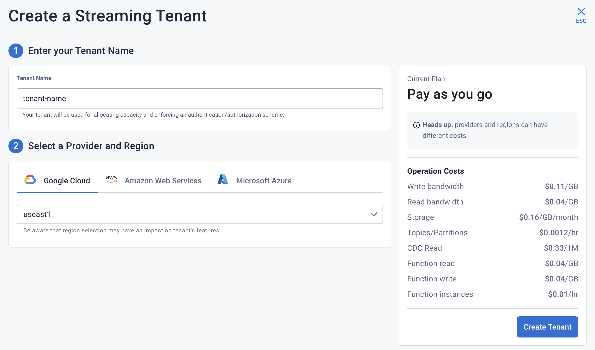
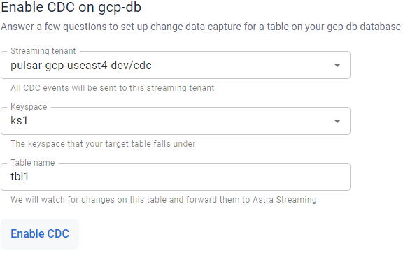
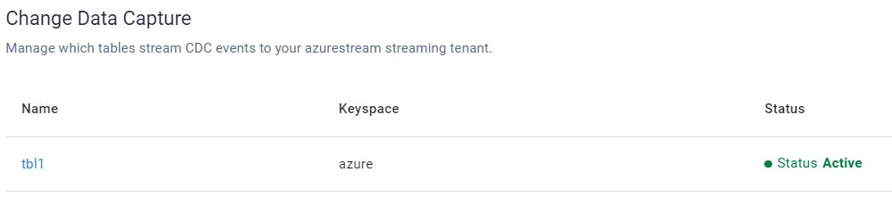
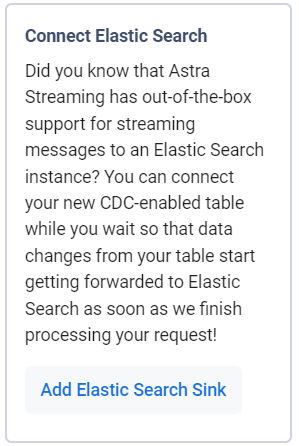
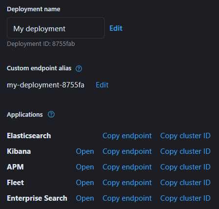
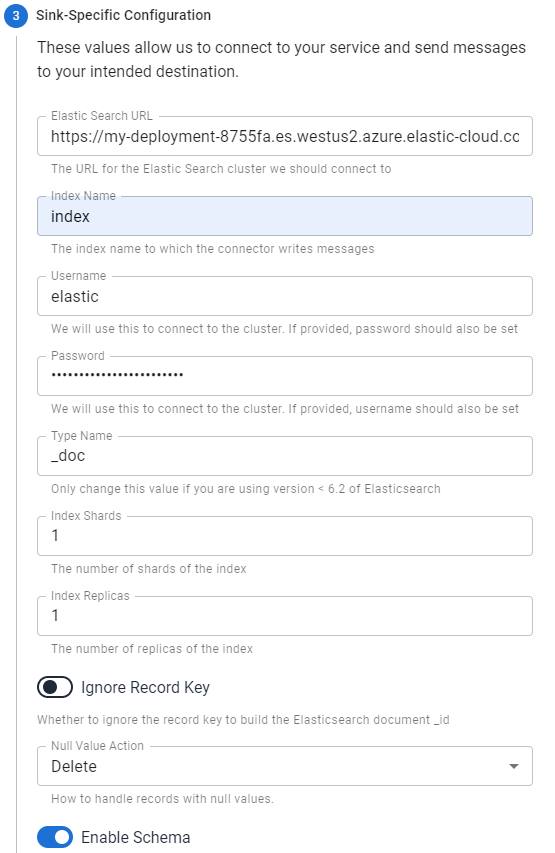
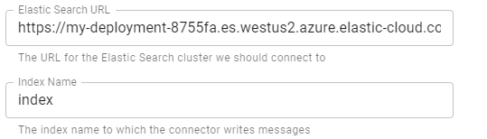

<details>
<summary><b> 📖 Reference Documentation and resources</b></summary>
<ol>
<li><a href="https://docs.datastax.com/en/astra-streaming/docs/astream-cdc.html"><b>📖  Astra Docs</b> - Reference documentation</a>
<li><a href="https://www.youtube.com/watch?v=Wk__BrI-CCk&list=PL2g2h-wyI4SqeKH16czlcQ5x4Q_z-X7_m&index=20"><b>🎥 Youtube Video</b> - Astra Streaming demo</a>
<li><a href="https://pulsar.apache.org/docs/en/standalone/"><b>🎥 Pulsar Documentation</b> - Getting Started</a>
<li><a href="https://pulsar.apache.org/docs/en/next"><b>🎥 Apache Pulsar Documentation</b></a>
</ol>
</details>

# CDC for Astra 

CDC for Astra automatically captures changes in real time, de-duplicates the changes, and streams the clean set of changed data into Astra Streaming where it can be processed by client applications or sent to downstream systems.

Astra Streaming processes data changes via a Pulsar topic. By design, the Change Data Capture (CDC) component is simple, with a 1:1 correspondence between the table and a single Pulsar topic.

This doc will show you how to create a CDC connector for your Astra DB deployment and send change data to an Elasticsearch sink.

## Creating a tenant and topic

1. In **astra.datastax.com**, select **Create Streaming**.
2. Enter the name for your new streaming tenant and select a provider.


3. Select **Create Tenant**.

Use the default *persistent* and *non-partitioned* topic settings.

!!! note
    Astra Streaming CDC can only be used in a region that supports both Astra Streaming and AstraDB. See [Regions](https://docs.datastax.com/en/astra-streaming/docs/astream-regions.html) for more information.


## Creating a table

1. In your [Astra Database](/docs/pages/astra/create-instance/), create a table with a primary key column:
```sh
CREATE TABLE IF NOT EXISTS <keyspacename>.tbl1 (key text PRIMARY KEY, c1 text);
```

2. Confirm you created your table:
```sh
select * from <mykeyspace>.tbl1;
```

Results:


## Connecting to CDC for Astra

1. Select the **CDC** tab in your database dashboard.
2. Select **Enable CDC**.
3. Complete the fields to connect CDC.


4. Select **Enable CDC**.
Once created, your CDC connector will appear:


5. Enabling CDC creates a new `astracdc` namespace with two new topics, `data-` and `log-`. The `log-` topic consumes schema changes, processes them, and then writes clean data to the `data-` topic. The `log-` topic is for CDC functionality and should not be used. The `data-` topic can be used to consume CDC data in Astra Streaming. 

## Connecting Elasticsearch sink

After creating your CDC connector, connect an Elasticsearch sink to it. DataStax recommends using the default Astra Streaming settings.

1. Select **Add Elastic Search Sink** from the database CDC console to enforce the default settings. 


2. Use your Elasticsearch deployment to complete the fields. To find your *Elasticsearch URL*, navigate to your deployment within the Elastic Common Schema (ECS).
3. Copy the Elasticsearch endpoint to the *Elastic Search URL* field. 


4. Complete the remaining fields. Most values will auto-populate. These values are recommended:
    - `ignoreKey` as `false`
    - `nullValueAction` as `DELETE`
    - `enabled` as `true`


5. When the fields are completed, select **Create**.
If creation is successful, `<sink-name> created successfully` appears at the top of the screen. You can confirm your new sink was created in the **Sinks** tab.


## Sending messages

Let's process some changes with CDC.

1. Go to the CQL console.
2. Modify the table you created. 
```
INSERT INTO <keyspacename>.tbl1 (key,c1) VALUES ('32a','bob3123');
INSERT INTO <keyspacename>.tbl1 (key,c1) VALUES ('32b','bob3123b');
```

3. Confirm the changes you've made:
```
select * from <keyspacename>.tbl1;
```
Results:


## Confirming ECS is receiving data

To confirm ECS is receiving your CDC changes, use a `curl` request to your ECS deployment.

1. Get your index name from your ECS sink tab:


2. Issue your `curl` request with your Elastic `username`, `password`, and `index name`:
```
curl  -u <username>:<password>  \
   -XGET "https://asdev.es.westus2.azure.elastic-cloud.com:9243/<index_name>.tbl1/_search?pretty=true"  \
   -H 'Content-Type: application/json'
```

!!! note 
    If you have a trial account, the username is `elastic`.

You will receive a JSON response with your changes to the index, which confirms Astra Streaming is sending your CDC changes to your ECS sink.

```
{
    "_index" : "index.tbl1",
    "_type" : "_doc",
    "_id" : "32a",
    "_score" : 1.0,
    "_source" : {
        "c1" : "bob3123"
    }
}

{
    "_index" : "index.tbl1",
    "_type" : "_doc",
    "_id" : "32b",
    "_score" : 1.0,
    "_source" : {
        "c1" : "bob3123b"
    }
}
```

