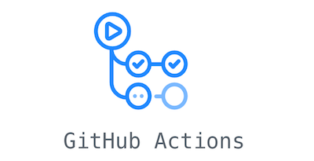
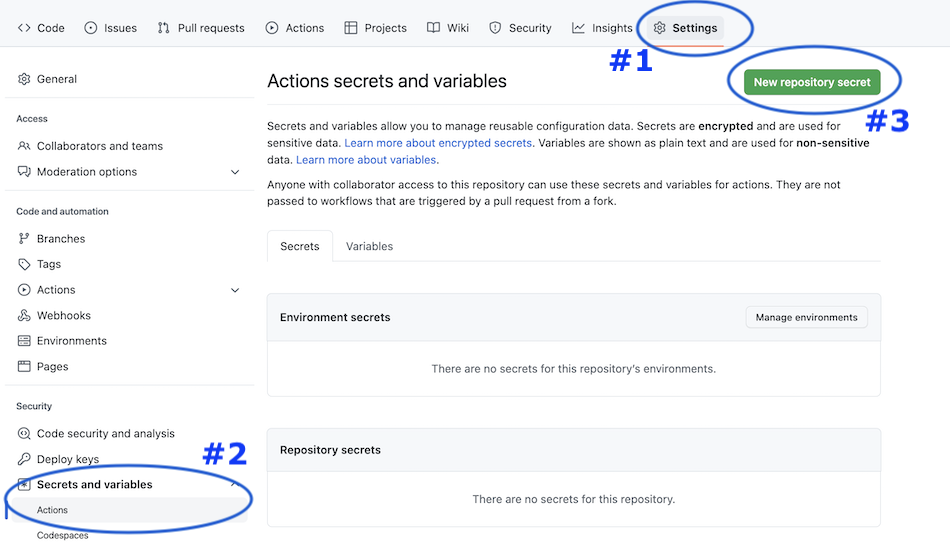
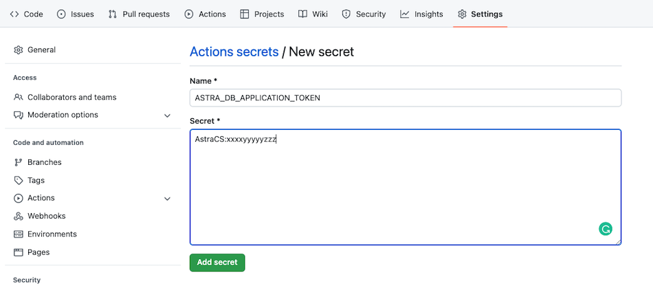
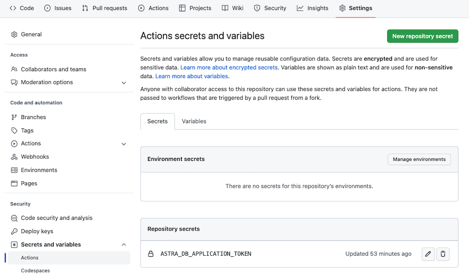
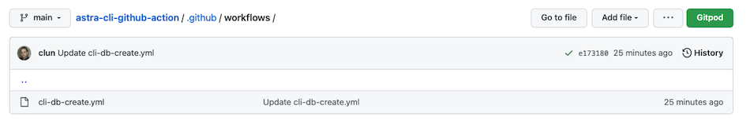
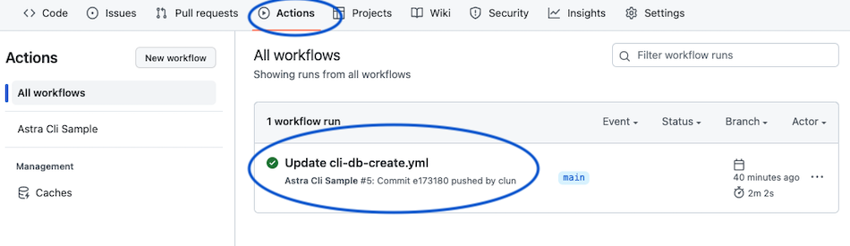
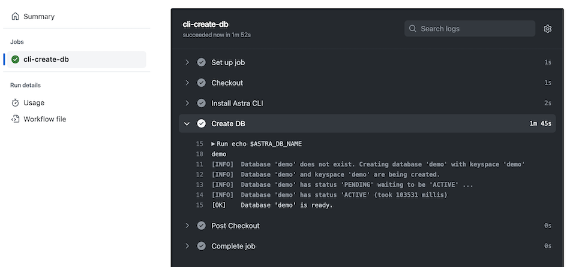

<div class="nosurface" markdown="1">


</div>

## Overview

[Github Actions](https://docs.github.com/en/actions)
is a continuous integration and continuous delivery (CI/CD) platform that allows you to automate your build, test, and deployment pipeline. You can create workflows that build and test every pull request to your repository, or deploy merged pull requests to production.

GitHub Actions goes beyond just DevOps and lets you run workflows when other events happen in your repository. For example, you can run a workflow to automatically add the appropriate labels whenever someone creates a new issue in your repository.

GitHub provides Linux, Windows, and macOS virtual machines to run your workflows, or you can host your own self-hosted runners in your own data center or cloud infrastructure.

<div class="nosurface" markdown="1">
Reference documentation:

- ℹ️ [Github Documentation](https://docs.github.com/en/actions)
- ℹ️ [Understanding Github Actions](https://docs.github.com/en/actions/learn-github-actions/understanding-github-actions)

</div>

## Prerequisites

<ul class="prerequisites">
    <li class="nosurface">You should have an <a href="https://astra.dev/3B7HcYo">Astra account</a></li>
    <li class="nosurface">You should <a href="https://awesome-astra.github.io/docs/pages/astra/create-token/">Create an Astra Token</a> with the role "Database Administrator" (Feast will have to dynamically create and delete tables in the keyspace).</li>
    <li class="nosurface">You should have a github account and a created repository</li>
</ul>


## Github Repository Configuration

!!! note "Note"
    It is not rocket science. We ask github for an ubuntu environment, we install the [Astra CLI](https://awesome-astra.github.io/docs/pages/astra/astra-cli/) and 
    we use the `CLI` to create a database.

### Create a secret for token

- `#1` - Open your github Repository and locate the tabs `Settings`

- `#2` - On the left menu locate `Secrets and variables` and expand to list different options. Clikc on `Actions`

- `#3` - Click on the `[New Repository Secret]` on the top right hand corner

> 

- `#4` - Enter the new secret name `ASTRA_DB_APPLICATION_TOKEN` and provide the value for your secret

> 

- `#5` - The Secret should now be visible in your secret list



### Create a new action

- Create a new folder in your github repository `.github/actions`

- Create a new Yaml file and name it as you like here i use `cli-db-create`



- Populate the file as followed

```yaml
name: Astra Cli Sample
on:
  push:
    branches:
      - main
jobs:
  cli-create-db:
    env:
      ASTRA_DB_APPLICATION_TOKEN: ${{ secrets.ASTRA_DB_APPLICATION_TOKEN }}
      ASTRA_DB_NAME: demo
      ASTRA_DB_KEYSPACE: demo
      TERM: linux
    runs-on: ubuntu-latest
    steps:
    
      - name: Checkout
        uses: actions/checkout@v3
      
      - name: Install Astra CLI
        run: curl -Ls "https://dtsx.io/get-astra-cli" | bash
        
      - name: Create DB
        run: |
          echo $ASTRA_DB_NAME
          /home/runner/.astra/cli/astra db create $ASTRA_DB_NAME -k $ASTRA_DB_KEYSPACE --token $ASTRA_DB_APPLICATION_TOKEN --if-not-exists 

```

!!! note "Informations Regarding the variables"
    

    | Variable     | Description   |
    |--------------|-----------|
    | ASTRA_DB_NAME | The name of your database   | 
    | ASTRA_DB_KEYSPACE | The keyspace (if not provided defaulting to same name as db) |
    | ASTRA_DB_APPLICATION_TOKEN | The secret we defined before |

### Run the action

With the configuration above the CLI is triggered at each commit. As we provided the options `--if-not-exists` in the command line, it is not harmful.

- Locate the tab `ACTIONS` in your github repository and select the last execution

> 

- You will get the following output

> 

Here is a [sample repository](https://github.com/DataStax-Examples/astra-cli-github-action) you can use as a reference.

## What's NEXT ?

If you are not familiar with the CLI all available commands are available in [the documentation](https://awesome-astra.github.io/docs/pages/astra/astra-cli/) or in the help of the tools

```
$> astra help db create

NAME
        astra db create - Create a database with cli

SYNOPSIS
        astra db create [ --async ] [ {-cf | --config-file} <CONFIG_FILE> ]
                [ {-conf | --config} <CONFIG_SECTION> ]
                [ {--if-not-exist | --if-not-exists} ]
                [ {-k | --keyspace} <KEYSPACE> ] [ --no-color ]
                [ {-o | --output} <FORMAT> ] [ {-r | --region} <DB_REGION> ]
                [ --timeout <timeout> ] [ --token <AUTH_TOKEN> ]
                [ {-v | --verbose} ] [ --wait ] [--] <DB>

OPTIONS
        --async
            Will not wait for the resource to become available

        -cf <CONFIG_FILE>, --config-file <CONFIG_FILE>
            Configuration file (default = ~/.astrarc)

        -conf <CONFIG_SECTION>, --config <CONFIG_SECTION>
            Section in configuration file (default = ~/.astrarc)

        --if-not-exist, --if-not-exists
            will create a new DB only if none with same name

        -k <KEYSPACE>, --keyspace <KEYSPACE>
            Default keyspace created with the Db

        --no-color
            Remove all colors in output

        -o <FORMAT>, --output <FORMAT>
            Output format, valid values are: human,json,csv

        -r <DB_REGION>, --region <DB_REGION>
            Cloud provider region to provision

        --timeout <timeout>
            Provide a limit to the wait period in seconds, default is 300s.

        --token <AUTH_TOKEN>
            Key to use authenticate each call.

        -v, --verbose
            Verbose mode with log in console

        --wait
            Will wait until the database become ACTIVE

        --
            This option can be used to separate command-line options from the
            list of arguments (useful when arguments might be mistaken for
            command-line options)

        <DB>
            Database name (not unique)
```